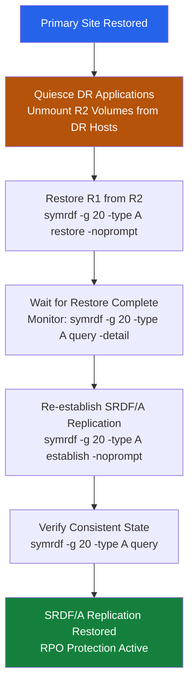

# SRDF/A — Procedures


<div class="kb-summary">
> Part of the [SRDF/A](../../index.md) reference.
</div>

---

## Change Readiness

- [ ] All SRDF/A pairs are in Consistent state before beginning any storage changes on R1 or R2 devices
- [ ] SRDF/A link bandwidth headroom has been confirmed — check current utilization is not at saturation
- [ ] SYMCLI host access to both R1 and R2 arrays is confirmed and credentials are available
- [ ] RDF group configuration is documented (RDF group number, R1 SID, R2 SID, cycle time)
- [ ] DR site personnel are available and contactable during the maintenance window
- [ ] If the change involves R2 devices, confirm that activating R2 (failover) is not required during the window

| Item | Status | Notes |
|---|---|---|
| All SRDF/A pairs in Consistent state | | |
| SRDF link bandwidth headroom confirmed | | |
| SYMCLI access to R1 and R2 confirmed | | |
| RDF group number and SIDs documented | | |
| DR site personnel available | | |
| R2 activation not required during window | | |

---

## Maintenance Window

**Safe suspend procedure for SRDF/A (e.g., before a storage upgrade affecting R1 or R2):**

1. Confirm all pairs are in Consistent state
2. Suspend SRDF/A replication for the RDF group:
   ```bash
   symrdf suspend -sid <r1_sid> -rdfg <rdf_group_number> -type RDF/A -force
   ```
3. Confirm pairs are now in the Suspended state:
   ```bash
   symrdf list -sid <r1_sid> -rdfg <rdf_group_number>
   ```
4. Perform the planned maintenance on R1 or R2 devices
5. Resume SRDF/A replication after maintenance:
   ```bash
   symrdf resume -sid <r1_sid> -rdfg <rdf_group_number> -type RDF/A
   ```
6. Monitor resync — delta marks should decrease; pairs should return to Consistent state

---

## Failover Procedure

### Overview

SRDF/A failover promotes R2 volumes to read/write. Because SRDF/A is asynchronous, R2 is consistent to the last **completed cycle** rather than the last write, so there is an inherent RPO equal to the lag at the moment of failure. Before failing over, always check the cycle state and lag to understand the data exposure window.

Planned failover (site still accessible) uses `-establish` to immediately reverse replication after the split. Unplanned failover (primary site down) uses the standard `failover` command and requires a separate restore+establish sequence to recover replication.

### Failover Decision Flow

```mermaid
flowchart TD
    incident["Incident: Primary Site Issue Reported"]
    primaryReachable{"Primary Site\nReachable?"}
    checkCycleState["Check Cycle State and Lag\nsymrdf -g 20 -type A query -detail"]
    r2Consistent{"R2 in Consistent\nor Transmitting State?"}
    stakeholderBriefing["Brief Stakeholders on RPO\n(lag = data exposure window)"]
    managementAuth{"Management\nAuthorisation\nGranted?"}
    plannedFO["Planned Failover\nsymrdf -g 20 -type A failover -establish -noprompt"]
    unplannedFO["Unplanned Failover\nsymrdf -g 20 -type A failover -noprompt"]
    presentR2["Present R2 Volumes\nto DR Hosts"]
    validateApp["Validate Application\nat DR Site"]
    failback["When Primary Recovers:\nRestore + Establish\nsymrdf restore → establish"]
    waitSite["Continue Monitoring\nWait for Site Recovery"]

    incident --> primaryReachable
    primaryReachable -->|"Yes — planned"| checkCycleState
    primaryReachable -->|"No — unplanned"| stakeholderBriefing
    checkCycleState --> r2Consistent
    r2Consistent -->|"Yes"| stakeholderBriefing
    r2Consistent -->|"No — Inconsistent"| stakeholderBriefing
    stakeholderBriefing --> managementAuth
    managementAuth -->|"Approved — planned"| plannedFO
    managementAuth -->|"Approved — unplanned"| unplannedFO
    managementAuth -->|"Not approved"| waitSite
    plannedFO --> presentR2
    unplannedFO --> presentR2
    presentR2 --> validateApp
    validateApp --> failback

    style incident fill:#be123c,color:#fff
    style plannedFO fill:#2563eb,color:#fff
    style unplannedFO fill:#7c3aed,color:#fff
    style validateApp fill:#15803d,color:#fff
    style waitSite fill:#6b7280,color:#fff
```text
┌───────────────────────────────────────── SRDF/A — Procedures ─────────────────────────────────────────┐
│                                                                                                       │
│   ┌──────────────────────────────────────────────┐  ┌─────────────────────────────────────────────┐   │
│   │              Routine Procedures              │  │                DR Procedures                │   │
│   │          Add new protection source           │  │              Initiate failover              │   │
│   │           Modify retention policy            │  │               Validate replica              │   │
│   │          Expire old recover points           │  │              Redirect host I/O              │   │
│   │             Add storage capacity             │  │         Test failover (non-disrupt)         │   │
│   │           Service account rotation           │  │            Failback to production           │   │
│   └──────────────────────────────────────────────┘  └─────────────────────────────────────────────┘   │
│                                                                                                       │
│   ┌───────────────────────────────────────────────────────────────────────────────────────────────┐   │
│   │                             Change Control Requirements for SRDF/A                            │   │
│   │           All changes to protection policies require change ticket with rollback plan         │   │
│   │                      Failover tests must be scheduled in maintenance window                   │   │
│   │              Firmware/software upgrades need 48 h pre-approval and backup snapshot            │   │
│   │                  Post-change: verify jobs run successfully for 2 backup cycles                │   │
│   └───────────────────────────────────────────────────────────────────────────────────────────────┘   │
│                                                                                                       │
│  Physical Infrastructure:                                                                             │
│  Two PowerMax arrays (production + DR site) · FC/FCIP SRDF link (dedicated bandwidth) · RF ports      │
│  Key terms:                                                                                           │
│                                                                                                       │
│  SRDF          = Symmetrix Remote Data Facility; EMC array-based replication technology               │
│  R1            = source SRDF volume on production array; host writes flow here                        │
│  R2            = target SRDF volume on DR array; receives replicated data asynchronously              │
│  Delta Set     = batch of host writes accumulated per SRDF/A cycle; shipped to R2 atomically          │
│  Cycle Time    = SRDF/A replication interval (15–60 seconds); determines maximum RPO                  │
│  symrdf        = Solutions Enabler CLI for SRDF operations: establish, split, failover, restore       │
│  SRDF Link     = FC or FCIP path between R1 and R2 arrays; dedicated, monitored bandwidth             │
│  Suspended     = SRDF pair state where replication is paused; R2 data frozen at last cycle            │
│  Failover      = SRDF operation making R2 read-write; R1 becomes Not Ready to hosts                   │
│  Restore       = after failover resolution, re-establishes replication with R1 as source              │
│  Establish     = initial sync or re-sync operation that copies R1 to R2 in full                       │
│  Split         = breaks SRDF pair temporarily; both R1 and R2 are R/W; no replication                 │
│  FCIP          = Fibre Channel over IP; tunnels FC SRDF traffic over IP WAN link                      │
│  Unisphere     = Dell PowerMax management GUI; REST API; array health and provisioning                │
│                                                                                                       │
└───────────────────────────────────────────────────────────────────────────────────────────────────────┘
```

| RPO Factor | How to Check | Acceptable Threshold |
|---|---|---|
| Cycle lag at failover | `query -detail` Lag field | Depends on SLA; typical < 30 s |
| Cycles lost (in-flight) | Transmitting state at failover | 0-1 cycles |
| DSE overflow data | DSE utilization at failover | Ideally 0% |
| Time since last Consistent | Last Consistent timestamp | Per business RPO agreement |

### Post-Failover Steps

```bash
# Verify R2 devices are Failed Over and accessible
symrdf -g 20 -type A query

# Confirm write access on R2 (run from DR host)
dd if=/dev/zero of=/dev/sdX bs=1M count=10 oflag=direct

# Confirm no unexpected devices still in Consistent/Transmitting
symrdf -g 20 -type A query | grep -v "Failed Over"
```

### Failback and Replication Restoration



```bash
# After primary site recovery: restore R1 from R2
symrdf -g 20 -type A restore -noprompt

# Wait for restore to complete (R1 returns to RW)
symrdf -g 20 -type A query -detail

# Re-establish SRDF/A replication (R1 -> R2)
symrdf -g 20 -type A establish -noprompt

# Confirm Consistent state restored
symrdf -g 20 -type A query
```

### Planned Failover via SYMCLI

```bash
# Confirm all R1 applications are quiesced or shut down
# Initiate planned failover:
symrdf failover -sid <r1_sid> -rdfg <rdf_group_number> -type RDF/A -planned

# Activate R2 volumes for host access at the DR site
# When failing back, follow the failback procedure: resync R2 to R1, then swap direction
```

### Known Issues — Failover

- **Failover refused when DSE is 100% full**: The array may block the failover operation if DSE is completely full and data has not been transmitted. Suspend the group first to stop accumulating writes, then failover.
- **R2 shows stale data at failover**: This is expected with SRDF/A — check the last completed cycle timestamp to determine the actual recovery point and communicate it to application owners.
- **Establish after failback fails with "Invalid device state"**: Ensure the restore has fully completed (pair state returns to Synchronized) before issuing the establish. Attempting establish while restore is in progress will fail.
- **Lag counter does not reset after planned failover with -establish**: After a planned failover that reverses replication, the new R1 (former R2) will show a brief lag as the first cycles are established. This is normal and should clear within 1-2 cycle periods.

---

## Incident Triage

**On alert or issue:**
1. Run `symrdf list -sid <r1_sid> -rdfg <rdf_group_number>` to identify the current pair states
2. Run `symrdf queryall -sid <r1_sid> -rdfg <rdf_group_number>` to get delta mark count, cycle time, and link state detail
3. Check SRDF/A link utilization and bandwidth — if the link is saturated, Transmit Idle is expected
4. Check the network/dark fibre/WAN path between R1 and R2 sites for outages or congestion
5. If pairs have entered Mixed state, identify which devices are inconsistent and do not activate R2 until consistency is restored or a failover decision is made
6. Escalate to DR site team if link restoration is not possible within the RPO SLA

| Symptom | Likely Cause | Action |
|---|---|---|
| Pair in Transmit Idle | Link saturation — write bandwidth exceeds SRDF/A link capacity | Check link utilization, reduce R1 write I/O during peak, or increase SRDF link bandwidth; run `symrdf queryall` to monitor delta marks |
| Delta mark count growing without bound | Link consistently under-provisioned for current write rate | Increase SRDF bandwidth, adjust cycle time, or implement write throttling on R1 |
| Pair in Mixed state | Partial consistency group inconsistency | Do NOT activate R2 — run `symrdf queryall`, identify inconsistent devices, check for link errors, attempt re-establish: `symrdf establish -sid <r1_sid> -rdfg <rdf_group_number> -type RDF/A` |
| Pair in Split state (unexpected) | Network interruption between R1 and R2 | Check inter-site network, restore connectivity, then re-establish: `symrdf resume -sid <r1_sid> -rdfg <rdf_group_number>` |
| R2 activation required (DR failover) | Production site failure | Follow DR failover runbook; activate R2: `symrdf failover -sid <r1_sid> -rdfg <rdf_group_number>` |
| Cycle time exceeding configured value | Write burst or link latency increase | Monitor cycle time via `symrdf queryall`, check inter-site latency with `ping` and `traceroute` |
