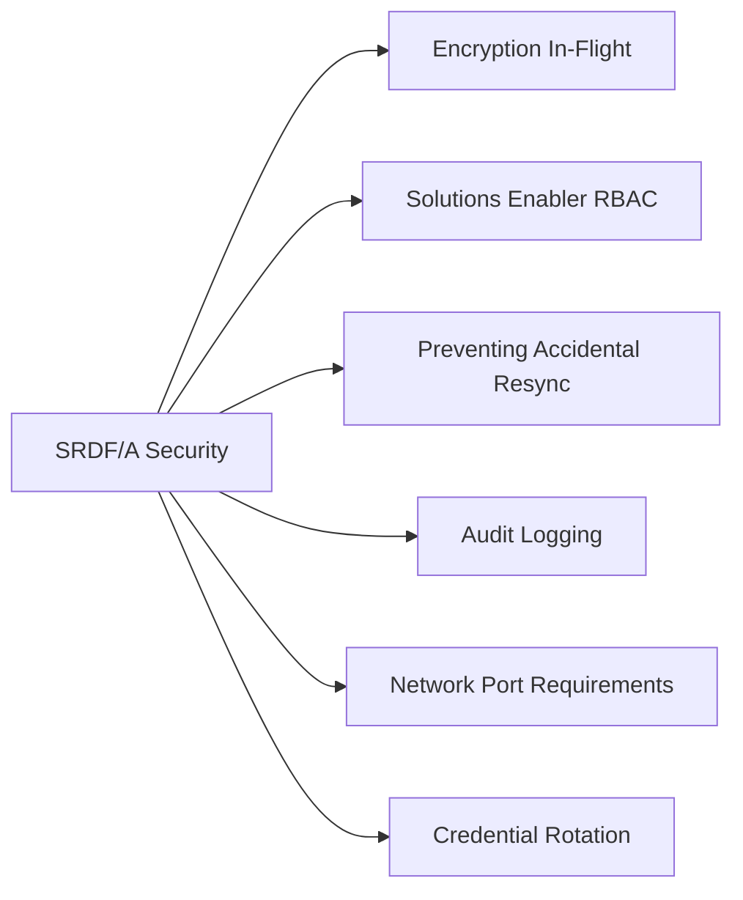

# SRDF/A Security



## Encryption In-Flight

SRDF/E (SRDF Encryption) encrypts data over FCIP using AES-256. Verify per SRDF group:

```bash
symcfg list -rdfg -v | grep -i encrypt
# Output should show: Encryption: Enabled
```

Enable SRDF/E on an existing SRDF group:

```bash
symrdf -g <rdfg> set encrypt enable
symcfg list -rdfg <rdfg> -v        # Verify Encryption: Enabled
```

## Solutions Enabler RBAC

Solutions Enabler v9+ enforces role-based access at the array scope. Roles for SRDF operations:

| Role | Permitted Operations |
|---|---|
| `StorageAdmin` | symrdf failover, establish, split, suspend |
| `StorageMonitor` | symrdf query, list — read-only |
| `Audit` | Read-only access to audit logs |

Create a dedicated service account per automation system; never use the root Solutions Enabler account:

```bash
symauth -sid <SID> add -username svc_dr_automation -role StorageAdmin -scope rdfg:<group_number>
```

## Preventing Accidental Resync

For async operations, accidentally re-syncing from target to source (after a failover test) destroys production data. Guard against this:

- Set SYMCLI session to confirm mode for destructive operations: `SYMCLI_CONFIRM=prompt`
- Restrict `symrdf restore` and `symrdf establish -full` to a separate break-glass account
- Implement a peer-review process for any SRDF failover in production

## Audit Logging

All SRDF operations generate entries in the PowerMax audit log:

```bash
symevent list -sid <SID> -type rdf         # List all RDF events
symevent show -sid <SID> -event_id <ID>    # Detail on specific event
```

Forward to SIEM via syslog:
- Configure Unisphere: Settings → Notifications → Syslog → add SIEM IP, port 514 (UDP) or 6514 (TLS)
- Alert on event types: `SRDF Split`, `SRDF Failover`, `SRDF Suspend`, `SRDF Establish`

## Network Port Requirements

| Port | Protocol | Purpose |
|---|---|---|
| 3260 | TCP | iSCSI (if used for management) |
| 5000 | TCP | Solutions Enabler SYMAPI |
| 443 | HTTPS | Unisphere REST API |
| Custom | FCIP | SRDF replication over IP (configurable per director) |

Restrict FCIP and Solutions Enabler API ports to array management IPs only using firewall ACLs.

## Credential Rotation

- Solutions Enabler service accounts: rotate passwords every 90 days
- Unisphere API tokens: rotate client certificates annually or on personnel change
- Verify no shared credentials between monitoring and DR automation accounts
