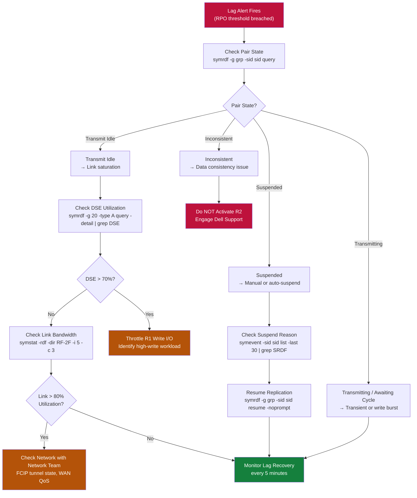

# SRDF/A — Common Issues

> Part of the [SRDF/A](../../index.md) reference.

Common SRDF/A issues: link failures, increasing cycle times, suspended consistency groups, and volume capacity mismatches. Always collect `symrdf query -g <group> -v` and array event logs before engaging Dell support. Correlate with network monitoring timestamps to distinguish storage-side from WAN-side causes.

## Lag Alert Triage Decision Tree



**Triage path:**

1. Check SAN switch ISL counters — is the FCIP tunnel or dark fibre link up?
2. Check FCIP session state from both switches (Cisco MDS: `show fcip session`; Brocade: `portshow fcipport`).
3. If the link is physically up but SRDF shows no traffic, check SRDF director port zoning.
4. If the link is down, escalate to network team with the affected FCIP tunnel endpoints.

Once the link is restored:

```bash
# Resume SRDF/A after link restoration
symrdf -g <dgname> -sid <r1_sid> resume -noprompt

# Monitor delta set queue flushing — expect high bandwidth burst as backlog clears
symrdf -g <dgname> -sid <r1_sid> query
```

---

## Cycle Time Increasing / RPO Growing

**Symptom:** `symrdf query` shows cycle time significantly above the configured interval; RPO alerts fire.

```bash
# Check current cycle time and delta set state
symrdf list -sid <r1_sid> -rdfg <group_num> -type RDF/A

# Check delta set size and transmit queue
symcfg -sid <r1_sid> list -rdfg <group_num> -v | grep -E "Delta|Cycle|Transmit"
```

**Root causes:**

| Cause | Indicator | Why it happens | Remediation |
|---|---|---|---|
| WAN bandwidth saturation | Delta set queue growing; utilisation at 100% | Write rate exceeds provisioned FCIP bandwidth | Contact network team to increase WAN bandwidth or implement QoS |
| Write I/O spike | Delta set size abnormally large | Batch jobs or backups generating burst writes | Identify the high-write workload; schedule heavy batch jobs for off-peak |
| Array backend congestion | R1 or R2 performance counters showing latency | Backend storage pool or disk group under pressure | Check array Unisphere performance; review storage pool or disk group health |
| FCIP GRE overhead miscalculation | MTU issues causing fragmentation | FCIP MTU not accounting for GRE/IPsec encapsulation overhead | Verify FCIP MTU settings on switches; test with `ping -M do -s 1400` |

---

## Consistency Group Suspended Automatically

**Symptom:** SRDF/A pair automatically suspends; state moves to `Suspended` without manual intervention.

This occurs when the delta set grows beyond the array's ability to manage it — the array protects itself by suspending to prevent memory exhaustion.

```bash
# Confirm the suspension and check reason
symrdf -g <dgname> -sid <r1_sid> query
symcfg -sid <r1_sid> list -rdfg <group_num> -v

# Review array events for the suspension trigger
symevent -sid <r1_sid> list -last 30 | grep -i "SRDF\|suspend"
```

**Resolution:**

1. Identify and resolve the cause (WAN congestion, write storm) before resuming.
2. If the cause is resolved, resume and monitor cycle time closely:

```bash
symrdf -g <dgname> -sid <r1_sid> resume -noprompt
symrdf -g <dgname> -sid <r1_sid> query
# Watch for immediate re-suspension — if it re-suspends, the root cause is not resolved
```

---

## Target Volume Capacity Mismatch / Thin Pool Exhaustion

**Symptom:** Replication fails with errors related to target volume space or thin pool.

```bash
# Check target array thin pool utilisation
symcfg -sid <r2_sid> list -pool -thin -v | grep -E "Pool|Used|Free"

# Check individual device capacity on R2
symdev -sid <r2_sid> show <dev_id> | grep -E "Emulation|Capacity|Pool"
```

**Remediation:**

- Expand the thin pool on the R2 array (add more capacity devices via Unisphere).
- If the R2 thin pool is shared with other workloads, review which volumes are consuming the most space.

---

## `Invalid` Pair State

**Symptom:** `symrdf query` shows one or more pairs in `Invalid` state.

This typically follows an unclean failover, a host that wrote to both R1 and R2 simultaneously (split scenario), or a prior `symrdf split` that was not properly resolved.

```bash
# Identify which pairs are in Invalid state
symrdf -g <dgname> -sid <r1_sid> query | grep Invalid

# Check which side has the authoritative data
# If R1 is authoritative (normal scenario — no actual failover occurred)
symrdf -g <dgname> -sid <r1_sid> resync -noprompt
# This pushes R1 data to R2 and re-establishes replication

# If R2 has the latest data (after a real failover — confirm with the application team)
symrdf -g <dgname> -sid <r2_sid> failback -noprompt
```

**Do not run `resync` or `restore` without confirming which side has the correct data.** An incorrect resync will overwrite valid data on the target side.
