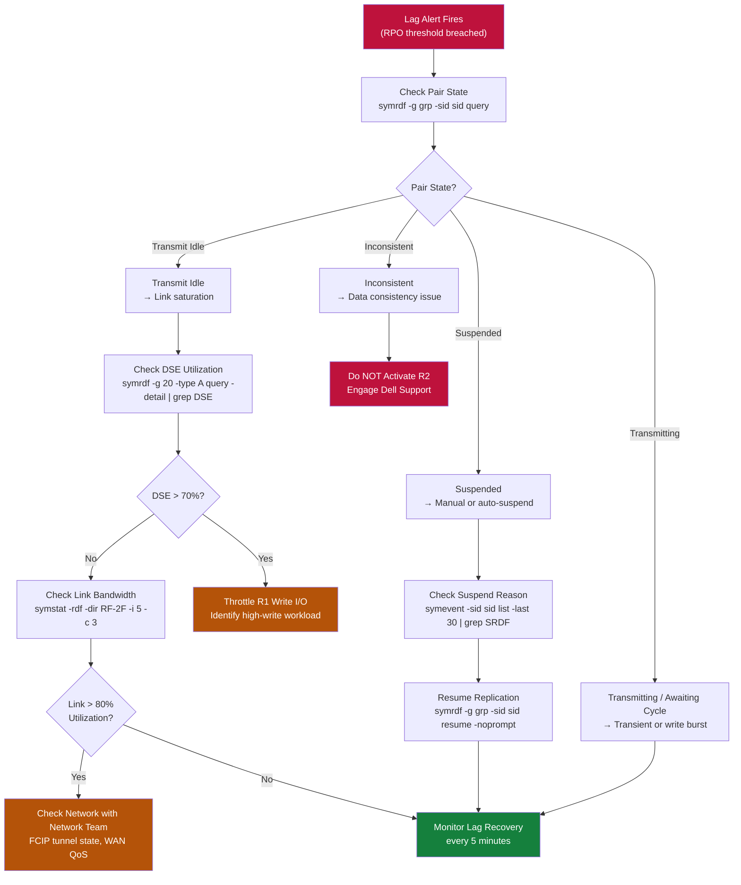

# SRDF/A — Common Issues


<div class="kb-summary">
> Part of the [SRDF/A](../../index.md) reference. Common SRDF/A issues: link failures, increasing cycle times, suspended consistency groups, and volume capacity mismatches. Always collect `symrdf query -g <group> -v` and array event logs before engaging Dell support.
</div>

> Part of the [SRDF/A](../../index.md) reference.

Common SRDF/A issues: link failures, increasing cycle times, suspended consistency groups, and volume capacity mismatches. Always collect `symrdf query -g <group> -v` and array event logs before engaging Dell support. Correlate with network monitoring timestamps to distinguish storage-side from WAN-side causes.

## Lag Alert Triage Decision Tree


```text
┌─────────────────────────────────────── SRDF/A — Common Issues ────────────────────────────────────────┐
│                                                                                                       │
│   │     Symptom      │   Likely Cause   │    First Check    │       Fix        │      Verify      │   │
│   │     High RPO     │cycle time exceed │ symrdf query -cyc │increase bandwidt │    symrdf -v     │   │
│   │    Link down     │ RF port failure  │ symrdf query stat │  failover ports  │  symcfg list -r  │   │
│   │   Pair invalid   │  R1/R2 mismatch  │   symrdf verify   │re-establish pair │  symrdf establi  │   │
│   │  Failover fail   │   R2 not ready   │   check R2 state  │split then failov │   symrdf -sid    │   │
│   └───────────────────────────────────────────────────────────────────────────────────────────────┘   │
│                                                                                                       │
│   ┌───────────────────────────────────────────────────────────────────────────────────────────────┐   │
│   │                                     General Triage Pattern                                    │   │
│   │          Is the issue new or recurring? New = recent change; Recurring = config problem       │   │
│   │             Is it isolated to one source or all? Isolated = agent; All = server/repo          │   │
│   │                                  Check logs first: symrdf query                               │   │
│   │                    If unresolved in 2h: open vendor case with full log bundle                 │   │
│   └───────────────────────────────────────────────────────────────────────────────────────────────┘   │
│                                                                                                       │
│  Physical Infrastructure:                                                                             │
│  Two PowerMax arrays (production + DR site) · FC/FCIP SRDF link (dedicated bandwidth) · RF ports      │
│  Key terms:                                                                                           │
│                                                                                                       │
│  SRDF          = Symmetrix Remote Data Facility; EMC array-based replication technology               │
│  R1            = source SRDF volume on production array; host writes flow here                        │
│  R2            = target SRDF volume on DR array; receives replicated data asynchronously              │
│  Delta Set     = batch of host writes accumulated per SRDF/A cycle; shipped to R2 atomically          │
│  Cycle Time    = SRDF/A replication interval (15–60 seconds); determines maximum RPO                  │
│  symrdf        = Solutions Enabler CLI for SRDF operations: establish, split, failover, restore       │
│  SRDF Link     = FC or FCIP path between R1 and R2 arrays; dedicated, monitored bandwidth             │
│  Suspended     = SRDF pair state where replication is paused; R2 data frozen at last cycle            │
│  Failover      = SRDF operation making R2 read-write; R1 becomes Not Ready to hosts                   │
│  Restore       = after failover resolution, re-establishes replication with R1 as source              │
│  Establish     = initial sync or re-sync operation that copies R1 to R2 in full                       │
│  Split         = breaks SRDF pair temporarily; both R1 and R2 are R/W; no replication                 │
│  FCIP          = Fibre Channel over IP; tunnels FC SRDF traffic over IP WAN link                      │
│  Unisphere     = Dell PowerMax management GUI; REST API; array health and provisioning                │
│                                                                                                       │
└───────────────────────────────────────────────────────────────────────────────────────────────────────┘
```

**Root causes:**

| Cause | Indicator | Why it happens | Remediation |
|---|---|---|---|
| WAN bandwidth saturation | Delta set queue growing; utilisation at 100% | Write rate exceeds provisioned FCIP bandwidth | Contact network team to increase WAN bandwidth or implement QoS |
| Write I/O spike | Delta set size abnormally large | Batch jobs or backups generating burst writes | Identify the high-write workload; schedule heavy batch jobs for off-peak |
| Array backend congestion | R1 or R2 performance counters showing latency | Backend storage pool or disk group under pressure | Check array Unisphere performance; review storage pool or disk group health |
| FCIP GRE overhead miscalculation | MTU issues causing fragmentation | FCIP MTU not accounting for GRE/IPsec encapsulation overhead | Verify FCIP MTU settings on switches; test with `ping -M do -s 1400` |

---

## Consistency Group Suspended Automatically

**Symptom:** SRDF/A pair automatically suspends; state moves to `Suspended` without manual intervention.

This occurs when the delta set grows beyond the array's ability to manage it — the array protects itself by suspending to prevent memory exhaustion.

```bash
# Confirm the suspension and check reason
symrdf -g <dgname> -sid <r1_sid> query
symcfg -sid <r1_sid> list -rdfg <group_num> -v

# Review array events for the suspension trigger
symevent -sid <r1_sid> list -last 30 | grep -i "SRDF\|suspend"
```

**Resolution:**

1. Identify and resolve the cause (WAN congestion, write storm) before resuming.
2. If the cause is resolved, resume and monitor cycle time closely:

```bash
symrdf -g <dgname> -sid <r1_sid> resume -noprompt
symrdf -g <dgname> -sid <r1_sid> query
# Watch for immediate re-suspension — if it re-suspends, the root cause is not resolved
```

---

## Target Volume Capacity Mismatch / Thin Pool Exhaustion

**Symptom:** Replication fails with errors related to target volume space or thin pool.

```bash
# Check target array thin pool utilisation
symcfg -sid <r2_sid> list -pool -thin -v | grep -E "Pool|Used|Free"

# Check individual device capacity on R2
symdev -sid <r2_sid> show <dev_id> | grep -E "Emulation|Capacity|Pool"
```

**Remediation:**

- Expand the thin pool on the R2 array (add more capacity devices via Unisphere).
- If the R2 thin pool is shared with other workloads, review which volumes are consuming the most space.

---

## `Invalid` Pair State

**Symptom:** `symrdf query` shows one or more pairs in `Invalid` state.

This typically follows an unclean failover, a host that wrote to both R1 and R2 simultaneously (split scenario), or a prior `symrdf split` that was not properly resolved.

```bash
# Identify which pairs are in Invalid state
symrdf -g <dgname> -sid <r1_sid> query | grep Invalid

# Check which side has the authoritative data
# If R1 is authoritative (normal scenario — no actual failover occurred)
symrdf -g <dgname> -sid <r1_sid> resync -noprompt
# This pushes R1 data to R2 and re-establishes replication

# If R2 has the latest data (after a real failover — confirm with the application team)
symrdf -g <dgname> -sid <r2_sid> failback -noprompt
```

**Do not run `resync` or `restore` without confirming which side has the correct data.** An incorrect resync will overwrite valid data on the target side.
