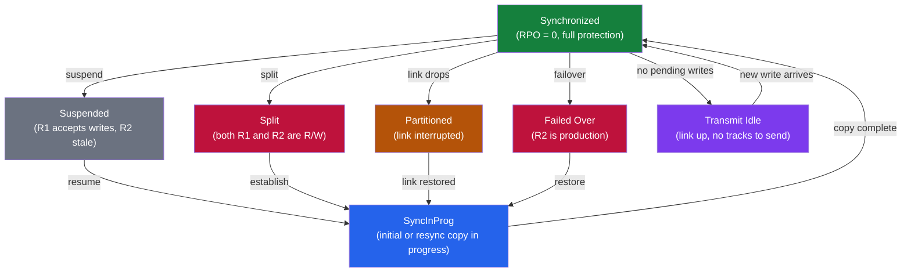

# SRDF/S — Components

> Part of the [SRDF/S Architecture](../) reference.

---

## Array Roles

| Role | Description |
|---|---|
| R1 (Source) | Primary production array — hosts write to R1; every write is synchronously mirrored to R2 |
| R2 (Target) | Secondary DR array — read-only during normal operation; becomes writable after failover |

SRDF director ports on both arrays handle the inter-site replication traffic over FC or FCIP links.

## Synchronous Write Commit Sequence

```mermaid
sequenceDiagram
    participant host as Production Host
    participant r1 as PowerMax R1<br/>(Site A)
    participant link as SRDF Link<br/>(FCIP / FC)
    participant r2 as PowerMax R2<br/>(Site B)

    host->>r1: Write I/O request
    r1->>link: Forward write to R2 (synchronous)
    link->>r2: Deliver write
    r2-->>r1: Acknowledge write committed
    r1-->>host: Acknowledge I/O complete

    Note over r1,r2: Both arrays commit before host ACK
    Note over link: WAN RTT directly adds to host write latency
```

---

## Key Components

- **SRDF Director Ports** — dedicated RDF ports on each PowerMax that carry replication traffic; must be licensed for synchronous mode
- **SRDF Groups (RDFG)** — logical groupings of device pairs that replicate together as a consistency group
- **Device Pairs** — one R1 device mapped to one R2 device of identical size; the pair is the smallest unit of failover
- **Solutions Enabler (SE)** — Dell management CLI host with gatekeeper LUN access; required for SYMCLI operations
- **Unisphere for PowerMax** — GUI and REST API management layer; used for monitoring, performance, and configuration

---

## Pair State

Every SRDF device pair has a **Pair State** that describes the current replication relationship. For SRDF/S (synchronous mode) the most important states are `Synchronized`, `SyncInProg`, `Suspended`, `Failed Over`, and `Split`. Understanding which state a pair is in determines which operations are valid and whether data is protected.

Pair state is visible per device and per RDFG group. Always check at the group level first, then drill into individual devices if anomalies are found.

### State Definitions

| Pair State | Description | Host Write Impact |
|---|---|---|
| Synchronized | R1 and R2 are identical; every R1 write goes synchronously to R2 | Full protection, no RPO |
| SyncInProg | Initial or resync copy in progress; not yet fully synchronized | R1 writable; R2 not consistent |
| Suspended | Replication is paused; R1 continues accepting writes without mirroring | R1 writable; R2 stale |
| Failed Over | R1 unavailable; R2 is now writable | R2 takes production I/O |
| Split | Pair manually split; both volumes are independent | Both writable; no replication |
| Partitioned | RDF link interrupted; pair state indeterminate | Depends on link recovery |
| Transmit Idle | No tracks to send; link is up but idle | Protected, no active copy |

### Querying Pair State

```bash
# Summary query for all devices in an RDFG group
symrdf -g 10 query

# Detailed output including track counts and link state
symrdf -g 10 query -detail

# Query a specific device
symrdf -sid 0001 -dev 0A1 query

# Query across all RDFG groups on the array
symcfg list -rdfg all

# Show RDF director and port status
symcfg list -dir all -rdf

# Output query to file for audit
symrdf -g 10 query -detail > /tmp/rdfg10_state_$(date +%Y%m%d_%H%M%S).txt
```

### Transitioning Between States

```bash
# Suspend replication (planned maintenance)
symrdf -g 10 -type S suspend -noprompt

# Resume from Suspended back to Synchronized
symrdf -g 10 -type S resume -noprompt

# Establish (initial sync or re-establish after split)
symrdf -g 10 -type S establish -noprompt

# Split pair (both sides become independent, no replication)
symrdf -g 10 -type S split -noprompt

# Restore (copy R2 data back to R1 after Failed Over)
symrdf -g 10 -type S restore -noprompt
```

### Normal vs. Alert States

A healthy SRDF/S environment shows all pairs as `Synchronized` with 0 invalid tracks during steady-state operation. Alert conditions requiring immediate attention:

```bash
# Find any device not in Synchronized state
symrdf -g 10 query | grep -v Synchronized

# Check track counts for out-of-sync data
symrdf -g 10 query -detail | grep -E "Tracks|Pair State"

# Check RDF link health
symcfg list -rdfg 10 -detail
```

Expected output for a healthy pair:

```
Dev      R1 State     R2 State     Pair State     Tracks
----     --------     --------     ----------     ------
0A1      RW           WD           Synchronized   0
0A2      RW           WD           Synchronized   0
```

### Pair State Transition Diagram



### Known Issues and Field Notes

- **Pairs stuck in SyncInProg**: Usually caused by heavy host I/O overwhelming the RDF link. Check link utilization with `symstat -rdf` and consider suspending non-critical pairs during peak hours.
- **Unexpected Suspended state after link bounce**: A temporary network interruption can transition pairs to Suspended automatically if the array detects it cannot maintain synchronous commit. Resume once the link is confirmed stable.
- **Partitioned state persists after link recovery**: Run `symrdf -g <rdfg> query -detail` to verify link status. If the link shows Online but pairs remain Partitioned, a manual `establish` may be required after confirming data consistency.
- **Failed Over devices visible on both arrays**: This is expected. The R1 side shows `Not Ready (NR)` and the R2 side shows `RW`. Do not attempt to make R1 writable while R2 is in production use.
