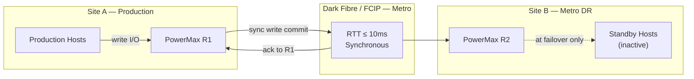

# SRDF/S — Standards


<div class="kb-summary">
> Part of the [SRDF/S Architecture](../index.md) reference.
</div>

---

## RTT and Latency Budget

SRDF/S commits every host write synchronously across the replication link. The host write RTT equals local storage latency + 2× WAN latency. Document and enforce maximum RTT before production enablement.

| Site Distance | Typical RTT | Max Acceptable | Why | Notes |
|---|---|---|---|---|
| Campus / same campus | < 1ms | 2ms | Negligible WAN penalty on host write latency | Ideal for SRDF/S |
| Metro (≤ 100km dark fibre) | 1–5ms | 5ms | RTT within application tolerance for most workloads | Within spec |
| Metro (> 100km) | 5–10ms | ≤ 10ms | Latency penalty becomes noticeable on high-IOPS workloads | Borderline — test under peak load |
| WAN (> 200km) | > 10ms | Not recommended | Synchronous commit would add > 20ms to every write — use SRDF/A | Use SRDF/A instead |


```text
┌────────────────────────────────────── SRDF/S — Design Standards ──────────────────────────────────────┐
│                                                                                                       │
│   ┌──────────────────────────────────────────────┐  ┌─────────────────────────────────────────────┐   │
│   │              Sizing Guidelines               │  │               HA Requirements               │   │
│   │         Deduplicate where supported          │  │           N+1 component redundancy          │   │
│   │          Bandwidth: 10 GbE minimum           │  │          Heartbeat / health monitor         │   │
│   │          Storage: 130% of raw data           │  │          Separate mgmt / data VLANs         │   │
│   │         Latency: < 10 ms to storage          │  │          Out-of-band access (IPMI)          │   │
│   │           CPU: 8+ vCPU for engine            │  │          Anti-affinity VM placement         │   │
│   └──────────────────────────────────────────────┘  └─────────────────────────────────────────────┘   │
│                                                                                                       │
│    Ports: Dark fiber FC (< 5 ms RTT) · DWDM long-haul FC · 9443 (Unisphere)                           │
│                                                                                                       │
│   ┌───────────────────────────────────────────────────────────────────────────────────────────────┐   │
│   │                                  Standard SRDF/S Design Rules                                 │   │
│   │            RPO target drives snapshot/cycle frequency — document in service design            │   │
│   │            RTO target drives recovery tier: instant, warm standby, or cold restore            │   │
│   │                  Dedicated backup network VLAN — no shared production traffic                 │   │
│   │          Encryption: Data identical at R2; FA port encryption optional; Unisphere TLS         │   │
│   │               Service accounts: minimum privilege; rotate credentials quarterly               │   │
│   └───────────────────────────────────────────────────────────────────────────────────────────────┘   │
│                                                                                                       │
│  Physical Infrastructure:                                                                             │
│  Two PowerMax arrays · Dark fiber / DWDM FC link · Low-latency network (< 200 km) · RF director ports │
│  Key terms:                                                                                           │
│                                                                                                       │
│  SRDF/S        = Synchronous SRDF; every R1 write is mirrored to R2 before host acknowledgment        │
│  R1            = source volume; write is held pending R2 confirmation — adds WAN RTT to latency       │
│  R2            = target volume; must acknowledge each write; acts as synchronous mirror               │
│  RTT           = Round-Trip Time between R1 and R2 arrays; directly added to host write latency       │
│  RPO=0         = zero recovery point objective; no data loss possible under normal operation          │
│  RTO           = Recovery Time Objective; SRDF/S failover typically < 5 minutes manual, < 1 min       │
│  symrdf        = CLI for all SRDF operations: establish, split, suspend, failover, restore, ver       │
│  Pair State    = Synchronized | Consistent | Suspended | Failed Over | Split                          │
│  Consistent    = transient state where R1 write is in transit but not yet confirmed on R2             │
│  Failover      = makes R2 read-write; production continues from DR site after R1 failure              │
│  Restore       = re-synchronises after failover; direction is reversed until R1 catches up            │
│  RDFG          = RDF Group: logical grouping of SRDF pairs sharing same link and parameters           │
│  FA Port       = Front-End Adapter port on PowerMax; used for host connectivity (non-SRDF)            │
│  RF Port       = Remote Fabric port on PowerMax; used exclusively for SRDF replication traffic        │
│                                                                                                       │
└───────────────────────────────────────────────────────────────────────────────────────────────────────┘
```

Where 1.25 = 25% headroom for burst absorption.

Measure peak write throughput:
```bash
symstat -sid <SID> -type rdf -i 5 -c 12   # 5-second samples, 12 cycles = 1 minute
```

Sizing must be validated at peak (end-of-month batch, backup window) — not average load.

---

## Target Volume Standards

- R2 volumes must be identical in size to R1 — no thin over-subscription on R2
- R2 emulation and track format must match R1 exactly
- R2 volumes should not be presented to hosts except during planned failover or DR test

Verify before establishing:
```bash
symdev show -sid <target_SID> <dev_id> | grep -E "Size|Emulation|Track"
```

---

## Test Frequency

| Test Type | Minimum Frequency | Why |
|---|---|---|
| Non-disruptive pair state verification | Monthly | Confirms Synchronized state and zero invalid tracks without impacting production |
| SRM recovery plan test (non-production) | Quarterly | Validates SRA discovery, protection group integrity, and recovery plan steps |
| Full failover test (maintenance window) | Annually | Confirms end-to-end RTO including host masking, VM startup, and application validation |
| RTT re-validation after WAN changes | After every network change affecting SRDF links | WAN routing changes can silently increase RTT beyond the SRDF/S tolerance |

---

## Recovery Time Standards

| RTO Category | Target | Notes |
|---|---|---|
| Planned failover (SRM automated) | < 15 minutes | Per recovery plan |
| Unplanned failover (manual) | < 30 minutes | DR runbook execution |
| Post-failover data validation | < 60 minutes | Application-level check |
