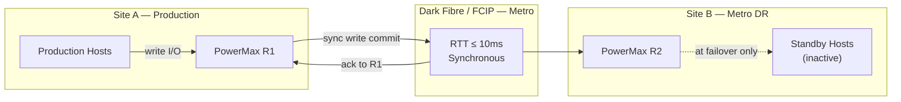

# SRDF/S — Standards

> Part of the [SRDF/S Architecture](../index.md) reference.

---

## RTT and Latency Budget

SRDF/S commits every host write synchronously across the replication link. The host write RTT equals local storage latency + 2× WAN latency. Document and enforce maximum RTT before production enablement.

| Site Distance | Typical RTT | Max Acceptable | Why | Notes |
|---|---|---|---|---|
| Campus / same campus | < 1ms | 2ms | Negligible WAN penalty on host write latency | Ideal for SRDF/S |
| Metro (≤ 100km dark fibre) | 1–5ms | 5ms | RTT within application tolerance for most workloads | Within spec |
| Metro (> 100km) | 5–10ms | ≤ 10ms | Latency penalty becomes noticeable on high-IOPS workloads | Borderline — test under peak load |
| WAN (> 200km) | > 10ms | Not recommended | Synchronous commit would add > 20ms to every write — use SRDF/A | Use SRDF/A instead |


```

---

## SRDF Group Design Rules

- One SRDF/S group per application tier — isolate DB, APP, and WEB tiers
- Never mix tiers in a single consistency group
- Maximum 2,048 devices per SRDF group
- Three-site design: SRDF/S to secondary (RPO=0), SRDF/A to tertiary (RPO=30s)

```text
RDFG-S-<site-pair>-<tier>-<seq>
```

Examples:
- `RDFG-S-DC1DC2-DB-01`
- `RDFG-S-DC1DC2-APP-01`
- `RDFG-S-DC1DC2-WEB-01`

---

## Bandwidth Sizing

Every host write is replicated synchronously — bandwidth must sustain peak write throughput without queueing.

```text
Required bandwidth (MB/s) = peak_write_throughput_MB_s × 1.25
```

Where 1.25 = 25% headroom for burst absorption.

Measure peak write throughput:
```bash
symstat -sid <SID> -type rdf -i 5 -c 12   # 5-second samples, 12 cycles = 1 minute
```

Sizing must be validated at peak (end-of-month batch, backup window) — not average load.

---

## Target Volume Standards

- R2 volumes must be identical in size to R1 — no thin over-subscription on R2
- R2 emulation and track format must match R1 exactly
- R2 volumes should not be presented to hosts except during planned failover or DR test

Verify before establishing:
```bash
symdev show -sid <target_SID> <dev_id> | grep -E "Size|Emulation|Track"
```

---

## Test Frequency

| Test Type | Minimum Frequency | Why |
|---|---|---|
| Non-disruptive pair state verification | Monthly | Confirms Synchronized state and zero invalid tracks without impacting production |
| SRM recovery plan test (non-production) | Quarterly | Validates SRA discovery, protection group integrity, and recovery plan steps |
| Full failover test (maintenance window) | Annually | Confirms end-to-end RTO including host masking, VM startup, and application validation |
| RTT re-validation after WAN changes | After every network change affecting SRDF links | WAN routing changes can silently increase RTT beyond the SRDF/S tolerance |

---

## Recovery Time Standards

| RTO Category | Target | Notes |
|---|---|---|
| Planned failover (SRM automated) | < 15 minutes | Per recovery plan |
| Unplanned failover (manual) | < 30 minutes | DR runbook execution |
| Post-failover data validation | < 60 minutes | Application-level check |
