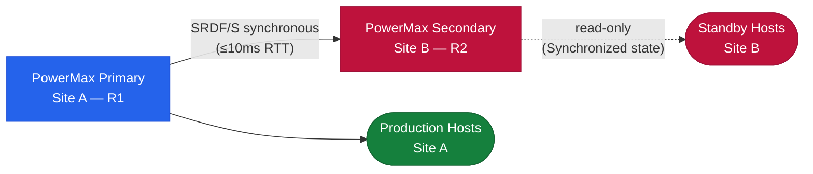

# SRDF/S — How It Works


<div class="kb-summary">
How It Works reference covering Overview, Write Commit Model, RTT Requirements, Recovery Time Standards.
</div>

## Overview

SRDF/S (Synchronous) provides zero-data-loss replication between two PowerMax arrays. Every host write is committed to both the source (R1) and target (R2) before an acknowledgement is returned to the host. This guarantees RPO = 0 at the cost of write latency, which is directly proportional to inter-site round-trip time (RTT). Use case: financial transaction systems, active-active cluster workloads, and DR configurations where RPO = 0 is contractually required.

## Write Commit Model


┌──────────────────────────────────────── SRDF/S — How It Works ────────────────────────────────────────┐
│                                                                                                       │
│    SRDF/S data flow — from source to target through the protection pipeline:                          │
│                                                                                                       │
│   ┌───────────────────────────────────────────────────────────────────────────────────────────────┐   │
│   │                                 1  Source / Production System                                 │   │
│   │           R1 Volume (Source)  — production PowerMax; write holds until R2 acknowledges        │   │
│   │               Host writes are intercepted or snapshotted by the SRDF/S agent/proxy            │   │
│   │                  Changed blocks tracked via CBT / journal / delta-set mechanism               │   │
│   │                 Consistency ensured at quiesce point before data transfer begins              │   │
│   └───────────────────────────────────────────────────────────────────────────────────────────────┘   │
│                                                                                                       │
│    Changed data forwarded to the SRDF/S engine — compression and encryption applied in transit        │
│                                                                                                       │
│                                                   ▼                                                   │
│                                                                                                       │
│   ┌───────────────────────────────────────────────────────────────────────────────────────────────┐   │
│   │                                        2  SRDF/S Engine                                       │   │
│   │          R2 Volume (Target)  — DR PowerMax; must confirm write before host I/O completes      │   │
│   │                    Data compressed, deduplicated, and encrypted before storage                │   │
│   │                  Metadata catalog updated; job status reported to control plane               │   │
│   │                                     symrdf establish -type s                                  │   │
│   └───────────────────────────────────────────────────────────────────────────────────────────────┘   │
│                                                                                                       │
│                                                   ▼                                                   │
│                                                                                                       │
│   ┌───────────────────────────────────────────────────────────────────────────────────────────────┐   │
│   │                                     3  Target / Repository                                    │   │
│   │         SRDF/S Engine       — synchronous write mirroring; adds WAN RTT to write latency      │   │
│   │                  Recovery point written; retention policy applied automatically               │   │
│   │                                     Restore: symrdf failover                                  │   │
│   │                     RTO driven by target storage performance and data volume                  │   │
│   └───────────────────────────────────────────────────────────────────────────────────────────────┘   │
│                                                                                                       │
│  Physical Infrastructure:                                                                             │
│  Two PowerMax arrays · Dark fiber / DWDM FC link · Low-latency network (< 200 km) · RF director ports │
│  Key terms:                                                                                           │
│                                                                                                       │
│  SRDF/S        = Synchronous SRDF; every R1 write is mirrored to R2 before host acknowledgment        │
│  R1            = source volume; write is held pending R2 confirmation — adds WAN RTT to latency       │
│  R2            = target volume; must acknowledge each write; acts as synchronous mirror               │
│  RTT           = Round-Trip Time between R1 and R2 arrays; directly added to host write latency       │
│  RPO=0         = zero recovery point objective; no data loss possible under normal operation          │
│  RTO           = Recovery Time Objective; SRDF/S failover typically < 5 minutes manual, < 1 min       │
│  symrdf        = CLI for all SRDF operations: establish, split, suspend, failover, restore, ver       │
│  Pair State    = Synchronized | Consistent | Suspended | Failed Over | Split                          │
│  Consistent    = transient state where R1 write is in transit but not yet confirmed on R2             │
│  Failover      = makes R2 read-write; production continues from DR site after R1 failure              │
│  Restore       = re-synchronises after failover; direction is reversed until R1 catches up            │
│  RDFG          = RDF Group: logical grouping of SRDF pairs sharing same link and parameters           │
│  FA Port       = Front-End Adapter port on PowerMax; used for host connectivity (non-SRDF)            │
│  RF Port       = Remote Fabric port on PowerMax; used exclusively for SRDF replication traffic        │
│                                                                                                       │
└───────────────────────────────────────────────────────────────────────────────────────────────────────┘
```

## RTT Requirements

| Site Distance | Typical RTT | Max Acceptable | Notes |
|---|---|---|---|
| Campus / same campus | < 1ms | 2ms | Ideal for SRDF/S |
| Metro (≤ 100km dark fibre) | 1–5ms | 5ms | Within spec |
| Metro (> 100km) | 5–10ms | ≤ 10ms | Borderline — test under peak load |
| WAN (> 200km) | > 10ms | Not recommended | Use SRDF/A instead |

## Recovery Time Standards

| RTO Category | Target |
|---|---|
| Planned failover (SRM automated) | < 15 minutes |
| Unplanned failover (manual) | < 30 minutes |
| Post-failover data validation | < 60 minutes |
