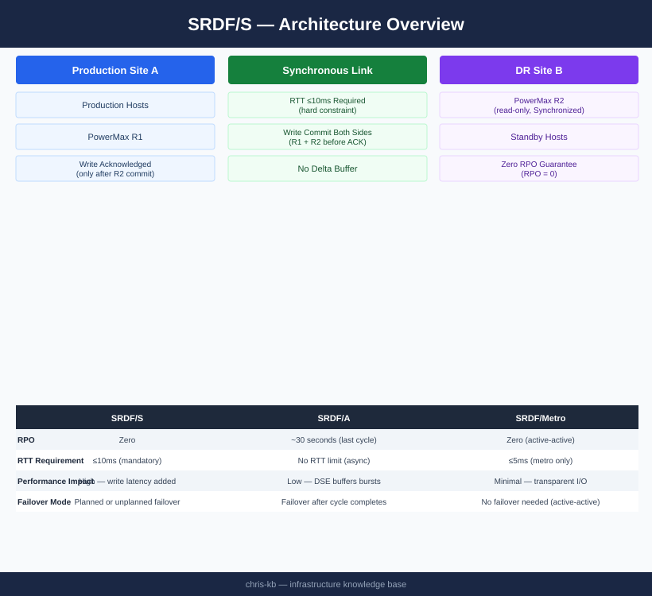

# SRDF/S — Architecture

<div class="kb-summary">
Dell PowerMax SRDF/S synchronous replication — every host write is committed to both R1 and R2 before acknowledgement, guaranteeing RPO = 0; requires ≤10ms inter-site RTT.
</div>

```text
┌──────────────────────────────────────── SRDF/S — Architecture ────────────────────────────────────────┐
│                                                                                                       │
│   ┌───────────────────────────────────────────────────────────────────────────────────────────────┐   │
│   │                                SRDF/S — Component Architecture                                │   │
│   │          R1 Volume (Source)  — production PowerMax; write holds until R2 acknowledges         │   │
│   │        R2 Volume (Target)  — DR PowerMax; must confirm write before host I/O completes        │   │
│   │        SRDF/S Engine       — synchronous write mirroring; adds WAN RTT to write latency       │   │
│   │            Ports: Dark fiber FC (< 5 ms RTT) · DWDM long-haul FC · 9443 (Unisphere)           │   │
│   └───────────────────────────────────────────────────────────────────────────────────────────────┘   │
│                                                                                                       │
│    Three-tier component model — control plane, data plane, and management                             │
│                                                                                                       │
│                          ▼                        ▼                        ▼                          │
│                                                                                                       │
│   ┌─────────────────────────────┐  ┌─────────────────────────────┐  ┌─────────────────────────────┐   │
│   │        Control Plane        │  │          Data Plane         │  │          Management         │   │
│   │ R1 Volume (Source)  — produc│  │ R2 Volume (Target)  — DR Pow│  │ PowerMax Mgmt       — Unisph│   │
│   │          Scheduling         │  │      Replication/Backup     │  │  Dark fiber FC (< 5 ms RTT) │   │
│   │         Policy mgmt         │  │        Data movement        │  │           REST API          │   │
│   │          Catalog/DB         │  │        Dedup/compress       │  │             RBAC            │   │
│   │          Job engine         │  │      DWDM long-haul FC      │  │           Alerting          │   │
│   └─────────────────────────────┘  └─────────────────────────────┘  └─────────────────────────────┘   │
│                                                                                                       │
│  Physical Infrastructure:                                                                             │
│  Two PowerMax arrays · Dark fiber / DWDM FC link · Low-latency network (< 200 km) · RF director ports │
│  Key terms:                                                                                           │
│                                                                                                       │
│  SRDF/S        = Synchronous SRDF; every R1 write is mirrored to R2 before host acknowledgment        │
│  R1            = source volume; write is held pending R2 confirmation — adds WAN RTT to latency       │
│  R2            = target volume; must acknowledge each write; acts as synchronous mirror               │
│  RTT           = Round-Trip Time between R1 and R2 arrays; directly added to host write latency       │
│  RPO=0         = zero recovery point objective; no data loss possible under normal operation          │
│  RTO           = Recovery Time Objective; SRDF/S failover typically < 5 minutes manual, < 1 min       │
│  symrdf        = CLI for all SRDF operations: establish, split, suspend, failover, restore, ver       │
│  Pair State    = Synchronized | Consistent | Suspended | Failed Over | Split                          │
│  Consistent    = transient state where R1 write is in transit but not yet confirmed on R2             │
│  Failover      = makes R2 read-write; production continues from DR site after R1 failure              │
│  Restore       = re-synchronises after failover; direction is reversed until R1 catches up            │
│  RDFG          = RDF Group: logical grouping of SRDF pairs sharing same link and parameters           │
│  FA Port       = Front-End Adapter port on PowerMax; used for host connectivity (non-SRDF)            │
│  RF Port       = Remote Fabric port on PowerMax; used exclusively for SRDF replication traffic        │
│                                                                                                       │
└───────────────────────────────────────────────────────────────────────────────────────────────────────┘
```


<div class="kb-grid kb-grid-3">
<a class="kb-card" href="how-it-works/"><strong>How It Works</strong><span>Synchronous write commit model, pair states, RTT requirements, SYMCLI commands, and RTO targets.</span></a>
<a class="kb-card" href="integrations/"><strong>Integrations</strong><span>SRM automated failover, Solutions Enabler, and SRDF/Metro active-active variant.</span></a>
<a class="kb-card" href="design-standards/"><strong>Design Standards</strong><span>RTT thresholds, SRDF group naming, consistency group design, and failover runbook.</span></a>
</div>

| Pair State | Description | Host Write Impact |
|---|---|---|
| Synchronized | R1 and R2 identical; writes committed to both | Full protection, RPO = 0 |
| SyncInProg | Initial or resync copy in progress | R1 writable; R2 not consistent |
| Suspended | Replication paused | R1 writable; R2 stale |
| Failed Over | R1 unavailable; R2 writable | R2 takes production I/O |


