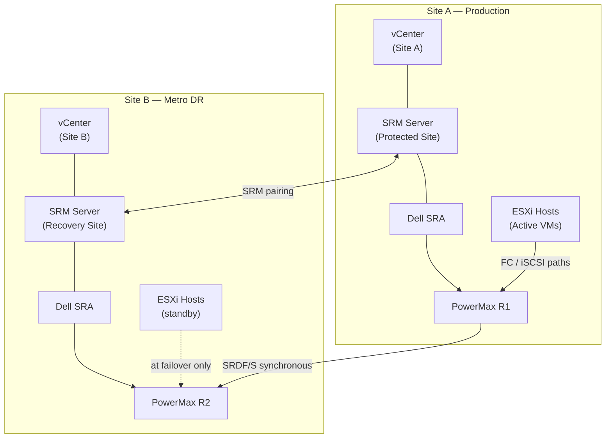

# SRDF/S — Integrations


<div class="kb-summary">
> Part of the [SRDF/S Architecture](../index.md) reference.
</div>

---

## vMSC and SRM Integration Topology


┌───────────────────────────────── SRDF/S — Architecture Integrations ──────────────────────────────────┐
│                                                                                                       │
│   ┌───────────────────────────────────────────────────────────────────────────────────────────────┐   │
│   │                              SRDF/S — External Integration Points                             │   │
│   │       Auth: Symmetrix admin credentials; Solutions Enabler; Unisphere role-based access       │   │
│   │             Storage: connected via Dark fiber FC (< 5 ms RTT) · DWDM long-haul FC             │   │
│   │            Monitoring: SNMP traps / syslog / REST API to ITSM and alerting systems            │   │
│   │    Encryption: Data identical to R1 at R2; FA port encryption optional; Unisphere TLS/HTTPS   │   │
│   └───────────────────────────────────────────────────────────────────────────────────────────────┘   │
│                                                                                                       │
│                          ▼                        ▼                        ▼                          │
│                                                                                                       │
│   ┌─────────────────────────────┐  ┌─────────────────────────────┐  ┌─────────────────────────────┐   │
│   │           Identity          │  │           Storage           │  │          Monitoring         │   │
│   │          AD / LDAP          │  │  Dark fiber FC (< 5 ms RTT) │  │        SNMP / syslog        │   │
│   │           SAML SSO          │  │      DWDM long-haul FC      │  │         REST webhook        │   │
│   │          RBAC roles         │  │       NFS / iSCSI / FC      │  │         Email alerts        │   │
│   │         MFA optional        │  │       Dedup appliance       │  │          ServiceNow         │   │
│   │          Cert auth          │  │        Object storage       │  │          Prometheus         │   │
│   └─────────────────────────────┘  └─────────────────────────────┘  └─────────────────────────────┘   │
│                                                                                                       │
│  Physical Infrastructure:                                                                             │
│  Two PowerMax arrays · Dark fiber / DWDM FC link · Low-latency network (< 200 km) · RF director ports │
│  Key terms:                                                                                           │
│                                                                                                       │
│  SRDF/S        = Synchronous SRDF; every R1 write is mirrored to R2 before host acknowledgment        │
│  R1            = source volume; write is held pending R2 confirmation — adds WAN RTT to latency       │
│  R2            = target volume; must acknowledge each write; acts as synchronous mirror               │
│  RTT           = Round-Trip Time between R1 and R2 arrays; directly added to host write latency       │
│  RPO=0         = zero recovery point objective; no data loss possible under normal operation          │
│  RTO           = Recovery Time Objective; SRDF/S failover typically < 5 minutes manual, < 1 min       │
│  symrdf        = CLI for all SRDF operations: establish, split, suspend, failover, restore, ver       │
│  Pair State    = Synchronized | Consistent | Suspended | Failed Over | Split                          │
│  Consistent    = transient state where R1 write is in transit but not yet confirmed on R2             │
│  Failover      = makes R2 read-write; production continues from DR site after R1 failure              │
│  Restore       = re-synchronises after failover; direction is reversed until R1 catches up            │
│  RDFG          = RDF Group: logical grouping of SRDF pairs sharing same link and parameters           │
│  FA Port       = Front-End Adapter port on PowerMax; used for host connectivity (non-SRDF)            │
│  RF Port       = Remote Fabric port on PowerMax; used exclusively for SRDF replication traffic        │
│                                                                                                       │
└───────────────────────────────────────────────────────────────────────────────────────────────────────┘
```

---

## Backup from R2

To offload backup I/O from production (R1), take SnapVX snapshots on the R2 side:

```bash
symsnap -sid <target_SID> -sg <sg_name> create -name BACKUP_$(date +%Y%m%d) -ttl 3
# Mount the linked copy to a backup proxy server
symsnap -sid <target_SID> -sg <sg_name> link -name BACKUP_$(date +%Y%m%d) -lnsg <proxy_sg>
```

Note: always snapshot the R2 while it is in `Synchronized` state to ensure consistency.
