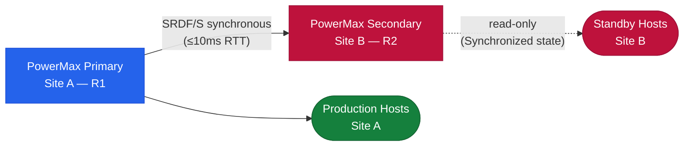

# SRDF/S — Overview

> Part of the [SRDF/S Architecture](../) reference.

---
## Overview

SRDF/S (Synchronous) provides zero-data-loss replication between two PowerMax arrays. Every host write is committed to both the source (R1) and target (R2) before an acknowledgement is returned to the host. This guarantees **RPO = 0** at the cost of write latency, which is directly proportional to the inter-site round-trip time (RTT).

**Use case:** Applications that cannot tolerate any data loss — financial transaction systems, active-active cluster workloads, and DR configurations where RPO = 0 is contractually required.

---

## Write Commit Model

This provides:
- Zero data loss between production and metro DR
- Cost-effective remote protection without requiring synchronous WAN bandwidth to the remote site

---

## Licensing

- SRDF/S license required on both arrays (separate from SRDF/A license)
- SRDF director ports must be licensed for synchronous replication
- SRDF/Metro (active-active SRDF/S variant) requires an additional license
