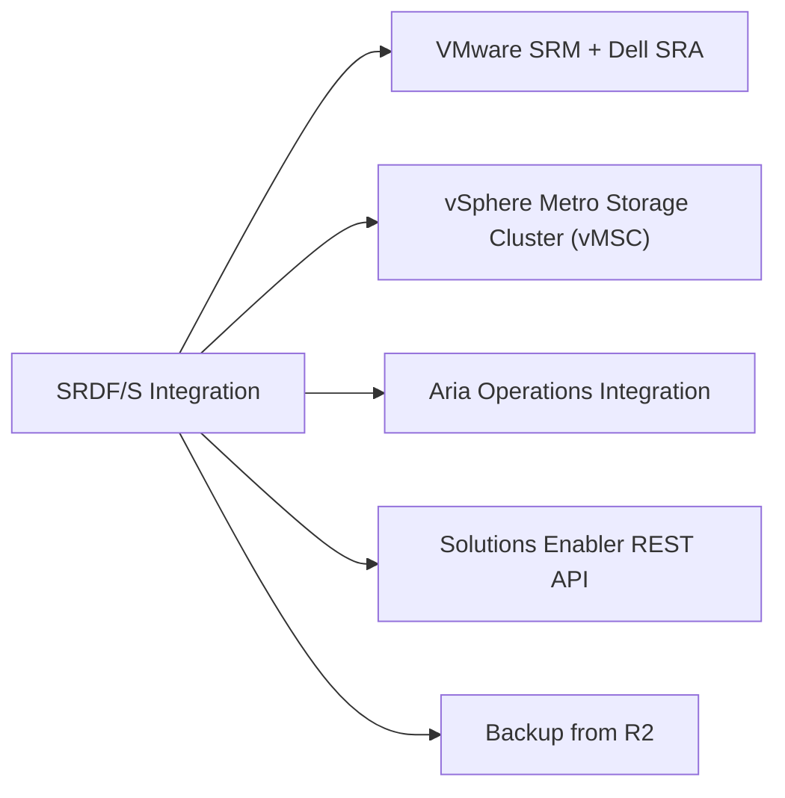

# SRDF/S Integration



## VMware SRM + Dell SRA

The Dell Storage Replication Adapter (SRA) enables Site Recovery Manager to discover and manage SRDF/S replicated datastores for automated failover.

### Installation

1. Download the Dell SRA for PowerMax from dell.com/support — install on each SRM server (protected and recovery site)
2. In vCenter → SRM → Array Managers → Add:
   - Array Manager Name: `PowerMax-<SID>`
   - Manager type: Dell EMC PowerMax/VMAX
   - Unisphere URL: `https://<unisphere-ip>:8443`
   - Username/password: dedicated svc_srm account with `StorageAdmin` role

### Protection Group Configuration

```bash
# Verify SRM can discover SRDF groups
# In SRM: Array Managers → Rescan Devices
# All SRDF/S groups should appear as replication candidates
```

Map each protection group to an SRDF group:
- One protection group per SRDF group (one per application tier)
- Include all datastores in the consistency group within a single protection group

## vSphere Metro Storage Cluster (vMSC)

SRDF/S supports vMSC configurations with RPO=0 for stretched clusters:

- Both sites present the same SRDF/S volumes to ESXi hosts via separate fabric paths
- vSphere HA configured with `vm.minLastFailoverTime = 0` for immediate failover
- vSAN witness appliance in a third site (or substitute with PDL handling policies)
- Host affinity rules keep VMs at their preferred site under normal operation

Verify vMSC readiness:
```bash
esxcli storage nmp path list | grep -i powermax   # Confirm paths at both sites
```

## Aria Operations Integration

The PowerMax management pack surfaces SRDF/S health in Aria Ops dashboards:

- SRDF pair state (`Synchronized`, `SyncInProg`, `Split`)
- Write latency penalty imposed by synchronous replication
- Link health and director port errors
- Cycle time trends for capacity planning

Install the management pack from Aria Marketplace → search "PowerMax" → Deploy.

## Solutions Enabler REST API

The Unisphere REST API enables programmatic SRDF/S pair management from Ansible or Terraform:

```bash
# Authenticate
curl -k -u svc_api:password https://<unisphere>:8443/univmax/restapi/system/version

# List SRDF groups
GET /univmax/restapi/91/replication/symmetrix/{sid}/rdf_group

# Get pair state
GET /univmax/restapi/91/replication/symmetrix/{sid}/rdf_group/{rdfgNumber}/volume/{devId}

# Split pair (planned failover)
PUT /univmax/restapi/91/replication/symmetrix/{sid}/rdf_group/{rdfgNumber}/volume
Body: {"action": "Split", "executionOption": "SYNCHRONOUS"}
```

## Backup from R2

To offload backup I/O from production (R1), take SnapVX snapshots on the R2 side:

```bash
symsnap -sid <target_SID> -sg <sg_name> create -name BACKUP_$(date +%Y%m%d) -ttl 3
# Mount the linked copy to a backup proxy server
symsnap -sid <target_SID> -sg <sg_name> link -name BACKUP_$(date +%Y%m%d) -lnsg <proxy_sg>
```

Note: always snapshot the R2 while it is in `Synchronized` state to ensure consistency.
