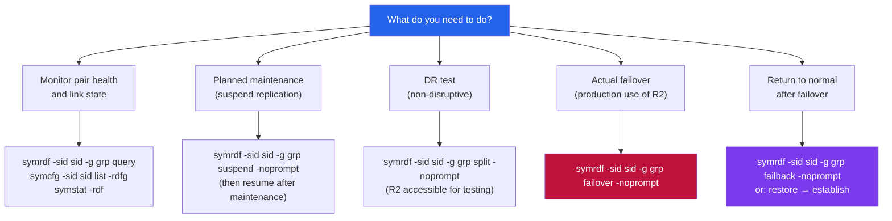

# SRDF/S — CLI Reference

> Part of the [SRDF/S Operations](../index.md) reference.

All SRDF/S management is performed via SYMCLI (Solutions Enabler). Commands require appropriate RBAC permissions and must be run from a Solutions Enabler host with connectivity to the array. Always specify `-g <group>` to scope operations to the correct SRDF group and `-sid <sid>` to target the correct array.

## SRDF/S Operation Decision Map



---

## Pair State & Health

Monitor SRDF/S pair states and link health before and after any change.

```bash
# Show pair states for all devices in an SRDF group
symrdf -sid <sid> -g <group> query

# Verbose pair state detail
symrdf -sid <sid> -g <group> query -v

# List all SRDF groups with port and link state
symcfg -sid <sid> list -rdfg

# List all SRDF groups — both sides
symcfg list -rdfg -v

# Show SRDF link performance counters
symstat -sid <sid> -type rdf -v
```

---

## Device Groups

Device groups scope SRDF operations. Confirm group membership before running any failover or resync.

```bash
# List all device groups
symdg list

# Show devices in a specific group
symdg show <group_name>

# List SRDF group membership
symrdf -sid <sid> list -v

# Show full device pair detail
symrdf -sid <sid> -g <group> -v show
```

---

## Establish & Suspend

Use establish to create or re-establish synchronous replication. Use suspend carefully — it stops replication.

```bash
# Establish (initial sync or re-establish after split)
symrdf -sid <sid> -g <group> establish -noprompt

# Suspend replication (R2 becomes read/write accessible)
symrdf -sid <sid> -g <group> suspend -noprompt

# Check pair state after suspend
symrdf -sid <sid> -g <group> query
```

---

## Failover & Failback

Failover makes R2 the new production side. Always run in a maintenance window except during a real DR event.

```bash
# Planned failover (splits pairs, R2 becomes R/W)
symrdf -sid <sid> -g <group> failover -noprompt

# Verify R2 is now active
symrdf -sid <sid> -g <group> query

# Failback to original R1 (after restoring R1 site)
symrdf -sid <sid> -g <group> failback -noprompt

# Resynchronise after failover or split
symrdf -sid <sid> -g <group> resync -noprompt
```

---

## Swap & Metro Operations

For SRDF/Metro or swap operations on bidirectional configurations.

```bash
# Swap R1/R2 roles
symrdf -sid <sid> -g <group> swap -noprompt

# Set SRDF mode to synchronous
symrdf -sid <sid> -g <group> setmode -sync -noprompt

# Set SRDF mode to asynchronous (temporary degraded mode)
symrdf -sid <sid> -g <group> setmode -acp_disk -noprompt
```

---

## Common Health Check Sequence

```bash
# Full SRDF/S pre-change health check
symcfg -sid <sid> list -rdfg
symrdf -sid <sid> -g <group> query
symrdf -sid <sid> list -v
symdg show <group_name>
```
