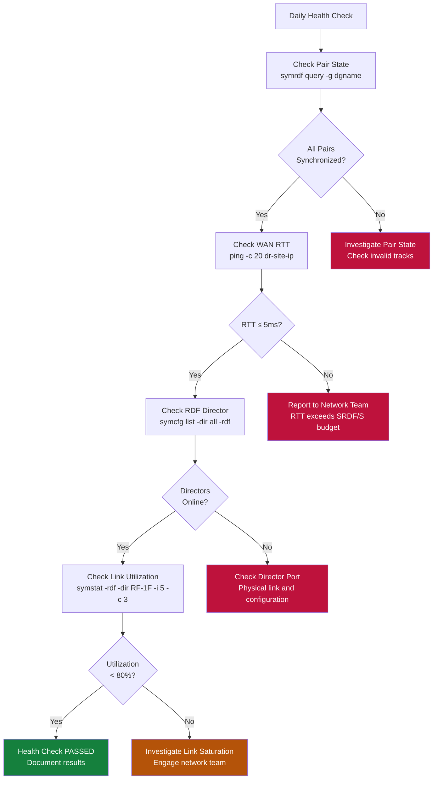

# SRDF/S — Health Checks


<div class="kb-summary">
> Part of the [SRDF/S Operations](../index.md) reference. Regular health checks on SRDF/S replication confirm that all device pairs are synchronized, RDF directors and links are operational, and no track backlogs exist.
</div>

> Part of the [SRDF/S Operations](../index.md) reference.

Regular health checks on SRDF/S replication confirm that all device pairs are synchronized, RDF directors and links are operational, and no track backlogs exist. These checks should run daily as part of infrastructure monitoring and immediately before any planned failover or maintenance activity.

Health checks cover four layers: pair state, link/director status, performance metrics, and array-level configuration consistency.


┌─────────────────────────────────────── SRDF/S — Health Checks ────────────────────────────────────────┐
│                                                                                                       │
│   ┌───────────────────────────────────────────────────────────────────────────────────────────────┐   │
│   │                                SRDF/S — Health Check Procedures                               │   │
│   │                 Run these checks daily/weekly to confirm protection is working                │   │
│   │                                           symrdf query                                        │   │
│   │                  Review job completion rate — target 100%; investigate failures               │   │
│   │                         Check replication/backup lag against RPO target                       │   │
│   └───────────────────────────────────────────────────────────────────────────────────────────────┘   │
│                                                                                                       │
│   │      Check       │  What to verify  │      Expected     │    Frequency     │  Action if bad   │   │
│   │    Job status    │All jobs complete │    100% success   │      Daily       │ Triage failures  │   │
│   │    Lag / RPO     │ Replication lag  │    < RPO target   │      Daily       │  Tune bandwidth  │   │
│   │     Capacity     │ Repo space used  │     < 80% full    │      Weekly      │ Expand or expire │   │
│   │   Restore test   │  Random restore  │    Data intact    │     Monthly      │ Fix backup chain │   │
│   └───────────────────────────────────────────────────────────────────────────────────────────────┘   │
│                                                                                                       │
│  Physical Infrastructure:                                                                             │
│  Two PowerMax arrays · Dark fiber / DWDM FC link · Low-latency network (< 200 km) · RF director ports │
│  Key terms:                                                                                           │
│                                                                                                       │
│  SRDF/S        = Synchronous SRDF; every R1 write is mirrored to R2 before host acknowledgment        │
│  R1            = source volume; write is held pending R2 confirmation — adds WAN RTT to latency       │
│  R2            = target volume; must acknowledge each write; acts as synchronous mirror               │
│  RTT           = Round-Trip Time between R1 and R2 arrays; directly added to host write latency       │
│  RPO=0         = zero recovery point objective; no data loss possible under normal operation          │
│  RTO           = Recovery Time Objective; SRDF/S failover typically < 5 minutes manual, < 1 min       │
│  symrdf        = CLI for all SRDF operations: establish, split, suspend, failover, restore, ver       │
│  Pair State    = Synchronized | Consistent | Suspended | Failed Over | Split                          │
│  Consistent    = transient state where R1 write is in transit but not yet confirmed on R2             │
│  Failover      = makes R2 read-write; production continues from DR site after R1 failure              │
│  Restore       = re-synchronises after failover; direction is reversed until R1 catches up            │
│  RDFG          = RDF Group: logical grouping of SRDF pairs sharing same link and parameters           │
│  FA Port       = Front-End Adapter port on PowerMax; used for host connectivity (non-SRDF)            │
│  RF Port       = Remote Fabric port on PowerMax; used exclusively for SRDF replication traffic        │
│                                                                                                       │
└───────────────────────────────────────────────────────────────────────────────────────────────────────┘
```
┌─────────────────────────────────────── SRDF/S — Health Checks ────────────────────────────────────────┐
│                                                                                                       │
│   ┌───────────────────────────────────────────────────────────────────────────────────────────────┐   │
│   │                                SRDF/S — Health Check Procedures                               │   │
│   │                 Run these checks daily/weekly to confirm protection is working                │   │
│   │                                           symrdf query                                        │   │
│   │                  Review job completion rate — target 100%; investigate failures               │   │
│   │                         Check replication/backup lag against RPO target                       │   │
│   └───────────────────────────────────────────────────────────────────────────────────────────────┘   │
│                                                                                                       │
│   │      Check       │  What to verify  │      Expected     │    Frequency     │  Action if bad   │   │
│   │    Job status    │All jobs complete │    100% success   │      Daily       │ Triage failures  │   │
│   │    Lag / RPO     │ Replication lag  │    < RPO target   │      Daily       │  Tune bandwidth  │   │
│   │     Capacity     │ Repo space used  │     < 80% full    │      Weekly      │ Expand or expire │   │
│   │   Restore test   │  Random restore  │    Data intact    │     Monthly      │ Fix backup chain │   │
│   └───────────────────────────────────────────────────────────────────────────────────────────────┘   │
│                                                                                                       │
│  Physical Infrastructure:                                                                             │
│  Two PowerMax arrays · Dark fiber / DWDM FC link · Low-latency network (< 200 km) · RF director ports │
│  Key terms:                                                                                           │
│                                                                                                       │
│  SRDF/S        = Synchronous SRDF; every R1 write is mirrored to R2 before host acknowledgment        │
│  R1            = source volume; write is held pending R2 confirmation — adds WAN RTT to latency       │
│  R2            = target volume; must acknowledge each write; acts as synchronous mirror               │
│  RTT           = Round-Trip Time between R1 and R2 arrays; directly added to host write latency       │
│  RPO=0         = zero recovery point objective; no data loss possible under normal operation          │
│  RTO           = Recovery Time Objective; SRDF/S failover typically < 5 minutes manual, < 1 min       │
│  symrdf        = CLI for all SRDF operations: establish, split, suspend, failover, restore, ver       │
│  Pair State    = Synchronized | Consistent | Suspended | Failed Over | Split                          │
│  Consistent    = transient state where R1 write is in transit but not yet confirmed on R2             │
│  Failover      = makes R2 read-write; production continues from DR site after R1 failure              │
│  Restore       = re-synchronises after failover; direction is reversed until R1 catches up            │
│  RDFG          = RDF Group: logical grouping of SRDF pairs sharing same link and parameters           │
│  FA Port       = Front-End Adapter port on PowerMax; used for host connectivity (non-SRDF)            │
│  RF Port       = Remote Fabric port on PowerMax; used exclusively for SRDF replication traffic        │
│                                                                                                       │
└───────────────────────────────────────────────────────────────────────────────────────────────────────┘
```

**WAN Latency Impact on Write Performance:**

SRDF/S adds one WAN round trip to every host write. The relationship is approximately:

```text
Effective write latency = local array write time + (WAN RTT / 2) + remote commit time
```

```bash
# Continuous WAN RTT check from primary site to DR site storage port
ping -i 5 -c 60 <dr_storage_port_ip> | tee /tmp/srdf_rtt_$(date +%Y%m%d).log

# Check SRDF link bandwidth utilisation via Unisphere REST API
UNISPHERE="https://unisphere.example.com:8443/univmax/restapi"
SID="000123456789"
RDFG=10
AUTH="-u smc:password --insecure"

curl -s $AUTH \
  "$UNISPHERE/performance/RDFGroup/metrics" \
  -H "Content-Type: application/json" \
  -d "{
    \"symmetrixId\": \"${SID}\",
    \"rdfgNumber\": ${RDFG},
    \"dataFormat\": \"Average\",
    \"metrics\": [\"MBSentPerSec\",\"MBReceivedPerSec\",\"WriteResponseTime\",\"AvgIOServiceTime\"]
  }" | python3 -m json.tool

# From SE host: check SRDF group statistics
symstat -sid 000123456789 -type rdfg -rdfg 10

# Monitor write latency continuously at 60-second intervals
watch -n 60 'symrdf -sid 000123456789 -rdfg 10 list -v | grep -E "Latency|WriteResp|State"'
```

**Thresholds:**

| Metric | Normal | Investigate | Escalate | Why |
|---|---|---|---|---|
| WAN RTT (ping) | ≤5 ms | 5–10 ms | >10 ms | Every 1ms of RTT adds ~2ms to host write latency |
| Write response time vs baseline | ±10% | +10–25% | >25% or application SLA breach | SRDF/S latency penalty is directly visible to application users |
| SRDF link utilisation | <70% | 70–85% | >85% | Saturation causes write pending buildup and possible Write Disabled state |

A sustained WAN RTT increase of more than 2 ms above baseline should be reported to the network team before it impacts application SLAs.

---

## Configuration Consistency Check

```bash
# Confirm RDFG group membership matches expected device list
symrdf -g 10 list -v

# Verify OLPAIRS (Online Pair) configuration
symrdf -g 10 query -detail | grep OLPAIRS

# Check SRDF/S mode is correctly set (not accidentally changed to /A)
symcfg list -rdfg 10 -detail | grep "SRDF Mode"

# Confirm both arrays have matching group numbers
symcfg list -rdfg all
```

---

## Health Check Summary Table

| Check | Command | Healthy Result | Alert Threshold |
|---|---|---|---|
| Pair state | `symrdf -g <rdfg> query` | All Synchronized | Any non-Synchronized |
| Invalid tracks | `symrdf -g <rdfg> query -detail` | 0 tracks | > 0 tracks |
| RDF director | `symcfg list -dir all -rdf` | Online | Any Offline/Failed |
| Link utilization | `symstat -rdf` | < 80% sustained | > 80% for > 5 min |
| Remote connectivity | `symcfg list -rdfg <n> -detail` | Link Online | Link Offline/Partitioned |

---

## Known Issues and Field Notes

- **Intermittent "Transmit Idle" during off-peak hours**: Normal behaviour when there are no writes to replicate. Does not indicate a problem. Confirm by checking that track count remains 0.
- **Director shows Online but link shows Partitioned**: Usually a transient WAN interruption. Wait 2 minutes and re-query. If it persists, escalate to network team to check the dark fibre or IP WAN path.
- **Health check script timeouts on large arrays**: If `symcfg list -rdfg all` takes > 60 seconds, break queries into per-group calls and parallelize across RDFG groups using a shell loop.
- **Mismatched device counts between R1 and R2**: Investigate immediately — indicates a pairing configuration error. Use `symrdf -g <rdfg> list -v` on both arrays to compare device lists.

---

## Validation

Validation confirms that SRDF/S replication is protecting data as designed, that pair states are correct, and that a failover would succeed if required. Validation runs are performed after configuration changes, after DR tests, after link maintenance, and on a scheduled basis (typically monthly). Validation differs from health checks in that it actively verifies end-to-end data integrity and failover readiness rather than just checking operational status.

### Pre-Validation Inventory

Before running validation, capture a baseline state snapshot:

```bash
# Save current pair state for all RDFG groups
symcfg list -rdfg all > /tmp/rdfg_inventory_$(date +%Y%m%d).txt

# Capture device-level state for each group
symrdf -g 10 query -detail >> /tmp/rdfg_inventory_$(date +%Y%m%d).txt
symrdf -g 11 query -detail >> /tmp/rdfg_inventory_$(date +%Y%m%d).txt

# Confirm RDF director status
symcfg list -dir all -rdf >> /tmp/rdfg_inventory_$(date +%Y%m%d).txt

# Record SRDF group configuration
symcfg list -rdfg 10 -detail >> /tmp/rdfg_inventory_$(date +%Y%m%d).txt
```

### Pair State and Data Consistency Validation

```bash
# Confirm all pairs are Synchronized (0 invalid tracks)
symrdf -g 10 query -detail | grep -E "Pair State|Invalid Tracks"

# Verify SRDF/S mode (not accidentally switched to /A)
symcfg list -rdfg 10 -detail | grep "SRDF Mode"

# Check for any devices in non-protected states
symrdf -g 10 query | grep -iv "synchronized\|transmit idle"

# Validate device count matches expected configuration
symrdf -g 10 list -v | grep -c "R1"

# Cross-check R2 array shows matching device count
symrdf -sid 0002 -g 10 list -v | grep -c "R2"
```

### Simulated Failover Validation (Non-Disruptive)

A non-disruptive test verifies that the failover command succeeds without actually transferring production I/O. Use `symrdf -testmode` where available, or perform a suspend/resume cycle to confirm link responsiveness:

```bash
# Suspend all pairs (simulates loss of sync link — non-destructive)
symrdf -g 10 -type S suspend -noprompt

# Confirm Suspended state
symrdf -g 10 query

# Resume and verify re-synchronization completes
symrdf -g 10 -type S resume -noprompt

# Wait for Synchronized and confirm 0 tracks
symrdf -g 10 query -detail | grep "Invalid Tracks"
```

For a full DR test failover, follow the DR test runbook and use the SRM test failover workflow to isolate impact to the test bubble network.

### Post-Change Validation

After any SRDF configuration change (adding devices, changing RDFG membership, link maintenance):

```bash
# Confirm new devices appear in group query
symrdf -g 10 list -v

# Confirm all devices reach Synchronized within SLA window
symrdf -g 10 query -detail

# Check no unexpected devices are in Suspended or Split state
symrdf -g 10 query | grep -iv "synchronized\|syncInProg"

# Confirm OLPAIRS configuration is intact
symrdf -g 10 query -detail | grep OLPAIRS
```

### Validation Checklist Table

| Validation Item | Command | Pass Criteria |
|---|---|---|
| All pairs Synchronized | `symrdf -g <rdfg> query` | State = Synchronized |
| Zero invalid tracks | `symrdf -g <rdfg> query -detail` | Invalid Tracks = 0 |
| SRDF mode is /S | `symcfg list -rdfg <n> -detail` | Mode = Synchronous |
| RDF directors Online | `symcfg list -dir all -rdf` | All directors Online |
| Device count matches design | `symrdf -g <rdfg> list -v` | Count matches CMDB |
| Remote array reachable | `symcfg list -rdfg <n> -detail` | Link Online |
| Resync completes within SLA | Monitor `SyncInProg` duration | < agreed RTO window |

### Known Issues and Field Notes (Validation)

- **Validation script shows false positives during scheduled snapshots**: TimeFinder/SnapVX operations on R1 devices can briefly increase track counts. Schedule validation runs outside snapshot windows.
- **Device count mismatch between arrays**: If R1 and R2 show different device counts, the RDFG was likely modified on one array without the corresponding change on the other. Open a Dell support case immediately — do not attempt manual corrections.
- **SRDF mode shows "Adaptive Copy" instead of "Synchronous"**: This indicates the array temporarily switched to adaptive copy mode due to link congestion. Review link utilization history and correct mode with `symrdf -g <rdfg> -type S set mode synchronous`.
- **Post-DR-test validation shows Suspended pairs**: SRM test failover with array-based replication uses a test bubble snapshot, not a real failover. If pairs appear Suspended after cleanup, run `symrdf -g <rdfg> -type S resume -noprompt` and verify they return to Synchronized.
