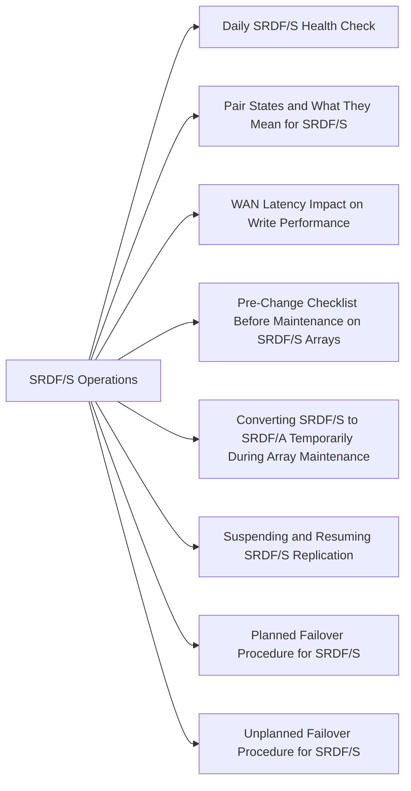

# SRDF/S Operations

> Part of the [SRDF/S](../) reference.

---

SRDF/S (Synchronous) replication provides zero-RPO protection by holding every host write until it has been committed at both the R1 (primary) and R2 (secondary) site. The synchronous acknowledgement model means WAN latency is directly visible to applications as additional write response time. Daily operations therefore have two equal concerns: confirming replication health and confirming that write latency has not degraded beyond the application baseline.

---



## Daily SRDF/S Health Check

Run these checks at the start of each shift and before any planned changes. All commands are executed from a Solutions Enabler (SE) host with gatekeeper access to the R1 array unless noted.

```bash
# 1. Confirm pair states for all devices in the primary SRDF group
symrdf query -g <dgname>

# 2. List all SRDF groups and inspect for any non-Synchronized entries
symrdf list -v

# 3. Confirm SRDF group port and link state — look for Online on all ports
symcfg -sid <r1_sid> list -rdfg <rdf_group_number>

# 4. Show group-level detail including mode, link ports, and pair count
symcfg -sid <r1_sid> show -rdfgrp <rdf_group_number>

# 5. Verify all pairs report Synchronized (exits non-zero if any pair differs)
symrdf -sid <r1_sid> -rdfg <rdf_group_number> verify -synchronized

# 6. Check R2 side — run from an SE host connected to the R2 array
symrdf query -g <dgname> -sid <r2_sid>

# 7. Check WAN RTT between sites (run from a host at the primary site)
ping -c 20 <dr_site_gateway_or_storage_ip>

# 8. Pull write latency metrics from Unisphere Performance
# Aria Operations / Unisphere: confirm write I/O response time is within baseline ±10%
```

**Checklist items to confirm:**

| Check | Expected |
|---|---|
| All pairs in `Synchronized` state | No `Invalid`, `Split`, `Write Disabled`, or `Mixed` entries |
| SRDF group port state | All ports `Online` on both R1 and R2 |
| WAN RTT to DR site | Within agreed latency budget (typically ≤5 ms RTT) |
| Write I/O response time | Within application baseline ±10% |
| No pairs transitioning (SyncInProg) without a known cause | Confirm against open change tickets |

---

## Pair States and What They Mean for SRDF/S

Unlike SRDF/A, SRDF/S has no cycle buffer — every write is held until both sides acknowledge. The pair states therefore reflect whether the synchronous commitment chain is intact.

| State | Meaning | Action Required |
|---|---|---|
| `Synchronized` | R1 and R2 contain identical data; all writes are being acknowledged at both sites | None — normal operating state |
| `SyncInProg` | Initial synchronisation or resync is in progress; R2 is behind R1 | Monitor progress; do not failover until complete |
| `Write Disabled` | R2 volumes are not accepting writes; typically set during planned failover or maintenance | Expected after failover; investigate if unexpected |
| `Invalid` | R2 data is not consistent with R1 — link failure caused writes to complete at R1 without R2 | Treat as a P1; confirm WAN health; resync required before R2 can be used |
| `Split` | Replication has been administratively stopped; R1 and R2 are diverging | Expected during maintenance if deliberately split; treat as incident if unexpected |
| `Failed Over` | R2 is now the active side; R1 is suspended | Expected after planned or unplanned failover |
| `Suspended` | Replication paused administratively (e.g., for array maintenance) | Confirm suspension was planned; resume as soon as maintenance is complete |

> Any state other than `Synchronized` or `SyncInProg` during a planned maintenance window should be recorded in the change ticket. Any unexpected state change outside a change window is a P2 or higher incident.

---

## WAN Latency Impact on Write Performance

SRDF/S adds one WAN round trip to every host write. The relationship is approximately:

```
Effective write latency = local array write time + (WAN RTT / 2) + remote commit time
```

**What to monitor:**

```bash
# Continuous WAN RTT check from primary site to DR site storage port
ping -i 5 -c 60 <dr_storage_port_ip> | tee /tmp/srdf_rtt_$(date +%Y%m%d).log

# Check SRDF link bandwidth utilisation via Unisphere REST API
UNISPHERE="https://unisphere.example.com:8443/univmax/restapi"
SID="000123456789"
RDFG=10
AUTH="-u smc:password --insecure"

curl -s $AUTH \
  "$UNISPHERE/performance/RDFGroup/metrics" \
  -H "Content-Type: application/json" \
  -d "{
    \"symmetrixId\": \"${SID}\",
    \"rdfgNumber\": ${RDFG},
    \"dataFormat\": \"Average\",
    \"metrics\": [\"MBSentPerSec\",\"MBReceivedPerSec\",\"WriteResponseTime\",\"AvgIOServiceTime\"]
  }" | python3 -m json.tool

# From SE host: check SRDF group statistics
symstat -sid 000123456789 -type rdfg -rdfg 10

# Monitor write latency continuously at 60-second intervals
watch -n 60 'symrdf -sid 000123456789 -rdfg 10 list -v | grep -E "Latency|WriteResp|State"'
```

**Thresholds:**

| Metric | Normal | Investigate | Escalate |
|---|---|---|---|
| WAN RTT (ping) | ≤5 ms | 5–10 ms | >10 ms |
| Write response time vs baseline | ±10% | +10–25% | >25% or application SLA breach |
| SRDF link utilisation | <70% | 70–85% | >85% |

A sustained WAN RTT increase of more than 2 ms above baseline should be reported to the network team before it impacts application SLAs.

---

## Pre-Change Checklist Before Maintenance on SRDF/S Arrays

Complete this checklist and record results in the change ticket before any maintenance that touches R1 or R2 array hardware, firmware, or SRDF configuration.

```bash
# Capture baseline state before the window
symrdf query -g <dgname> > /tmp/srdf_s_prechange_$(date +%Y%m%d_%H%M).txt
symcfg -sid <r1_sid> list -rdfg <rdf_group_number> >> /tmp/srdf_s_prechange_$(date +%Y%m%d_%H%M).txt
symrdf -sid <r1_sid> -rdfg <rdf_group_number> verify -synchronized
echo "Baseline captured at $(date)"
```

| Item | Status | Notes |
|---|---|---|
| All SRDF/S pairs are `Synchronized` | | |
| WAN RTT is within baseline (≤5 ms) | | |
| SRDF link ports are `Online` on R1 and R2 | | |
| SYMCLI access confirmed on both R1 and R2 SE hosts | | |
| RDF group number, R1 SID, R2 SID documented | | |
| Application owners notified of potential write latency impact | | |
| DR site team is available and contactable during the window | | |
| Rollback plan documented (what to do if maintenance causes pair to go `Invalid`) | | |
| Pre-change pair state baseline captured to file | | |
| Change ticket number recorded | | |

---

## Converting SRDF/S to SRDF/A Temporarily During Array Maintenance

When array maintenance on R1 or R2 will cause extended WAN disruption (e.g., firmware upgrades, controller failover tests, port quiescing), temporarily converting the SRDF group to asynchronous mode removes the write-penalty impact on application hosts during the window. Convert back to synchronous after maintenance is complete.

> Only attempt this procedure if your SRDF group licences include SRDF/A capability. Confirm with the array team before converting.

**Convert R1 RDF group from SRDF/S to SRDF/A:**

```bash
# Step 1: Confirm current mode and capture baseline
symcfg -sid <r1_sid> show -rdfgrp <rdf_group_number>

# Step 2: Suspend the SRDF group cleanly before mode change
symrdf -sid <r1_sid> -rdfg <rdf_group_number> -g <dgname> suspend

# Confirm pairs are Suspended
symrdf query -g <dgname>

# Step 3: Set the RDF group mode to Asynchronous (SRDF/A)
# Note: mode change is performed via Unisphere GUI or SE set command
# Via SYMCLI (SE 9.x+):
symrdf -sid <r1_sid> -rdfg <rdf_group_number> set mode async

# Step 4: Resume replication in async mode
symrdf -sid <r1_sid> -rdfg <rdf_group_number> -g <dgname> resume

# Confirm pairs are now replicating in Asynchronous mode
symcfg -sid <r1_sid> show -rdfgrp <rdf_group_number> | grep -i mode
symrdf query -g <dgname>
```

**Perform array maintenance.** Then convert back to SRDF/S:

```bash
# Step 1: Suspend async replication cleanly
symrdf -sid <r1_sid> -rdfg <rdf_group_number> -g <dgname> suspend

# Step 2: Set mode back to Synchronous (SRDF/S)
symrdf -sid <r1_sid> -rdfg <rdf_group_number> set mode sync

# Step 3: Resume — replication will resync and return to Synchronized state
symrdf -sid <r1_sid> -rdfg <rdf_group_number> -g <dgname> resume

# Step 4: Monitor resync progress (SyncInProg is expected until complete)
watch -n 30 'symrdf query -g <dgname> | grep -v Synchronized'

# Step 5: Confirm all pairs are Synchronized before declaring maintenance complete
symrdf -sid <r1_sid> -rdfg <rdf_group_number> verify -synchronized
```

---

## Suspending and Resuming SRDF/S Replication

Use suspend when maintenance requires the R2 array to be temporarily unavailable (e.g., controller failover, port maintenance). Keep the suspension window as short as possible — every write during the suspension creates divergence that must be resynced.

```bash
# Step 1: Confirm all pairs are Synchronized before suspending
symrdf -sid <r1_sid> -rdfg <rdf_group_number> verify -synchronized

# Step 2: Suspend SRDF/S replication for the device group
symrdf -sid <r1_sid> -rdfg <rdf_group_number> -g <dgname> suspend

# Confirm pairs are now Suspended (R1 continues I/O; R2 is held)
symrdf query -g <dgname>

# -- Perform maintenance --

# Step 3: Resume replication after maintenance
symrdf -sid <r1_sid> -rdfg <rdf_group_number> -g <dgname> resume

# Step 4: Monitor resync — SyncInProg expected; watch until Synchronized
watch -n 30 'symrdf query -g <dgname>'

# Step 5: Verify full synchronisation before closing the change ticket
symrdf -sid <r1_sid> -rdfg <rdf_group_number> verify -synchronized
```

---

## Planned Failover Procedure for SRDF/S

A planned failover is initiated when the primary site is taken offline deliberately (e.g., planned maintenance, site power work, or a DR test). Because SRDF/S is synchronous, R2 is always current at the point of failover.

```bash
# Step 1: Quiesce applications on the primary site
# -- Application owner confirms quiesce --

# Step 2: Confirm all pairs are Synchronized
symrdf -sid <r1_sid> -rdfg <rdf_group_number> verify -synchronized

# Step 3: Capture pre-failover state baseline
symrdf query -g <dgname> > /tmp/srdf_s_failover_prestate_$(date +%Y%m%d_%H%M).txt

# Step 4: Initiate planned failover (R1 suspended, R2 write-enabled)
symrdf -sid <r1_sid> -rdfg <rdf_group_number> -g <dgname> failover

# Confirm pair state shows Failed Over / Write Disabled on R1
symrdf query -g <dgname>
symrdf -sid <r2_sid> -rdfg <rdf_group_number> query -g <dgname>

# Step 5: Present R2 volumes to DR site hosts
# -- Storage team enables host access to R2 LUNs --

# Step 6: DR site application team mounts volumes and starts applications
# -- DR team confirms applications are running at DR site --
```

---

## Unplanned Failover Procedure for SRDF/S

An unplanned failover occurs when the primary site fails without a clean shutdown. Because SRDF/S is synchronous, R2 is consistent with the last successfully committed write — no data is lost for writes that received application acknowledgement.

```bash
# Step 1: Confirm primary site is unreachable and an outage decision has been made
# -- Management authorisation required before proceeding --

# Step 2: From the DR site SE host, check R2 pair state
symrdf query -g <dgname> -sid <r2_sid>

# Expected state: Invalid or Suspended (link dropped; R2 data is consistent)

# Step 3: Initiate failover from R2 side (force flag required without R1 connectivity)
symrdf -sid <r2_sid> -rdfg <rdf_group_number> -g <dgname> failover -force

# Step 4: Confirm R2 pairs are now Write Disabled → R2 side should be writable
symrdf -sid <r2_sid> -rdfg <rdf_group_number> query -g <dgname>

# Step 5: Present R2 volumes to DR hosts and start applications
# -- Storage and application teams confirm --

# Step 6: Document the failover time, last known sync state, and any data exposure window
```

> For unplanned failovers, open an incident ticket immediately and engage the vendor (Dell Technologies support) if pair state is `Invalid` and there is any question about R2 data consistency.

---

## Resync After Maintenance-Induced Split

After a suspension or split during maintenance, pairs must be resynced before SRDF/S protection is restored. Resync sends only the changed tracks (dirty tracks) from R1 to R2.

```bash
# Step 1: Confirm R1 is the current active side and both arrays are accessible
symcfg list
symrdf query -g <dgname>

# Step 2: Initiate resync (re-establish synchronous pairing from R1 to R2)
symrdf -sid <r1_sid> -rdfg <rdf_group_number> -g <dgname> establish

# Alternative if pairs are in Split state:
symrdf -sid <r1_sid> -rdfg <rdf_group_number> -g <dgname> resume

# Step 3: Monitor progress — pairs will show SyncInProg until dirty tracks are cleared
watch -n 30 'symrdf query -g <dgname>'

# Check the number of invalid tracks remaining (decreasing count = progress)
symrdf -sid <r1_sid> -rdfg <rdf_group_number> list -v | grep -i "invalid\|track"

# Step 4: Confirm all pairs are Synchronized
symrdf -sid <r1_sid> -rdfg <rdf_group_number> verify -synchronized

# Step 5: Record resync completion time in the change ticket
echo "Resync completed at $(date)"
```

Resync duration depends on the volume of data that changed during the suspension window and available SRDF link bandwidth. For large volumes with high write rates during suspension, estimate 1–4 hours for full resync.

---

## Failback After Planned Failover

Failback returns replication to the original direction (R1 as source, R2 as target) after production has been running at the DR site.

```bash
# Step 1: Quiesce DR site applications
# -- DR application team confirms quiesce --

# Step 2: From DR SE host — confirm current pair state (should be Failed Over)
symrdf -sid <r2_sid> -rdfg <rdf_group_number> query -g <dgname>

# Step 3: Initiate failback (resync R1 from R2, then restore original direction)
symrdf -sid <r2_sid> -rdfg <rdf_group_number> -g <dgname> failback

# Step 4: Monitor until pairs reach Synchronized state in original direction
watch -n 30 'symrdf query -g <dgname> -sid <r1_sid>'

# Step 5: Confirm R1 is now the active R1 side (Synchronized, not Write Disabled)
symrdf -sid <r1_sid> -rdfg <rdf_group_number> verify -synchronized

# Step 6: Re-present R1 volumes to primary site hosts and restart applications
# -- Application team confirms production is running at primary site --

# Step 7: Confirm R2 is again the synchronous DR target (Write Disabled on R2)
symrdf query -g <dgname> -sid <r2_sid>
```

---

## SRM Integration: Automated vs Manual Failover

SRDF/S is registered with VMware Site Recovery Manager (SRM) via the Dell EMC Storage Replication Adapter (SRA). SRM drives SRDF/S failover as part of recovery plan execution and handles storage steps automatically.

**When SRM drives failover:**

1. SRM executes the recovery plan on the DR SRM server.
2. SRM calls the Dell SRA, which issues `symrdf failover` against the mapped SRDF group on behalf of SRM.
3. SRA confirms pair state transitions before SRM proceeds to datastore resignaturing and VM registration.
4. SRM powers on VMs at the DR site in the order defined by the recovery plan.

**When manual SYMCLI failover is used instead:**

Use manual SYMCLI failover when:
- SRM is unavailable or has lost connectivity to the SRA.
- The failure affects SRM infrastructure at the primary site.
- DR testing is being performed outside SRM (e.g., storage-only validation).

In manual failover, you must replicate the steps SRM would have taken:

```bash
# 1. Failover SRDF/S group
symrdf -sid <r1_sid> -rdfg <rdf_group_number> -g <dgname> failover

# 2. Present R2 LUNs to ESXi hosts at DR site (zoning / masking)
# -- Storage team action --

# 3. Resignature VMFS datastores at DR site (if not SRM-managed)
# esxcli storage vmfs snapshot list
# esxcli storage vmfs snapshot resignature -l <label>

# 4. Register and power on VMs manually in vCenter at DR site
# -- VMware team action --
```

**SRM test failover vs live failover:**

| Mode | SRDF/S Impact | R1 Data Impact |
|---|---|---|
| SRM test failover | R2 snapshot presented; no SRDF/S pair state change | None — production continues unaffected |
| SRM planned migration | Clean failover; pairs transition to `Failed Over` | R1 suspended; R2 becomes active |
| SRM disaster recovery | Force failover; pairs transition from `Invalid` to `Failed Over` | R1 offline; R2 becomes active |

---

## On-Call Triage: SRDF/S Lag Alert or Pair State Change

```bash
# Step 1: Identify current pair states
symrdf query -g <dgname>

# Step 2: Check SRDF group port and link state
symcfg -sid <r1_sid> list -rdfg <rdf_group_number>

# Step 3: Check WAN RTT to DR site
ping -c 10 <dr_site_ip>

# Step 4: Check for any pairs that are not Synchronized
symrdf -sid <r1_sid> -rdfg <rdf_group_number> list -v | grep -v Synchronized

# Step 5: Pull write latency metrics from Unisphere for the past hour
# (Unisphere GUI: Performance > RDF Group > select group > Write Response Time)
```

**Triage decision table:**

| Symptom | Likely Cause | Immediate Action |
|---|---|---|
| Pairs go `Invalid` | WAN link dropped; R1 writes completed without R2 commitment | Check inter-site network; engage network team; do not failover until decision made by management |
| Pairs go `SyncInProg` unexpectedly | Brief link interruption resolved; resync in progress | Monitor progress — no action if trending toward `Synchronized` within 30 min |
| Write latency spike with pairs still `Synchronized` | WAN RTT increase; link congestion | Check ping RTT; engage network team; monitor application SLA thresholds |
| Pairs go `Suspended` unexpectedly | Manual or automated suspension triggered without change ticket | Identify who suspended; confirm whether intentional; resume if safe |
| SRDF group port goes `Offline` | Physical link failure or port fault | Engage storage and network teams; check array event log: `symev -sid <sid> list -v` |
| Pairs go `Split` unexpectedly | Administrative split without authorisation or automation error | Identify cause; issue `symrdf resume` once link is confirmed healthy |

> If primary site connectivity is lost entirely and a failover decision is required, escalate to the DR decision authority. Do not initiate unplanned failover without management authorisation except when automated SRM recovery plans have been pre-approved for automatic execution.

---

## Post-Change Validation

```bash
# Confirm all pairs are Synchronized
symrdf -sid <r1_sid> -rdfg <rdf_group_number> verify -synchronized

# Confirm group port states are Online
symcfg -sid <r1_sid> list -rdfg <rdf_group_number>

# Confirm WAN RTT is within baseline
ping -c 10 <dr_site_ip>

# Capture post-change state for the change ticket
symrdf query -g <dgname> > /tmp/srdf_s_postchange_$(date +%Y%m%d_%H%M).txt
```

| Validation Item | Expected |
|---|---|
| All pairs `Synchronized` | Yes — no exceptions |
| Group ports `Online` on R1 and R2 | Yes |
| WAN RTT within baseline (≤5 ms) | Yes |
| Write I/O response time within baseline ±10% | Yes |
| No open alerts in Aria Operations / Unisphere | Yes |
| Post-change state baseline captured to file | Yes |
