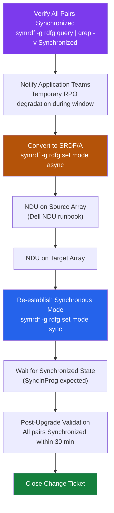

# SRDF/S — Install & Upgrade

> Part of the [SRDF/S Operations](../) reference.

---

## HYPERMAX OS Version Compatibility

SRDF/S pairs require compatible HYPERMAX OS versions on both arrays. Always check the Dell interoperability matrix before mixed-version pairing.

| Source Array | Target Array | Supported? | Why |
|---|---|---|---|
| PowerMax 2500 (10.0.x) | PowerMax 2500 (10.0.x) | Yes (same version) | Identical microcode level — full SRDF/S feature parity |
| PowerMax 2500 (10.0.x) | PowerMax 8500 (10.0.x) | Yes (same major) | Same major release supports cross-model pairing |
| PowerMax (10.0.x) | VMAX All Flash (8.4.x) | Check matrix — limited | Different product generations; some SRDF/S features unavailable |
| PowerMax (10.1.x) | PowerMax (10.0.x) | Check matrix — N-1 typically supported | N-1 is generally allowed but verify specific feature requirements |

Verify current version:
```bash
symcfg list -v | grep "Microcode"
```

---

## Firmware Upgrade Procedure

During an NDU (Non-Disruptive Upgrade), SRDF/S pairs are temporarily converted to async mode to avoid blocking host writes:

1. **Pre-upgrade**: Verify `Synchronized` state on all pairs
   ```bash
   symrdf -g <rdfg> query | grep -v Synchronized   # Should return nothing
   ```

2. **Notify application teams** of temporary RPO degradation during upgrade window

3. **Convert to SRDF/A** (if upgrade requires extended window):
   ```bash
   symrdf -g <rdfg> set mode async
   symrdf -g <rdfg> query | grep Mode   # Verify: Asynchronous
   ```

4. **Perform NDU on source array** — follow Dell NDU runbook; no I/O interruption expected

5. **Perform NDU on target array**

6. **Re-establish synchronous mode**:
   ```bash
   symrdf -g <rdfg> set mode sync
   # Wait for re-synchronization
   symrdf -g <rdfg> query | grep -E "State|Mode"   # Target: Synchronized, Synchronous
   ```

7. **Post-upgrade validation**: Confirm all pairs return to `Synchronized` state within 30 minutes

---

## VMAX to PowerMax Migration

Migrating SRDF/S from a VMAX source to PowerMax:

1. Establish new SRDF/S relationship: VMAX (R1) → PowerMax target as R2 initially, then PowerMax → new target
2. Quiesce application I/O and failover to PowerMax
3. Re-establish SRDF/S from PowerMax (now R1) to new target R2
4. Decommission VMAX SRDF groups and devices

```bash
# Check VMAX group topology before migration
symrdf -g <rdfg> query -detail
```

---

## Establishing a New SRDF/S Pair

```bash
# Create device group on source
symsg create <sg_name> -type regular
symsg -sg <sg_name> add dev <dev_range>

# Create SRDF group and establish pairs (first time — full sync)
symrdf -g <rdfg> establish -full -noprompt
# Monitor sync progress
symrdf -g <rdfg> query | grep -E "Tracks|SyncProgress"
```

---

## Decommission Procedure

```bash
# Step 1: Quiesce application I/O
# Step 2: Split pairs gracefully
symrdf -g <rdfg> split -noprompt

# Step 3: Verify split state
symrdf -g <rdfg> query | grep State   # Should show: Split

# Step 4: Delete SRDF pairs
symrdf -g <rdfg> deletepair -force -noprompt

# Step 5: Remove devices from SRDF group
symrdf -rdfg <rdfg> delete -noprompt

# Step 6: Update CMDB — remove group number from allocation register
```

---

## License Lifecycle

SRDF licenses are array-bound per PowerMax array. Track:

| Item | Action | Why |
|---|---|---|
| License expiry dates | Annual review; alert 90 days before expiry | Expired license disables SRDF operations — potential production outage |
| SRDF/S vs SRDF/A licences | Separate SKUs; verify correct licence type is applied | Wrong license type results in replication mode mismatch at establish time |
| SRDF/E (encryption) | Optional add-on — track separately | Required for compliance frameworks mandating data-in-transit encryption |
| License compliance | Compare licensed pairs vs. `symcfg list -rdfg` output | Over-deployed pairs may fail to establish if license count is exceeded |

## NDU Firmware Upgrade Sequence


