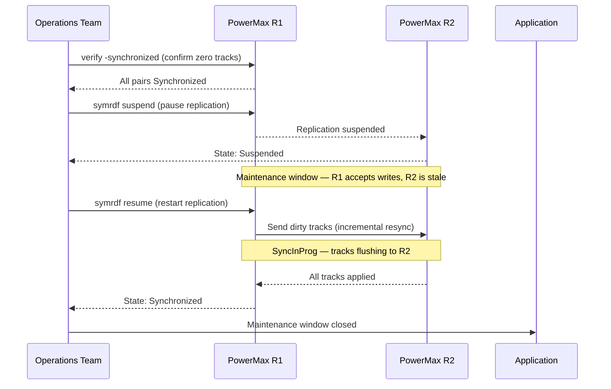

# SRDF/S — Procedures


<div class="kb-summary">
> Part of the [SRDF/S Operations](../index.md) reference.
</div>

---

## Pre-Change Checklist Before Maintenance on SRDF/S Arrays

Complete this checklist and record results in the change ticket before any maintenance that touches R1 or R2 array hardware, firmware, or SRDF configuration.

```bash
# Capture baseline state before the window
symrdf query -g <dgname> > /tmp/srdf_s_prechange_$(date +%Y%m%d_%H%M).txt
symcfg -sid <r1_sid> list -rdfg <rdf_group_number> >> /tmp/srdf_s_prechange_$(date +%Y%m%d_%H%M).txt
symrdf -sid <r1_sid> -rdfg <rdf_group_number> verify -synchronized
echo "Baseline captured at $(date)"
```
┌───────────────────────────────────────── SRDF/S — Procedures ─────────────────────────────────────────┐
│                                                                                                       │
│   ┌──────────────────────────────────────────────┐  ┌─────────────────────────────────────────────┐   │
│   │              Routine Procedures              │  │                DR Procedures                │   │
│   │          Add new protection source           │  │              Initiate failover              │   │
│   │           Modify retention policy            │  │               Validate replica              │   │
│   │          Expire old recover points           │  │              Redirect host I/O              │   │
│   │             Add storage capacity             │  │         Test failover (non-disrupt)         │   │
│   │           Service account rotation           │  │            Failback to production           │   │
│   └──────────────────────────────────────────────┘  └─────────────────────────────────────────────┘   │
│                                                                                                       │
│   ┌───────────────────────────────────────────────────────────────────────────────────────────────┐   │
│   │                             Change Control Requirements for SRDF/S                            │   │
│   │           All changes to protection policies require change ticket with rollback plan         │   │
│   │                      Failover tests must be scheduled in maintenance window                   │   │
│   │              Firmware/software upgrades need 48 h pre-approval and backup snapshot            │   │
│   │                  Post-change: verify jobs run successfully for 2 backup cycles                │   │
│   └───────────────────────────────────────────────────────────────────────────────────────────────┘   │
│                                                                                                       │
│  Physical Infrastructure:                                                                             │
│  Two PowerMax arrays · Dark fiber / DWDM FC link · Low-latency network (< 200 km) · RF director ports │
│  Key terms:                                                                                           │
│                                                                                                       │
│  SRDF/S        = Synchronous SRDF; every R1 write is mirrored to R2 before host acknowledgment        │
│  R1            = source volume; write is held pending R2 confirmation — adds WAN RTT to latency       │
│  R2            = target volume; must acknowledge each write; acts as synchronous mirror               │
│  RTT           = Round-Trip Time between R1 and R2 arrays; directly added to host write latency       │
│  RPO=0         = zero recovery point objective; no data loss possible under normal operation          │
│  RTO           = Recovery Time Objective; SRDF/S failover typically < 5 minutes manual, < 1 min       │
│  symrdf        = CLI for all SRDF operations: establish, split, suspend, failover, restore, ver       │
│  Pair State    = Synchronized | Consistent | Suspended | Failed Over | Split                          │
│  Consistent    = transient state where R1 write is in transit but not yet confirmed on R2             │
│  Failover      = makes R2 read-write; production continues from DR site after R1 failure              │
│  Restore       = re-synchronises after failover; direction is reversed until R1 catches up            │
│  RDFG          = RDF Group: logical grouping of SRDF pairs sharing same link and parameters           │
│  FA Port       = Front-End Adapter port on PowerMax; used for host connectivity (non-SRDF)            │
│  RF Port       = Remote Fabric port on PowerMax; used exclusively for SRDF replication traffic        │
│                                                                                                       │
└───────────────────────────────────────────────────────────────────────────────────────────────────────┘
```
```text

**SYMCLI shorthand:**
```bash
# Planned failover (site still accessible — reverses replication after split)
symrdf -g 10 -type S failover -establish -noprompt

# Failover a single device instead of the full group
symrdf -sid 0001 -dev 0A1 failover -noprompt

# Verify R2 devices are now in Failed Over state
symrdf -g 10 query
```

### Unplanned Failover Procedure for SRDF/S

An unplanned failover occurs when the primary site fails without a clean shutdown. Because SRDF/S is synchronous, R2 is consistent with the last successfully committed write — no data is lost for writes that received application acknowledgement.

```bash
# Step 1: Confirm primary site is unreachable and an outage decision has been made
# -- Management authorisation required before proceeding --

# Step 2: From the DR site SE host, check R2 pair state
symrdf query -g <dgname> -sid <r2_sid>

# Expected state: Invalid or Suspended (link dropped; R2 data is consistent)

# Step 3: Initiate failover from R2 side (force flag required without R1 connectivity)
symrdf -sid <r2_sid> -rdfg <rdf_group_number> -g <dgname> failover -force

# Step 4: Confirm R2 pairs are now Write Disabled → R2 side should be writable
symrdf -sid <r2_sid> -rdfg <rdf_group_number> query -g <dgname>

# Step 5: Present R2 volumes to DR hosts and start applications
# -- Storage and application teams confirm --

# Step 6: Document the failover time, last known sync state, and any data exposure window
```

> For unplanned failovers, open an incident ticket immediately and engage the vendor (Dell Technologies support) if pair state is `Invalid` and there is any question about R2 data consistency.

### Post-Failover Validation

```bash
# Confirm Failed Over state on all devices
symrdf -g 10 query | grep -E "R2|Pair State"

# Check for any devices still in inconsistent state
symrdf -g 10 query | grep -iv "Failed Over"

# Confirm no residual tracks needing flush
symrdf -g 10 query -detail | grep "Tracks"

# Verify host I/O at DR site (run from DR host)
dd if=/dev/sdX of=/dev/null bs=1M count=100 iflag=direct
```

| Check | Expected State | Action if Different |
|---|---|---|
| Pair State | Failed Over | Re-run failover or contact Dell support |
| Invalid Tracks | 0 | Allow sync to complete before failover |
| R2 Write Access | Enabled | Check masking view on DR array |
| RDF Director | Online | Check physical link and port config |
| Host I/O | Responding | Confirm zoning and host masking |

### Known Issues and Field Notes (Failover)

- **Extended RDF link latency before failover**: If the link was degraded and pairs went to `Transmit Idle` prior to the outage, some tracks may be out of sync. Run `symrdf -g <rdfg> query -detail` and check `Invalid Tracks` before proceeding.
- **Failover refused with "SYMAPI not ready"**: Ensure Solutions Enabler is running on the host issuing the command and that it has LUN access to the array management device (gatekeeper).
- **R2 remains read-only after failover**: Verify the array-side masking view includes the DR host's initiators. Failover changes the pair state but does not modify host masking.
- **Split-brain risk**: Never fail over while R1 is still accessible to production hosts without first quiescing I/O and confirming the R1 host is offline.

---

## Suspend and Resume Sequence



## Resync

### Overview

Resynchronization restores a fully synchronized SRDF/S pair after the pair has been suspended, split, or failed over. The resync process copies changed tracks from one volume back to the other, making both sides identical again. The direction of the copy depends on which operation preceded the resync.

- After **Suspend/Resume**: pairs re-sync R1 to R2 automatically on `resume`.
- After **Failover** (unplanned): use `restore` to copy R2 back to R1, then `establish` or `failover -establish` to reverse replication.
- After **Split**: use `establish` to restart replication from R1 to R2.

### Pre-Resync Checks

```bash
# Confirm current pair state before deciding resync direction
symrdf -g 10 query -detail

# Check how many invalid tracks need to be copied
symrdf -g 10 query -detail | grep -E "Invalid|Tracks"

# Confirm the RDF link is healthy before initiating
symcfg list -rdfg 10 -detail

# Estimate resync duration based on track count and link bandwidth
symstat -rdf -dir RF-1F -i 5 -c 2
```

Plan the resync during low-utilization periods when possible. A resync under heavy host I/O extends completion time and increases link saturation.

### Resync Operations

```bash
# Resume from Suspended (incremental resync R1 -> R2)
symrdf -g 10 -type S resume -noprompt

# Establish from Split or after manual intervention (R1 -> R2 full/incremental)
symrdf -g 10 -type S establish -noprompt

# Restore after Failed Over (copy R2 data back to R1)
symrdf -g 10 -type S restore -noprompt

# Monitor resync progress in real time
watch -n 10 'symrdf -g 10 query -detail | grep -E "Pair State|Tracks|SyncInProg"'

# Resume a single device rather than the full group
symrdf -sid 0001 -dev 0A1 -type S resume -noprompt
```

### Monitoring Resync Progress

```bash
# Poll pair state until all pairs show Synchronized
symrdf -g 10 query | grep -v Synchronized

# Track percentage complete (shown in SyncInProg state)
symrdf -g 10 query -detail

# Check link throughput during resync
symstat -rdf -i 10 -c 6

# Confirm completion: all pairs Synchronized, 0 tracks
symrdf -g 10 query -detail | grep "Invalid Tracks"
```

Expected output during active resync:

```text
Dev    Pair State    % Synced    Invalid Tracks
---    ----------    --------    --------------
0A1    SyncInProg    73%         2,450
0A2    SyncInProg    81%         1,102
```

Expected output after completion:

```text
Dev    Pair State     % Synced    Invalid Tracks
---    ----------     --------    --------------
0A1    Synchronized   100%        0
0A2    Synchronized   100%        0
```

### Resync Duration Estimation

| Data Volume | Link Speed | Estimated Duration |
|---|---|---|
| 100 GB changed | 4 Gbps FC | ~4-6 minutes |
| 1 TB changed | 4 Gbps FC | ~35-50 minutes |
| 5 TB changed | 8 Gbps FC | ~90-120 minutes |
| 10 TB changed | 8 Gbps FC | ~3-4 hours |

Times are approximate and depend on concurrent host I/O and array cache state.

### Resync After Maintenance-Induced Split

After a suspension or split during maintenance, pairs must be resynced before SRDF/S protection is restored. Resync sends only the changed tracks (dirty tracks) from R1 to R2.

```bash
# Step 1: Confirm R1 is the current active side and both arrays are accessible
symcfg list
symrdf query -g <dgname>

# Step 2: Initiate resync (re-establish synchronous pairing from R1 to R2)
symrdf -sid <r1_sid> -rdfg <rdf_group_number> -g <dgname> establish

# Alternative if pairs are in Split state:
symrdf -sid <r1_sid> -rdfg <rdf_group_number> -g <dgname> resume

# Step 3: Monitor progress — pairs will show SyncInProg until dirty tracks are cleared
watch -n 30 'symrdf query -g <dgname>'

# Check the number of invalid tracks remaining (decreasing count = progress)
symrdf -sid <r1_sid> -rdfg <rdf_group_number> list -v | grep -i "invalid\|track"

# Step 4: Confirm all pairs are Synchronized
symrdf -sid <r1_sid> -rdfg <rdf_group_number> verify -synchronized

# Step 5: Record resync completion time in the change ticket
echo "Resync completed at $(date)"
```

Resync duration depends on the volume of data that changed during the suspension window and available SRDF link bandwidth. For large volumes with high write rates during suspension, estimate 1–4 hours for full resync.

### Known Issues and Field Notes (Resync)

- **Resync stalls with "Transmit Idle"**: The array has temporarily paused sending tracks due to back-pressure on the remote cache. Usually self-resolves. If it persists > 15 minutes, check remote array cache utilization and free cache percentage.
- **Establish fails with "Device in use"**: The R1 device has active host I/O that cannot be quiesced. Schedule the establish during a maintenance window or use `symrdf -g <rdfg> establish -force` after confirming the application is quiesced.
- **Resync repeatedly restarts from 0%**: Indicates the link is dropping mid-resync. Review WAN circuit stability and check for packet loss on the RDF path. Solutions Enabler logs under `/var/symapi/log/` will show disconnect events.
- **Post-restore R1 not coming online**: After a `restore` command the R1 host may need a SCSI bus rescan and possibly a filesystem check before mounting. Never mount R1 volumes before confirming the restore is 100% complete.

---

## Suspending and Resuming SRDF/S Replication

Use suspend when maintenance requires the R2 array to be temporarily unavailable (e.g., controller failover, port maintenance). Keep the suspension window as short as possible — every write during the suspension creates divergence that must be resynced.

```bash
# Step 1: Confirm all pairs are Synchronized before suspending
symrdf -sid <r1_sid> -rdfg <rdf_group_number> verify -synchronized

# Step 2: Suspend SRDF/S replication for the device group
symrdf -sid <r1_sid> -rdfg <rdf_group_number> -g <dgname> suspend

# Confirm pairs are now Suspended (R1 continues I/O; R2 is held)
symrdf query -g <dgname>

# -- Perform maintenance --

# Step 3: Resume replication after maintenance
symrdf -sid <r1_sid> -rdfg <rdf_group_number> -g <dgname> resume

# Step 4: Monitor resync — SyncInProg expected; watch until Synchronized
watch -n 30 'symrdf query -g <dgname>'

# Step 5: Verify full synchronisation before closing the change ticket
symrdf -sid <r1_sid> -rdfg <rdf_group_number> verify -synchronized
```

---

## Converting SRDF/S to SRDF/A Temporarily During Array Maintenance

When array maintenance on R1 or R2 will cause extended WAN disruption (e.g., firmware upgrades, controller failover tests, port quiescing), temporarily converting the SRDF group to asynchronous mode removes the write-penalty impact on application hosts during the window. Convert back to synchronous after maintenance is complete.

> Only attempt this procedure if your SRDF group licences include SRDF/A capability. Confirm with the array team before converting.

**Convert R1 RDF group from SRDF/S to SRDF/A:**

```bash
# Step 1: Confirm current mode and capture baseline
symcfg -sid <r1_sid> show -rdfgrp <rdf_group_number>

# Step 2: Suspend the SRDF group cleanly before mode change
symrdf -sid <r1_sid> -rdfg <rdf_group_number> -g <dgname> suspend

# Confirm pairs are Suspended
symrdf query -g <dgname>

# Step 3: Set the RDF group mode to Asynchronous (SRDF/A)
# Note: mode change is performed via Unisphere GUI or SE set command
# Via SYMCLI (SE 9.x+):
symrdf -sid <r1_sid> -rdfg <rdf_group_number> set mode async

# Step 4: Resume replication in async mode
symrdf -sid <r1_sid> -rdfg <rdf_group_number> -g <dgname> resume

# Confirm pairs are now replicating in Asynchronous mode
symcfg -sid <r1_sid> show -rdfgrp <rdf_group_number> | grep -i mode
symrdf query -g <dgname>
```

**Perform array maintenance.** Then convert back to SRDF/S:

```bash
# Step 1: Suspend async replication cleanly
symrdf -sid <r1_sid> -rdfg <rdf_group_number> -g <dgname> suspend

# Step 2: Set mode back to Synchronous (SRDF/S)
symrdf -sid <r1_sid> -rdfg <rdf_group_number> set mode sync

# Step 3: Resume — replication will resync and return to Synchronized state
symrdf -sid <r1_sid> -rdfg <rdf_group_number> -g <dgname> resume

# Step 4: Monitor resync progress (SyncInProg is expected until complete)
watch -n 30 'symrdf query -g <dgname> | grep -v Synchronized'

# Step 5: Confirm all pairs are Synchronized before declaring maintenance complete
symrdf -sid <r1_sid> -rdfg <rdf_group_number> verify -synchronized
```

---

## Failback After Planned Failover

Failback returns replication to the original direction (R1 as source, R2 as target) after production has been running at the DR site.

```bash
# Step 1: Quiesce DR site applications
# -- DR application team confirms quiesce --

# Step 2: From DR SE host — confirm current pair state (should be Failed Over)
symrdf -sid <r2_sid> -rdfg <rdf_group_number> query -g <dgname>

# Step 3: Initiate failback (resync R1 from R2, then restore original direction)
symrdf -sid <r2_sid> -rdfg <rdf_group_number> -g <dgname> failback

# Step 4: Monitor until pairs reach Synchronized state in original direction
watch -n 30 'symrdf query -g <dgname> -sid <r1_sid>'

# Step 5: Confirm R1 is now the active R1 side (Synchronized, not Write Disabled)
symrdf -sid <r1_sid> -rdfg <rdf_group_number> verify -synchronized

# Step 6: Re-present R1 volumes to primary site hosts and restart applications
# -- Application team confirms production is running at primary site --

# Step 7: Confirm R2 is again the synchronous DR target (Write Disabled on R2)
symrdf query -g <dgname> -sid <r2_sid>
```

**Failback preparation (from R2 perspective):**

```bash
# After primary site recovery: restore R1 devices (accepts R2 data back)
symrdf -g 10 -type S restore -noprompt

# Confirm Synchronized state restored
symrdf -g 10 query

# Switch back to R1 (optional planned failback)
symrdf -g 10 -type S failover -establish -noprompt
```

---

## SRM Integration: Automated vs Manual Failover

SRDF/S is registered with VMware Site Recovery Manager (SRM) via the Dell EMC Storage Replication Adapter (SRA). SRM drives SRDF/S failover as part of recovery plan execution and handles storage steps automatically.

**When SRM drives failover:**

1. SRM executes the recovery plan on the DR SRM server.
2. SRM calls the Dell SRA, which issues `symrdf failover` against the mapped SRDF group on behalf of SRM.
3. SRA confirms pair state transitions before SRM proceeds to datastore resignaturing and VM registration.
4. SRM powers on VMs at the DR site in the order defined by the recovery plan.

**When manual SYMCLI failover is used instead:**

Use manual SYMCLI failover when:
- SRM is unavailable or has lost connectivity to the SRA.
- The failure affects SRM infrastructure at the primary site.
- DR testing is being performed outside SRM (e.g., storage-only validation).

In manual failover, you must replicate the steps SRM would have taken:

```bash
# 1. Failover SRDF/S group
symrdf -sid <r1_sid> -rdfg <rdf_group_number> -g <dgname> failover

# 2. Present R2 LUNs to ESXi hosts at DR site (zoning / masking)
# -- Storage team action --

# 3. Resignature VMFS datastores at DR site (if not SRM-managed)
# esxcli storage vmfs snapshot list
# esxcli storage vmfs snapshot resignature -l <label>

# 4. Register and power on VMs manually in vCenter at DR site
# -- VMware team action --
```

**SRM test failover vs live failover:**

| Mode | SRDF/S Impact | R1 Data Impact | When to use |
|---|---|---|---|
| SRM test failover | R2 snapshot presented; no SRDF/S pair state change | None — production continues unaffected | Quarterly DR testing; non-disruptive validation |
| SRM planned migration | Clean failover; pairs transition to `Failed Over` | R1 suspended; R2 becomes active | Planned site maintenance, site power work |
| SRM disaster recovery | Force failover; pairs transition from `Invalid` to `Failed Over` | R1 offline; R2 becomes active | Declared DR event; primary site unreachable |

---

## On-Call Triage: SRDF/S Lag Alert or Pair State Change

```bash
# Step 1: Identify current pair states
symrdf query -g <dgname>

# Step 2: Check SRDF group port and link state
symcfg -sid <r1_sid> list -rdfg <rdf_group_number>

# Step 3: Check WAN RTT to DR site
ping -c 10 <dr_site_ip>

# Step 4: Check for any pairs that are not Synchronized
symrdf -sid <r1_sid> -rdfg <rdf_group_number> list -v | grep -v Synchronized

# Step 5: Pull write latency metrics from Unisphere for the past hour
# (Unisphere GUI: Performance > RDF Group > select group > Write Response Time)
```

**Triage decision table:**

| Symptom | Likely Cause | Immediate Action |
|---|---|---|
| Pairs go `Invalid` | WAN link dropped; R1 writes completed without R2 commitment | Check inter-site network; engage network team; do not failover until decision made by management |
| Pairs go `SyncInProg` unexpectedly | Brief link interruption resolved; resync in progress | Monitor progress — no action if trending toward `Synchronized` within 30 min |
| Write latency spike with pairs still `Synchronized` | WAN RTT increase; link congestion | Check ping RTT; engage network team; monitor application SLA thresholds |
| Pairs go `Suspended` unexpectedly | Manual or automated suspension triggered without change ticket | Identify who suspended; confirm whether intentional; resume if safe |
| SRDF group port goes `Offline` | Physical link failure or port fault | Engage storage and network teams; check array event log: `symev -sid <sid> list -v` |
| Pairs go `Split` unexpectedly | Administrative split without authorisation or automation error | Identify cause; issue `symrdf resume` once link is confirmed healthy |

> If primary site connectivity is lost entirely and a failover decision is required, escalate to the DR decision authority. Do not initiate unplanned failover without management authorisation except when automated SRM recovery plans have been pre-approved for automatic execution.

---

## Post-Change Validation

```bash
# Confirm all pairs are Synchronized
symrdf -sid <r1_sid> -rdfg <rdf_group_number> verify -synchronized

# Confirm group port states are Online
symcfg -sid <r1_sid> list -rdfg <rdf_group_number>

# Confirm WAN RTT is within baseline
ping -c 10 <dr_site_ip>

# Capture post-change state for the change ticket
symrdf query -g <dgname> > /tmp/srdf_s_postchange_$(date +%Y%m%d_%H%M).txt
```

| Validation Item | Expected |
|---|---|
| All pairs `Synchronized` | Yes — no exceptions |
| Group ports `Online` on R1 and R2 | Yes |
| WAN RTT within baseline (≤5 ms) | Yes |
| Write I/O response time within baseline ±10% | Yes |
| No open alerts in Aria Operations / Unisphere | Yes |
| Post-change state baseline captured to file | Yes |
