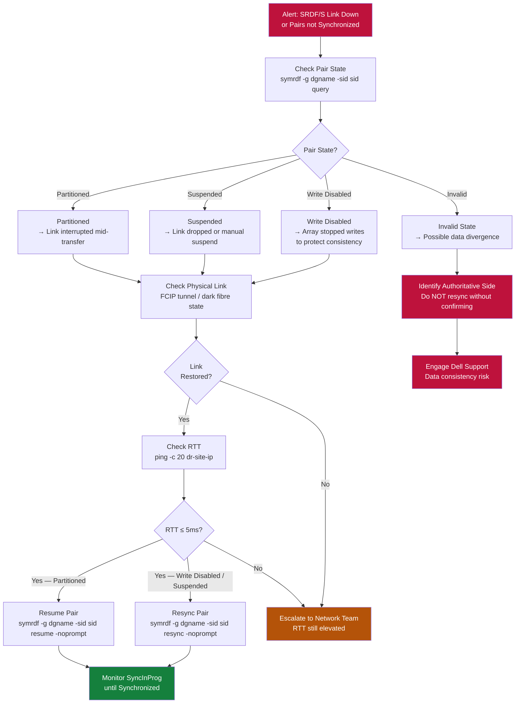

# SRDF/S — Common Issues


<div class="kb-summary">
> Part of the [SRDF/S Troubleshooting](../index.md) reference. SRDF/S issues typically manifest as pair state transitions away from `Synchronized`, elevated host write latency, or unexpected failover splits.
</div>

> Part of the [SRDF/S Troubleshooting](../index.md) reference.

SRDF/S issues typically manifest as pair state transitions away from `Synchronized`, elevated host write latency, or unexpected failover splits. Because SRDF/S is synchronous, any WAN degradation **directly impacts production write latency** — treat RTT increases above 5ms as a storage incident, not purely a network event.

Always collect `symrdf query -g <group> -v` and array event logs before engaging Dell support.

## Link-Down Recovery Decision Tree


┌─────────────────────────────────────── SRDF/S — Common Issues ────────────────────────────────────────┐
│                                                                                                       │
│   │     Symptom      │   Likely Cause   │    First Check    │       Fix        │      Verify      │   │
│   │  Write latency   │   RTT > budget   │ symrdf query -per │distance / bandwi │     symstat      │   │
│   │ Pair Consistent  │transient congest │    symrdf query   │monitor; usually  │    symrdf -v     │   │
│   │   Link failure   │   RF port down   │ symcfg list -rdfg │failover immediat │  symrdf failove  │   │
│   │   R2 not ready   │   array fault    │ check R2 Unispher │fix array, re-est │  symrdf establi  │   │
│   └───────────────────────────────────────────────────────────────────────────────────────────────┘   │
│                                                                                                       │
│   ┌───────────────────────────────────────────────────────────────────────────────────────────────┐   │
│   │                                     General Triage Pattern                                    │   │
│   │          Is the issue new or recurring? New = recent change; Recurring = config problem       │   │
│   │             Is it isolated to one source or all? Isolated = agent; All = server/repo          │   │
│   │                                  Check logs first: symrdf query                               │   │
│   │                    If unresolved in 2h: open vendor case with full log bundle                 │   │
│   └───────────────────────────────────────────────────────────────────────────────────────────────┘   │
│                                                                                                       │
│  Physical Infrastructure:                                                                             │
│  Two PowerMax arrays · Dark fiber / DWDM FC link · Low-latency network (< 200 km) · RF director ports │
│  Key terms:                                                                                           │
│                                                                                                       │
│  SRDF/S        = Synchronous SRDF; every R1 write is mirrored to R2 before host acknowledgment        │
│  R1            = source volume; write is held pending R2 confirmation — adds WAN RTT to latency       │
│  R2            = target volume; must acknowledge each write; acts as synchronous mirror               │
│  RTT           = Round-Trip Time between R1 and R2 arrays; directly added to host write latency       │
│  RPO=0         = zero recovery point objective; no data loss possible under normal operation          │
│  RTO           = Recovery Time Objective; SRDF/S failover typically < 5 minutes manual, < 1 min       │
│  symrdf        = CLI for all SRDF operations: establish, split, suspend, failover, restore, ver       │
│  Pair State    = Synchronized | Consistent | Suspended | Failed Over | Split                          │
│  Consistent    = transient state where R1 write is in transit but not yet confirmed on R2             │
│  Failover      = makes R2 read-write; production continues from DR site after R1 failure              │
│  Restore       = re-synchronises after failover; direction is reversed until R1 catches up            │
│  RDFG          = RDF Group: logical grouping of SRDF pairs sharing same link and parameters           │
│  FA Port       = Front-End Adapter port on PowerMax; used for host connectivity (non-SRDF)            │
│  RF Port       = Remote Fabric port on PowerMax; used exclusively for SRDF replication traffic        │
│                                                                                                       │
└───────────────────────────────────────────────────────────────────────────────────────────────────────┘

**Recovery:**

1. Resolve the underlying link or RTT issue first.
2. Once the link is stable, re-establish the SRDF pair:

```bash
# Resync from R1 to R2 (R1 data is authoritative in this scenario)
symrdf -g <dgname> -sid <r1_sid> resync -noprompt

# Monitor until pair returns to Synchronized
symrdf -g <dgname> -sid <r1_sid> query
```

---

## Pair in `Invalid` State

**Symptom:** Pair state shows `Invalid` — typically after an unresolved split or an earlier failover that was not cleanly restored.

```bash
# Check the event log for the event that caused the Invalid state
symevent -sid <r1_sid> list -last 30 | grep -i "SRDF\|Invalid\|failover"
```

**Resolution (R1 is authoritative — no real failover occurred):**

```bash
symrdf -g <dgname> -sid <r1_sid> resync -noprompt
# Pushes R1 data to R2 and re-establishes sync
```

**Resolution (R2 has the latest data — a real failover occurred):**

```bash
# Confirm with application team that R2 has the correct data
# Then fail back to R1
symrdf -g <dgname> -sid <r2_sid> failback -noprompt
```

**Do not resync or restore without first confirming which side has the authoritative data.** An incorrect resync will permanently overwrite data.

---

## Pair in `Split` State

A `Split` state means both R1 and R2 are R/W and data is diverging. This is normal during a planned failover but is an incident if unexpected.

```bash
# Check when the split occurred
symevent -sid <r1_sid> list -last 24h | grep -i "split\|SRDF"

# Identify which side has writes since the split
symdev -sid <r1_sid> show <dev_id> | grep "Modified"
symdev -sid <r2_sid> show <dev_id> | grep "Modified"
```

**Never re-establish a split pair without application team sign-off.** Restoring R1 overwrites any R2 writes made during the split period and vice versa.

---

## ISL / FCIP Link Failure

**Symptom:** SRDF link is down; pairs move to `Suspended` or `Write Disabled`.

```bash
# Check SRDF director port state
symcfg -sid <r1_sid> list -dir all -v | grep -E "RDF|Port|State"

# From SAN switch (Cisco MDS)
show fcip session
show port-channel summary  # if using port-channel
show interface gigabitEthernet X/X

# From Brocade
portshow <port>
portcfgshow  # check FCIP port config
```

**Recovery after link restoration:**

```bash
# Pair should auto-resume once link is restored (depending on configuration)
# If pairs remain Suspended, manually resume:
symrdf -g <dgname> -sid <r1_sid> resume -noprompt

# Verify Synchronized state is reached (may take time to fully sync)
symrdf -g <dgname> -sid <r1_sid> query
```

---

## Unintended Failover During Maintenance

**Cause:** Maintenance was performed without declaring a maintenance window; SRDF monitors triggered automatic protection responses.

**Prevention:**

```bash
# Before any maintenance that touches SRDF links, directors, or the arrays:
# Step 1 — Suspend SRDF/S pair (converts to async temporarily)
symrdf -g <dgname> -sid <r1_sid> suspend -noprompt

# Step 2 — Disable SRDF health monitoring alerts in the monitoring platform for the duration

# Step 3 — Perform maintenance

# Step 4 — Resume and verify Synchronized state before re-enabling monitoring
symrdf -g <dgname> -sid <r1_sid> resume -noprompt
symrdf -g <dgname> -sid <r1_sid> query
```
