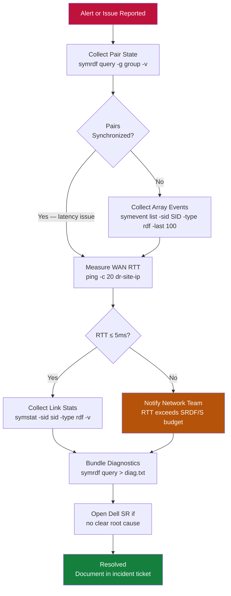

# SRDF/S — Diagnostics

> Part of the [SRDF/S Troubleshooting](../index.md) reference.

---

## SRDF/S Triage Flow



---

## Performance Diagnostics

```bash
# Check current SRDF link RTT and write pending counts
symcfg -sid <r1_sid> list -rdfg <group_num> -v | grep -E "RTT\|Pending\|Link"

# Write latency per device
symdev -sid <r1_sid> show <dev_id> | grep -E "Write|Response"

# SRDF link statistics — bandwidth and utilisation
symstat -sid <r1_sid> -type rdf -v

# WAN RTT measurement
ping -c 20 <dr_site_gateway_or_storage_ip>
```

---

## Log Locations

| Log | Location |
|---|---|
| Solutions Enabler daemon log | `/var/symapi/log/` |
| SE disconnect/reconnect events | `/var/symapi/log/symapi.log` |
| Unisphere event log | Unisphere GUI → Events, or export via REST API |
| Array audit log | `symevent list -sid <SID> -type rdf -output csv > /tmp/rdf_events.csv` |

---

## SAN Switch Diagnostics

```bash
# Cisco MDS
show fcip session
show port-channel summary
show interface gigabitEthernet X/X

# Brocade
portshow <port>
portcfgshow
```

---

## Diagnostic Data Export for Dell Support

```bash
# Export array event log
symevent list -sid <SID> -type rdf -output csv > /tmp/rdf_events_$(date +%Y%m%d).csv

# Capture full pair state baseline
symrdf query -g <group> -detail > /tmp/srdf_diagnostic_$(date +%Y%m%d_%H%M).txt
symcfg list -rdfg all >> /tmp/srdf_diagnostic_$(date +%Y%m%d_%H%M).txt
symcfg -sid <r1_sid> list -rdfg <rdf_group_number> -v >> /tmp/srdf_diagnostic_$(date +%Y%m%d_%H%M).txt

# Collect Unisphere logs via GUI
# Unisphere for PowerMax → System → Export Logs
```
