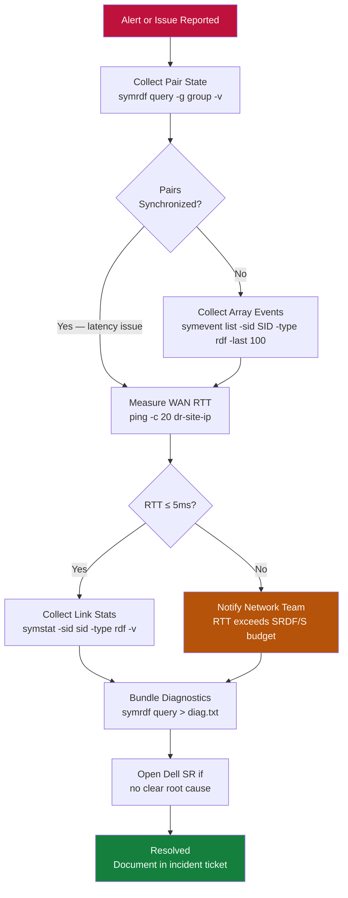

# SRDF/S — Diagnostics


<div class="kb-summary">
> Part of the [SRDF/S Troubleshooting](../index.md) reference.
</div>

---

## SRDF/S Triage Flow


┌──────────────────────────────────────── SRDF/S — Diagnostics ─────────────────────────────────────────┐
│                                                                                                       │
│   ┌───────────────────────────────────────────────────────────────────────────────────────────────┐   │
│   │                                  SRDF/S — Diagnostic Commands                                 │   │
│   │                       Collect these before opening a vendor support case                      │   │
│   │                                           symrdf query                                        │   │
│   │                                        symrdf -rdfg list                                      │   │
│   │                       Check system logs: /var/log/ or Windows Event Viewer                    │   │
│   └───────────────────────────────────────────────────────────────────────────────────────────────┘   │
│                                                                                                       │
│   ┌──────────────────────────────────────────────┐  ┌─────────────────────────────────────────────┐   │
│   │                Log Collection                │  │               Live Diagnostics              │   │
│   │            Application log bundle            │  │             Network connectivity            │   │
│   │            OS syslog (journalctl)            │  │              Storage path check             │   │
│   │             Core dump if crashed             │  │              Process list check             │   │
│   │             Config export/backup             │  │              Port reachability              │   │
│   │                 symrdf query                 │  │              symrdf -rdfg list              │   │
│   └──────────────────────────────────────────────┘  └─────────────────────────────────────────────┘   │
│                                                                                                       │
│  Physical Infrastructure:                                                                             │
│  Two PowerMax arrays · Dark fiber / DWDM FC link · Low-latency network (< 200 km) · RF director ports │
│  Key terms:                                                                                           │
│                                                                                                       │
│  SRDF/S        = Synchronous SRDF; every R1 write is mirrored to R2 before host acknowledgment        │
│  R1            = source volume; write is held pending R2 confirmation — adds WAN RTT to latency       │
│  R2            = target volume; must acknowledge each write; acts as synchronous mirror               │
│  RTT           = Round-Trip Time between R1 and R2 arrays; directly added to host write latency       │
│  RPO=0         = zero recovery point objective; no data loss possible under normal operation          │
│  RTO           = Recovery Time Objective; SRDF/S failover typically < 5 minutes manual, < 1 min       │
│  symrdf        = CLI for all SRDF operations: establish, split, suspend, failover, restore, ver       │
│  Pair State    = Synchronized | Consistent | Suspended | Failed Over | Split                          │
│  Consistent    = transient state where R1 write is in transit but not yet confirmed on R2             │
│  Failover      = makes R2 read-write; production continues from DR site after R1 failure              │
│  Restore       = re-synchronises after failover; direction is reversed until R1 catches up            │
│  RDFG          = RDF Group: logical grouping of SRDF pairs sharing same link and parameters           │
│  FA Port       = Front-End Adapter port on PowerMax; used for host connectivity (non-SRDF)            │
│  RF Port       = Remote Fabric port on PowerMax; used exclusively for SRDF replication traffic        │
│                                                                                                       │
└───────────────────────────────────────────────────────────────────────────────────────────────────────┘

---

## Log Locations

| Log | Location |
|---|---|
| Solutions Enabler daemon log | `/var/symapi/log/` |
| SE disconnect/reconnect events | `/var/symapi/log/symapi.log` |
| Unisphere event log | Unisphere GUI → Events, or export via REST API |
| Array audit log | `symevent list -sid <SID> -type rdf -output csv > /tmp/rdf_events.csv` |

---

## SAN Switch Diagnostics

```bash
# Cisco MDS
show fcip session
show port-channel summary
show interface gigabitEthernet X/X

# Brocade
portshow <port>
portcfgshow
```

---

## Diagnostic Data Export for Dell Support

```bash
# Export array event log
symevent list -sid <SID> -type rdf -output csv > /tmp/rdf_events_$(date +%Y%m%d).csv

# Capture full pair state baseline
symrdf query -g <group> -detail > /tmp/srdf_diagnostic_$(date +%Y%m%d_%H%M).txt
symcfg list -rdfg all >> /tmp/srdf_diagnostic_$(date +%Y%m%d_%H%M).txt
symcfg -sid <r1_sid> list -rdfg <rdf_group_number> -v >> /tmp/srdf_diagnostic_$(date +%Y%m%d_%H%M).txt

# Collect Unisphere logs via GUI
# Unisphere for PowerMax → System → Export Logs
```
