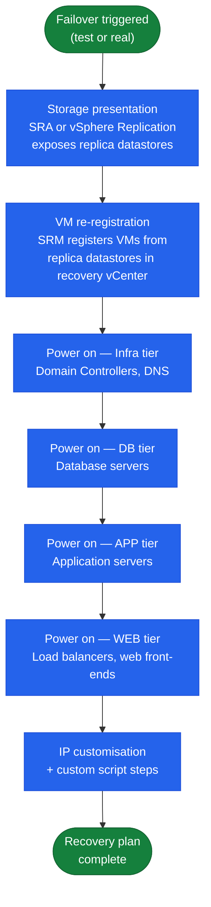

# SRM Architecture — Components

> Part of the [SRM](../../) reference.

---

## Core Components

| Component | Role |
|---|---|
| SRM Server | Orchestration engine; deployed as a plugin on each vCenter |
| Site Pair | Bidirectional trust relationship between two SRM instances |
| Protection Group | Set of VMs or datastores to be failed over together |
| Recovery Plan | Ordered workflow defining failover steps, power-on sequence, and customisations |
| SRA (Storage Replication Adapter) | Vendor-supplied plugin translating SRM commands to array APIs |
| vSphere Replication | Built-in per-VM replication engine (alternative to array-based SRAs) |

---

## Storage Replication Adapters (SRAs)

SRAs are vendor-supplied adapters installed on both SRM servers. They translate SRM storage operations (discover, test, failover, reprotect) into vendor-specific array commands.

| Vendor | SRA | Supported Replication |
|---|---|---|
| Dell EMC | Dell EMC SRA for PowerMax | SRDF/A, SRDF/S |
| Pure Storage | Pure Storage SRA | ActiveCluster (sync), async replication |
| NetApp | NetApp SRA for ONTAP | SnapMirror (async), SnapMirror Synchronous |
| HPE | HPE 3PAR / Primera SRA | Remote Copy (async and sync) |

SRAs must be installed on both sites and must match the same major version.

---

## Recovery Plans

### Recovery Plan Boot Sequence

A Recovery Plan defines what happens when failover is triggered (test or actual). The power-on sequence is mandatory — infrastructure must be online before application tiers.

A Recovery Plan defines what happens when failover is triggered (test or actual):

1. **Storage presentation** — SRA or vSphere Replication exposes the replica datastores to the recovery site hosts
2. **VM re-registration** — SRM registers VMs from the failed-over datastores onto the recovery vCenter
3. **Power-on sequencing** — VMs power on in a defined order (e.g., domain controllers first, then application servers, then web tier)
4. **IP customisation** — Network settings are adjusted using customisation specs or SRM IP customisation rules
5. **Custom steps** — Scripts or manual approval steps can be inserted at any point in the sequence

---

## Protection Groups

| Type | Granularity | Replication Backend |
|---|---|---|
| Array-based | Datastore (all VMs on the datastore) | SRA (vendor-specific) |
| vSphere Replication | Per-VM | Built-in vSphere Replication appliance |

Array-based protection groups are more efficient for large numbers of VMs sharing the same datastore but lack per-VM RPO control. vSphere Replication allows RPO configuration per VM (5 minutes minimum) but requires more network bandwidth between sites.

### Protection Group Design

- One protection group per application tier — do not mix DB and APP VMs in the same group
- Consistency groups: group all VMs of a multi-tier application across their respective PGs under a single recovery plan
- Maximum recommended VMs per protection group: 250 (above this, SRM recalculation times increase)

### Common Checks

- Confirm current health
- Review active alerts
- Check recent changes
- Confirm dependencies
- Check logs, events, and monitoring
- Capture current state before changes

### Known Issues

Add known issues here as they come up.
