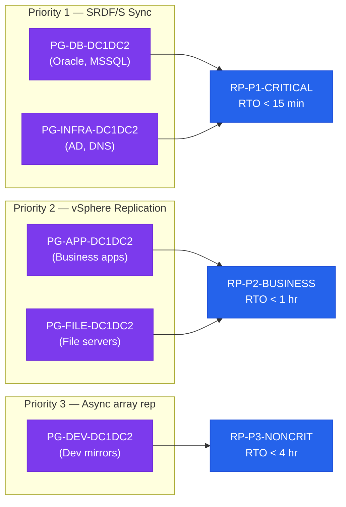

# SRM Architecture — Standards

> Part of the [SRM](../../) reference.

---

## Naming Conventions

| Object | Convention | Example |
|---|---|---|
| Protection Group | `PG-<tier>-<site-pair>` | `PG-DB-DC1DC2` |
| Recovery Plan | `RP-P<priority>-<tier>-<site-pair>` | `RP-P1-DB-DC1DC2` |
| vSphere Replication group | `VR-<app>-<env>` | `VR-ERP-PROD` |
| Test network (bubble) | `vPG-SRM-Test-Bubble` | — |

## Priority Tiers

| Priority | Application Class | RPO | RTO |
|---|---|---|---|
| P1 | Mission-critical (financial, ERP core) | 0 (SRDF/S) | < 15 min |
| P2 | Business-critical (standard apps) | ≤ 30 min | < 1 hour |
| P3 | Non-critical (dev mirror, reporting) | ≤ 4 hours | < 4 hours |

### Protection Group to Recovery Plan Mapping

## Recovery Plan Design

- Power-on sequence is mandatory: infrastructure VMs (DC, DNS) → DB tier → APP tier → WEB tier
- Each step must include a health check (custom script or vSphere Replication quiescing check)
- IP customisation rules must be configured for every VM in a non-same-subnet recovery design
- Boot dependencies: set appropriate per-step delays (e.g., wait 120 seconds after DB server boot before starting APP servers)

## Test Frequency and Documentation

| Test Type | Minimum Frequency | Documentation |
|---|---|---|
| Recovery plan test (non-disruptive) | Quarterly | Change record + test report |
| Live failover drill (maintenance window) | Annually | Post-incident review document |
| Failback validation after drill | After each live drill | Separate change record |

Test reports must include:
1. Date, time, and personnel involved
2. RTO achieved vs. target
3. Any failed steps and root cause
4. Outstanding action items with owners and due dates

## SRA Standards

| Storage Platform | SRA | Minimum Version |
|---|---|---|
| Dell PowerMax | Dell SRA for PowerMax | v5.0+ |
| Pure FlashArray | Pure Storage SRA | v3.0+ |
| NetApp ONTAP | NetApp SRA | v4.0+ |
| VMware vSphere Replication | Built-in (no SRA needed) | VR 8.x |

Install SRA on both SRM servers (protected and recovery site). Re-scan array managers after SRA update.

## Datastore Mapping Standards

- Every source datastore must have a recovery-site counterpart documented in the SRM datastore mapping
- Datastore mappings must be validated as part of quarterly test (verify VMs register on correct datastores post-test)
- Placeholder VMs: SRM creates placeholder VMs on recovery-site datastores; ensure recovery datastores have adequate free space for placeholders plus recovered VMs
