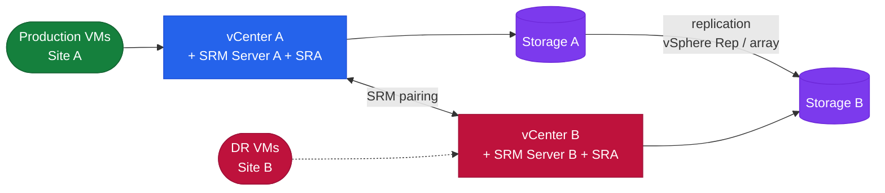
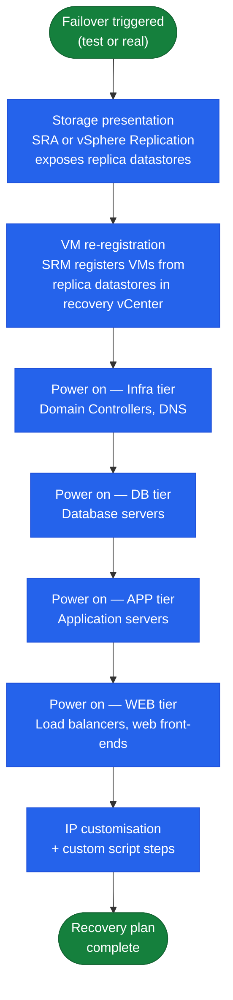

# SRM — How It Works

## Overview

VMware Site Recovery Manager (SRM) is a DR orchestration platform deployed as a vCenter plugin on both the protected and recovery sites. It automates VM failover by coordinating storage presentation, VM registration, power-on sequencing, IP customisation, and custom scripts — without manual intervention at the storage or compute layer. SRM supports both array-based replication (via SRAs) and built-in vSphere Replication.

## Topology

## Components

| Component | Role |
|---|---|
| SRM Server | Orchestration engine; deployed as a plugin on each vCenter |
| Site Pair | Bidirectional trust relationship between two SRM instances |
| Protection Group | Set of VMs or datastores to be failed over together |
| Recovery Plan | Ordered workflow defining failover steps, power-on sequence, and customisations |
| SRA (Storage Replication Adapter) | Vendor-supplied plugin translating SRM commands to array APIs |
| vSphere Replication | Built-in per-VM replication engine (alternative to array-based SRAs) |

## Site Pair Connectivity

| Port | Purpose |
|---|---|
| TCP 443 | vCenter and SRM API communication |
| TCP 8095 | SRM server-to-server communication |
| TCP 9086 | vSphere Replication data channel (if using vSphere Replication) |
| TCP 44046 | vSphere Replication traffic (source appliance to target) |

## Recovery Plan Boot Sequence

## Recovery Plan Modes

| Mode | Description |
|---|---|
| Test | SRM creates a temporary snapshot of R2/replica; powers on VMs in isolated network; production replication continues; test cleanup removes snapshot |
| Planned migration | Orderly shutdown of protected VMs, final sync, then power-on at recovery site |
| Unplanned failover | Protected site unavailable; SRM fails over using most recent replicated state |

## Storage Replication Adapters (SRAs)

| Vendor | SRA | Supported Replication |
|---|---|---|
| Dell EMC | Dell EMC SRA for PowerMax | SRDF/A, SRDF/S |
| Pure Storage | Pure Storage SRA | ActiveCluster (sync), async replication |
| NetApp | NetApp SRA for ONTAP | SnapMirror (async), SnapMirror Synchronous |

SRAs must be installed on both sites and must match the same major version.

## Protection Groups

| Type | Granularity | Replication Backend |
|---|---|---|
| Array-based | Datastore (all VMs on the datastore) | SRA (vendor-specific) |
| vSphere Replication | Per-VM | Built-in vSphere Replication appliance |

## vSphere Replication

- RPO: 5 minutes minimum (no lower)
- Consistency: crash-consistent by default; application-consistent with quiescing enabled
- Bandwidth: compressed and deduplicated; can be throttled per-VM
- No SRA required — replication engine is embedded in the vSphere Replication appliance (one per site)
