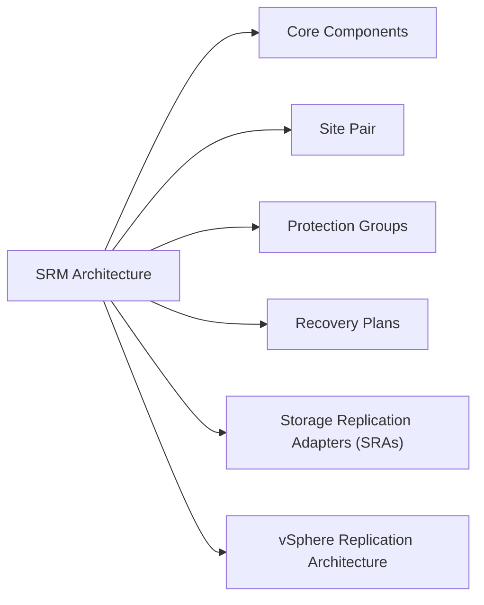

# SRM Architecture

> Part of the [SRM](../) reference.

---



## Overview

VMware Site Recovery Manager (SRM) is a DR orchestration platform deployed as a vCenter plugin on both the protected and recovery sites. It automates VM failover by coordinating storage presentation, VM registration, power-on sequencing, IP customisation, and custom scripts — without manual intervention at the storage or compute layer.

---

## Core Components

| Component | Role |
|---|---|
| SRM Server | Orchestration engine; deployed as a plugin on each vCenter |
| Site Pair | Bidirectional trust relationship between two SRM instances |
| Protection Group | Set of VMs or datastores to be failed over together |
| Recovery Plan | Ordered workflow defining failover steps, power-on sequence, and customisations |
| SRA (Storage Replication Adapter) | Vendor-supplied plugin translating SRM commands to array APIs |
| vSphere Replication | Built-in per-VM replication engine (alternative to array-based SRAs) |

---

## Site Pair

The site pair establishes a trust relationship between the protected site SRM and recovery site SRM. Both SRM servers must be able to reach each other on:

- **TCP 443** — vCenter and SRM API communication
- **TCP 8095** — SRM server-to-server communication (SRM API)
- **TCP 9086** — vSphere Replication data channel (if using vSphere Replication)

Each site pair maps a vCenter on the protected side to a vCenter on the recovery side. The pair is configured under SRM → Configure → Site Pair.

---

## Protection Groups

| Type | Granularity | Replication Backend |
|---|---|---|
| Array-based | Datastore (all VMs on the datastore) | SRA (vendor-specific) |
| vSphere Replication | Per-VM | Built-in vSphere Replication appliance |

Array-based protection groups are more efficient for large numbers of VMs sharing the same datastore but lack per-VM RPO control. vSphere Replication allows RPO configuration per VM (5 minutes minimum) but requires more network bandwidth between sites.

---

## Recovery Plans

A Recovery Plan defines what happens when failover is triggered (test or actual):

1. **Storage presentation** — SRA or vSphere Replication exposes the replica datastores to the recovery site hosts
2. **VM re-registration** — SRM registers VMs from the failed-over datastores onto the recovery vCenter
3. **Power-on sequencing** — VMs power on in a defined order (e.g., domain controllers first, then application servers, then web tier)
4. **IP customisation** — Network settings are adjusted using customisation specs or SRM IP customisation rules
5. **Custom steps** — Scripts or manual approval steps can be inserted at any point in the sequence

**Test vs. Actual failover:**

- **Test:** SRM creates a temporary snapshot of R2 devices (array-based) or a point-in-time copy (vSphere Replication) and powers on VMs in an isolated test network. Production replication continues. Test cleanup removes the snapshot.
- **Planned migration:** Orderly shutdown of protected site VMs, final sync, then power-on at recovery site. Used for scheduled DR tests or planned site migrations.
- **Unplanned failover:** Protected site is unavailable; SRM fails over using the most recent replicated state (last consistent checkpoint). VMs are powered on at the recovery site.

---

## Storage Replication Adapters (SRAs)

SRAs are vendor-supplied adapters installed on both SRM servers. They translate SRM storage operations (discover, test, failover, reprotect) into vendor-specific array commands.

| Vendor | SRA | Supported Replication |
|---|---|---|
| Dell EMC | Dell EMC SRA for PowerMax | SRDF/A, SRDF/S |
| Pure Storage | Pure Storage SRA | ActiveCluster (sync), async replication |
| NetApp | NetApp SRA for ONTAP | SnapMirror (async), SnapMirror Synchronous |
| HPE | HPE 3PAR / Primera SRA | Remote Copy (async and sync) |

SRAs must be installed on both sites and must match the same major version.

---

## vSphere Replication Architecture

vSphere Replication does not use an SRA. The replication engine is embedded in the vSphere Replication appliance (one per site).

```
Protected VM (ESXi)
      ↓ [vSphere Replication agent in hypervisor]
vSphere Replication Appliance (source site)
      ↓ [TCP 44046 — replication traffic]
vSphere Replication Appliance (recovery site)
      ↓
Replicated datastore (recovery site)
```

- RPO: 5 minutes minimum
- Consistency: crash-consistent by default; application-consistent with quiescing enabled
- Bandwidth: compressed and deduplicated; can be throttled per-VM
