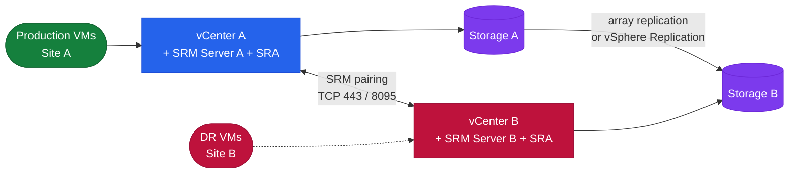

# SRM — Architecture

VMware Site Recovery Manager DR orchestration — vCenter plugin that automates storage presentation, VM registration, power-on sequencing, and IP customisation across a site pair.

<a class="kb-card" href="how-it-works/"><strong>How It Works</strong>Site pair topology, recovery plan boot sequence, recovery modes, SRAs, and vSphere Replication.</a>
<a class="kb-card" href="integrations/"><strong>Integrations</strong>Dell EMC, Pure Storage, and NetApp SRA integrations; vSphere Replication appliance.</a>
<a class="kb-card" href="design-standards/"><strong>Design Standards</strong>Protection group naming, recovery plan design, RPO targets, and test schedule.</a>

| Component | Role |
|---|---|
| SRM Server | Orchestration engine; deployed as vCenter plugin on each site |
| Site Pair | Bidirectional trust relationship between two SRM instances |
| Protection Group | Set of VMs or datastores failed over together |
| Recovery Plan | Ordered workflow: storage → VM registration → power-on tiers → IP customisation |
| SRA | Vendor plugin translating SRM commands to array replication APIs |
| vSphere Replication | Built-in per-VM replication; no SRA required; 5-minute minimum RPO |

