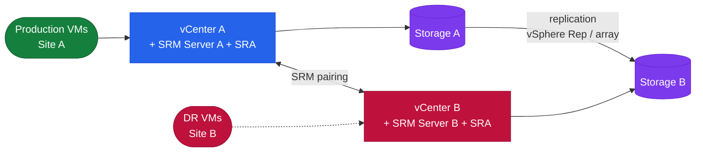

# SRM Architecture — Overview

> Part of the [SRM](../../) reference.

---
## Overview

VMware Site Recovery Manager (SRM) is a DR orchestration platform deployed as a vCenter plugin on both the protected and recovery sites. It automates VM failover by coordinating storage presentation, VM registration, power-on sequencing, IP customisation, and custom scripts — without manual intervention at the storage or compute layer.

---


## SRM Topology



## Site Pair

The site pair establishes a trust relationship between the protected site SRM and recovery site SRM. Both SRM servers must be able to reach each other on:

- **TCP 443** — vCenter and SRM API communication
- **TCP 8095** — SRM server-to-server communication (SRM API)
- **TCP 9086** — vSphere Replication data channel (if using vSphere Replication)

Each site pair maps a vCenter on the protected side to a vCenter on the recovery side. The pair is configured under SRM → Configure → Site Pair.

---

## Recovery Plan Modes

**Test vs. Actual failover:**

- **Test:** SRM creates a temporary snapshot of R2 devices (array-based) or a point-in-time copy (vSphere Replication) and powers on VMs in an isolated test network. Production replication continues. Test cleanup removes the snapshot.
- **Planned migration:** Orderly shutdown of protected site VMs, final sync, then power-on at recovery site. Used for scheduled DR tests or planned site migrations.
- **Unplanned failover:** Protected site is unavailable; SRM fails over using the most recent replicated state (last consistent checkpoint). VMs are powered on at the recovery site.

---

## vSphere Replication Architecture

vSphere Replication does not use an SRA. The replication engine is embedded in the vSphere Replication appliance (one per site).

```
Protected VM (ESXi)
      ↓ [vSphere Replication agent in hypervisor]
vSphere Replication Appliance (source site)
      ↓ [TCP 44046 — replication traffic]
vSphere Replication Appliance (recovery site)
      ↓
Replicated datastore (recovery site)
```

- RPO: 5 minutes minimum
- Consistency: crash-consistent by default; application-consistent with quiescing enabled
- Bandwidth: compressed and deduplicated; can be throttled per-VM
