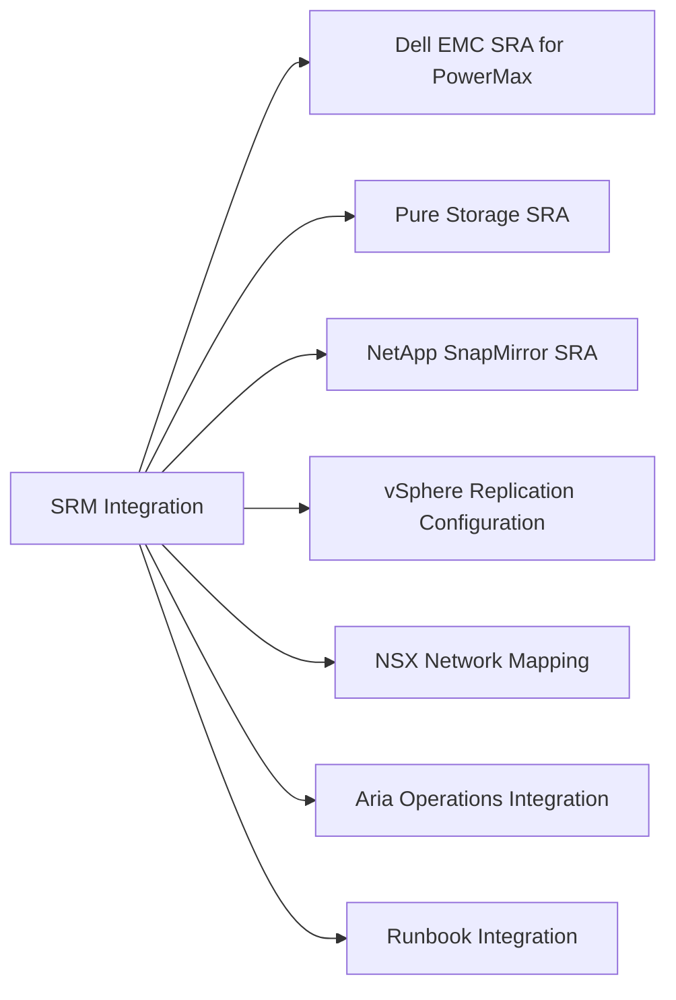

# SRM Integration

> Part of the [SRM](../) reference.

---

## Dell EMC SRA for PowerMax

The Dell EMC SRA translates SRM storage operations into SYMCLI/Unisphere REST API calls against PowerMax arrays.

**Installation:**

1. Download the Dell EMC SRA from the Dell support portal — match the SRA version to the SRM version in use.
2. Install on both protected-site and recovery-site SRM servers (Windows `.exe` installer or Linux package).
3. In SRM: Site Recovery → Configure → Array Managers → Add.
4. Provide PowerMax Unisphere credentials and array SID.
5. SRM discovers all SRDF groups visible to that Unisphere instance.

**Configuration notes:**

- The Unisphere account used by SRA requires the **StorageAdmin** role on both arrays.
- If Unisphere manages multiple arrays, configure a separate Array Manager entry per array serial (SID).
- SRA test failover uses SnapVX on the R2 — ensure adequate SnapVX capacity on the DR array before running tests.

---

## Pure Storage SRA

The Pure Storage SRA supports both **ActiveCluster** (synchronous, stretch cluster) and **async pod replication**.

- For ActiveCluster: SRM recovery plans perform a controlled cutover of write access between sites.
- For async replication: SRM presents the async replica to the recovery site hosts.
- Install Pure1 SRA on both SRM servers; configure with FlashArray management VIP and API token credentials.

---

## NetApp SnapMirror SRA

The NetApp SRA for ONTAP supports SnapMirror Asynchronous and SnapMirror Synchronous.

- Protection groups map to SnapMirror destination volumes.
- Test failover uses a FlexClone of the destination volume.
- SRM reprotect (post-failover reverse replication) triggers a SnapMirror reverse resync.

Configure with ONTAP management LIF credentials. Both source and destination SVM must be accessible from the SRM server at the corresponding site.

---

## vSphere Replication Configuration

vSphere Replication is built into vSphere and requires no SRA.

**Configure per-VM replication:**

1. Right-click a VM in vCenter → Site Recovery → Configure Replication.
2. Select a target replication server (remote vSphere Replication appliance).
3. Set RPO (5 minutes to 24 hours), quiescing, and network compression.
4. Monitor replication health: vCenter → Site Recovery → vSphere Replication → Monitor.

**Bandwidth estimate:** vSphere Replication bandwidth ≈ (VM change rate per RPO window) × (1 / compression ratio). For a VM with 5GB/hour change rate and 15-minute RPO, expect ~1.25GB per cycle before compression.

---

## NSX Network Mapping

When VMs are protected by SRM across NSX-T environments, network mappings ensure VMs connect to the correct segments at the recovery site.

**Configure in SRM:**

1. Site Recovery → Configure → Network Mappings.
2. Map each source NSX segment to the corresponding recovery site segment.
3. For test failover, map to an isolated test segment to avoid IP conflicts.

NSX Distributed Firewall (DFW) policy follows the VM via Security Group tags — the VM's group membership is preserved after failover without requiring manual firewall rule reconfiguration.

---

## Aria Operations Integration

The SRM monitoring pack for Aria Operations provides:

- **Protection group state** — healthy / degraded / failed per group
- **RPO compliance** — current vs. target RPO per VM
- **Recovery plan readiness** — last test date, test outcome
- **Replication lag** — for vSphere Replication-based protection groups

Configure the SRM management pack in Aria Operations under Administration → Solutions → Cloud Accounts: add the SRM endpoint with vCenter credentials.

---

## Runbook Integration

For SRM to execute custom scripts as part of a Recovery Plan:

1. In the Recovery Plan → View Steps → right-click a step → Add Step.
2. Choose **Call a script on the SRM server** (runs PowerShell or shell scripts on the SRM server itself) or **Run a program in the virtual machine** (requires VMware Tools).

Example use cases:
- Pre-failover: disable monitoring alerts to suppress DR failover noise
- Post-failover: update DNS records pointing services to the recovery site
- Post-failover: notify stakeholders via webhook
