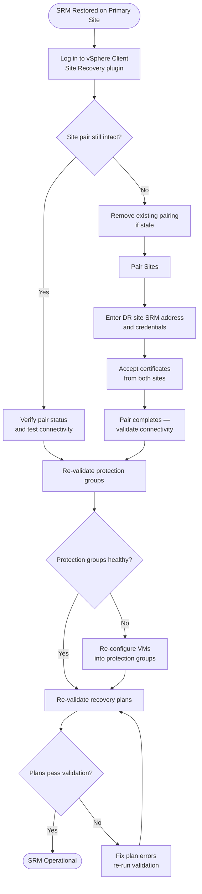
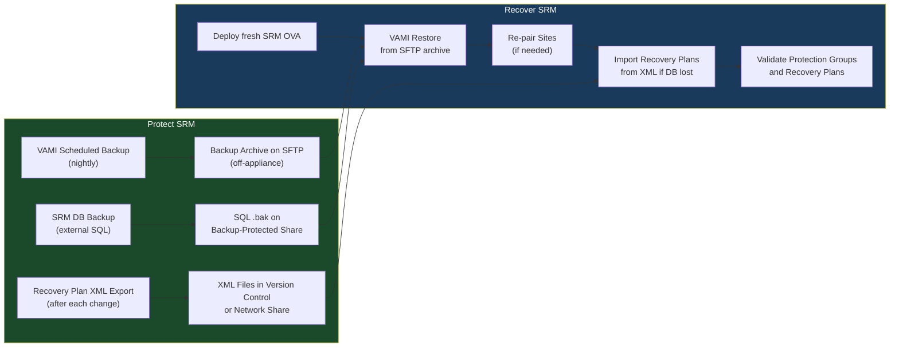

# SRM — Backup & Restore

```bash
# On the SRM appliance (SSH)
ls -lh /var/lib/applmgmt/backup/
# Should show recent .tar.gz archive files
```text
┌─────────────────────────────────────── SRM — Backup & Restore ────────────────────────────────────────┐
│                                                                                                       │
│    Backup flow: quiesce source → snapshot/copy → transfer → write to target → catalog                 │
│                                                                                                       │
│   ┌──────────────────────────────────────────────┐  ┌─────────────────────────────────────────────┐   │
│   │             Backup (Protection)              │  │              Restore (Recovery)             │   │
│   │               srm-cli vm list                │  │             srm-cli recovery run            │   │
│   │              Quiesce source I/O              │  │            Select recovery point            │   │
│   │             Take snapshot / CBT              │  │           Mount or copy to target           │   │
│   │           Transfer changed blocks            │  │              Validate integrity             │   │
│   │             Commit to repository             │  │             Restart application             │   │
│   └──────────────────────────────────────────────┘  └─────────────────────────────────────────────┘   │
│                                                                                                       │
│   ┌───────────────────────────────────────────────────────────────────────────────────────────────┐   │
│   │                                        Key SRM Commands                                       │   │
│   │                                Backup trigger  : srm-cli vm list                              │   │
│   │                              List points     : srm-cli recovery run                           │   │
│   │                               Health status   : srm-cli plan test                             │   │
│   │                                Retention mgmt  : srm-cli history                              │   │
│   └───────────────────────────────────────────────────────────────────────────────────────────────┘   │
│                                                                                                       │
│  Physical Infrastructure:                                                                             │
│  Two vCenter instances (protected + recovery) · SRA on SRM server · Array replication link            │
│  Key terms:                                                                                           │
│                                                                                                       │
│  SRM           = Site Recovery Manager; VMware product for DR orchestration and testing               │
│  SRA           = Storage Replication Adapter; plugin linking SRM to specific array replication        │
│  Protection Group= logical grouping of VMs covered by a single replication consistency group          │
│  Recovery Plan = automated DR runbook: power-off order, datastore failover, IP customization          │
│  IP Customization= per-VM network settings applied at recovery site (different subnet/gateway)        │
│  Test Failover = non-disruptive plan validation using snapshot; production unaffected                 │
│  Planned Migration= graceful workload movement; VMs shutdown at protected, started at recovery        │
│  Emergency Failover= disaster scenario; VMs powered on from latest available replica                  │
│  Failback      = after recovery, re-protect VMs and migrate back to production site                   │
│  Re-protect    = reverses replication direction; DR site becomes new protected site                   │
│  Recovery Point= specific replication snapshot used for VM recovery; RPO = interval                   │
│  vCenter Pair  = SRM connection between two vCenter instances enables cross-site orchestration        │
│  Startup Priority= ordering within recovery plan; lower number = powers on first                      │
│  Site Pair     = trust relationship between protected and recovery SRM servers                        │
│                                                                                                       │
└───────────────────────────────────────────────────────────────────────────────────────────────────────┘
```
```sql
-- Restore on SQL Server
RESTORE DATABASE [VMwareSRM]
FROM DISK = N'\\backup-server\sql-backups\VMwareSRM_Full.bak'
WITH REPLACE, RECOVERY;
```


