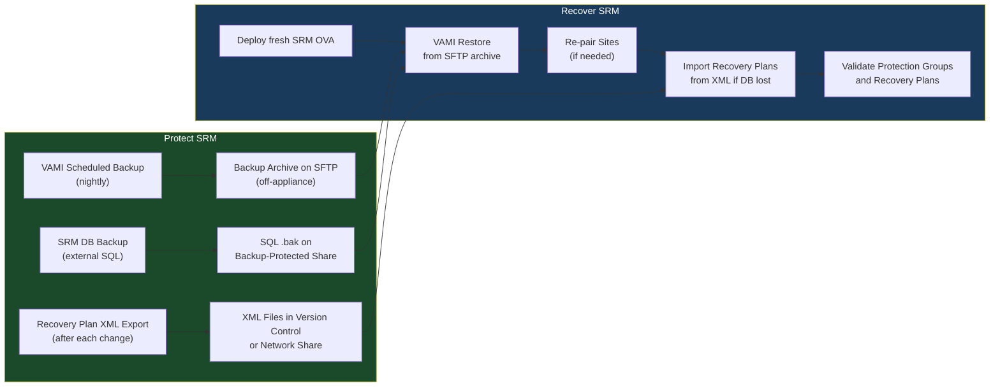

# SRM — Backup & Restore


<div class="kb-summary">
Backup & Restore reference covering SRM Backup Considerations, SRM Database Backup, SRM Configuration Backup, Restore SRM from Backup, Re-pairing Sites After Recovery and 2 more sections.
</div>

## SRM Backup Considerations

VMware Site Recovery Manager (SRM) does not protect the virtual machines it manages — it orchestrates their recovery. Protecting the SRM infrastructure itself is a separate and critical requirement. An SRM deployment that cannot be restored is a single point of failure for the entire DR plan.

**Components that must be protected:**

| Component | What to Back Up | Method |
|---|---|---|
| SRM Server (vCenter Plugin) | SRM DB, configuration, recovery plans | DB backup + export |
| SRM Database | SQL Server or vPostgres DB | SQL backup / snapshot |
| Recovery Plans | Exported as XML | Manual export or scripted |
| SRM Certificates | Pairing certs between sites | Export from SRM UI |
| vCenter | SRM depends on vCenter — vCenter must also be protected | vCenter file-based backup (VAMI) |

---

## SRM Database Backup

SRM uses either an embedded vPostgres database (appliance deployments) or an external SQL Server / Oracle database.

### Embedded vPostgres (SRM Appliance)

SRM 8.x and later ship as a Linux appliance. The embedded database is backed up via the VAMI file-based backup.

**Enable file-based backup in VAMI:**

1. Log in to `https://<srm-appliance>:5480`.
2. Navigate to **Backup**.
3. Configure an SFTP or SCP backup destination.
4. Set a schedule (daily recommended).
5. Click **Backup Now** for an immediate backup.

The VAMI backup captures the SRM appliance state, database, and configuration in a single archive.

**Verify backup:**

```bash
# On the SRM appliance (SSH)
ls -lh /var/lib/applmgmt/backup/
# Should show recent .tar.gz archive files
```
┌─────────────────────────────────────── SRM — Backup & Restore ────────────────────────────────────────┐
│                                                                                                       │
│    Backup flow: quiesce source → snapshot/copy → transfer → write to target → catalog                 │
│                                                                                                       │
│   ┌──────────────────────────────────────────────┐  ┌─────────────────────────────────────────────┐   │
│   │             Backup (Protection)              │  │              Restore (Recovery)             │   │
│   │               srm-cli vm list                │  │             srm-cli recovery run            │   │
│   │              Quiesce source I/O              │  │            Select recovery point            │   │
│   │             Take snapshot / CBT              │  │           Mount or copy to target           │   │
│   │           Transfer changed blocks            │  │              Validate integrity             │   │
│   │             Commit to repository             │  │             Restart application             │   │
│   └──────────────────────────────────────────────┘  └─────────────────────────────────────────────┘   │
│                                                                                                       │
│   ┌───────────────────────────────────────────────────────────────────────────────────────────────┐   │
│   │                                        Key SRM Commands                                       │   │
│   │                                Backup trigger  : srm-cli vm list                              │   │
│   │                              List points     : srm-cli recovery run                           │   │
│   │                               Health status   : srm-cli plan test                             │   │
│   │                                Retention mgmt  : srm-cli history                              │   │
│   └───────────────────────────────────────────────────────────────────────────────────────────────┘   │
│                                                                                                       │
│  Physical Infrastructure:                                                                             │
│  Two vCenter instances (protected + recovery) · SRA on SRM server · Array replication link            │
│  Key terms:                                                                                           │
│                                                                                                       │
│  SRM           = Site Recovery Manager; VMware product for DR orchestration and testing               │
│  SRA           = Storage Replication Adapter; plugin linking SRM to specific array replication        │
│  Protection Group= logical grouping of VMs covered by a single replication consistency group          │
│  Recovery Plan = automated DR runbook: power-off order, datastore failover, IP customization          │
│  IP Customization= per-VM network settings applied at recovery site (different subnet/gateway)        │
│  Test Failover = non-disruptive plan validation using snapshot; production unaffected                 │
│  Planned Migration= graceful workload movement; VMs shutdown at protected, started at recovery        │
│  Emergency Failover= disaster scenario; VMs powered on from latest available replica                  │
│  Failback      = after recovery, re-protect VMs and migrate back to production site                   │
│  Re-protect    = reverses replication direction; DR site becomes new protected site                   │
│  Recovery Point= specific replication snapshot used for VM recovery; RPO = interval                   │
│  vCenter Pair  = SRM connection between two vCenter instances enables cross-site orchestration        │
│  Startup Priority= ordering within recovery plan; lower number = powers on first                      │
│  Site Pair     = trust relationship between protected and recovery SRM servers                        │
│                                                                                                       │
└───────────────────────────────────────────────────────────────────────────────────────────────────────┘
```

---

## Restore SRM from Backup

### Restore from VAMI File-Based Backup (Appliance)

1. Deploy a fresh SRM OVA at `https://<vc>/ui` → **Deploy OVF Template**.
2. Configure with the same hostname and IP as the failed instance.
3. Log in to VAMI (`https://<new-srm-appliance>:5480`).
4. Navigate to **Restore**.
5. Provide the SFTP path to the backup archive.
6. Click **Restore** — the appliance will restore configuration and DB, then restart SRM services.

### Restore from SQL Backup (External DB)

```sql
-- Restore on SQL Server
RESTORE DATABASE [VMwareSRM]
FROM DISK = N'\\backup-server\sql-backups\VMwareSRM_Full.bak'
WITH REPLACE, RECOVERY;
```

1. Ensure the restored SQL instance is accessible from the new SRM server.
2. Install a fresh SRM appliance/server.
3. During setup wizard, point to the existing (restored) SQL database.
4. SRM will import the configuration from the restored DB.

### Recover Recovery Plans from XML Export

If the DB is unrecoverable but XML exports exist:

1. Install and configure SRM fresh.
2. Re-pair the sites (see below).
3. In **Recovery Plans** → **Import Recovery Plan** → select each XML file.
4. Review imported plans — protection groups and inventory mappings must be re-validated.

---

## Re-pairing Sites After Recovery

After SRM is reinstalled or restored, the site pair may need to be re-established.


### Re-pairing Steps

1. **vSphere Client** → **Site Recovery** → **Open Site Recovery**.
2. Click **New Site Pair**.
3. Enter the DR site vCenter FQDN and credentials.
4. Enter the DR site SRM FQDN and credentials.
5. Accept the self-signed certificates from both sites.
6. Click **Connect** — the pairing completes and inventory mappings are loaded.
7. Navigate to **Recovery Plans** → run **Validate** on each plan.

---

## SRM Backup & Restore Workflow



---

## Post-Recovery Validation Checklist

| # | Check | Method |
|---|---|---|
| 1 | SRM services running on both sites | VAMI → Summary → Service Status |
| 2 | Site pair connected | Site Recovery → Site Pairs → Status: Connected |
| 3 | vCenter inventory mapping intact | Site Recovery → Configure → Inventory Mappings |
| 4 | Network mappings correct | Site Recovery → Configure → Network Mappings |
| 5 | Protection groups show VMs protected | Site Recovery → Protection Groups → Status |
| 6 | Recovery plans validate without errors | Recovery Plans → Validate All → 0 errors |
| 7 | SRM DB accessible and populated | Check plan count matches pre-restore |
| 8 | Recovery plan XML matches latest export | Compare imported plan with version control |
| 9 | VAMI backup scheduled and tested | VAMI → Backup → Schedule active |
| 10 | Recovery documented | Incident/DR test record updated |
