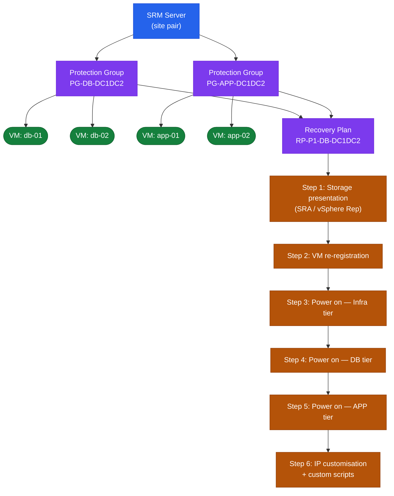

# SRM Operations — CLI Reference

## SRM Object Hierarchy

Protection Groups, Recovery Plans, and the steps that execute during failover form a strict containment hierarchy.


┌───────────────────────────────────────── SRM — CLI Reference ─────────────────────────────────────────┐
│                                                                                                       │
│   ┌───────────────────────────────────────────────────────────────────────────────────────────────┐   │
│   │                                    SRM — Command Reference                                    │   │
│   │           Use these commands for routine operations, scripting, and troubleshooting           │   │
│   │                                         srm-cli vm list                                       │   │
│   │                                       srm-cli recovery run                                    │   │
│   │                                        srm-cli plan test                                      │   │
│   │                                         srm-cli pg list                                       │   │
│   │                                         srm-cli history                                       │   │
│   └───────────────────────────────────────────────────────────────────────────────────────────────┘   │
│                                                                                                       │
│    Ports: 443 (SRM HTTPS) · 9086 (SRM-SRM pairing) · 443 (vCenter)                                    │
│                                                                                                       │
│   ┌───────────────────────────────────────────────────────────────────────────────────────────────┐   │
│   │                                       Command Categories                                      │   │
│   │                  Status / Query  — check current state, list jobs, show config                │   │
│   │                  Operations      — start, stop, failover, restore, sync, expire               │   │
│   │                Configuration   — add/modify policies, schedules, storage targets              │   │
│   │               Diagnostics     — collect logs, run health checks, test connectivity            │   │
│   │                  Scripting       — REST API or CLI for automation and reporting               │   │
│   └───────────────────────────────────────────────────────────────────────────────────────────────┘   │
│                                                                                                       │
│  Physical Infrastructure:                                                                             │
│  Two vCenter instances (protected + recovery) · SRA on SRM server · Array replication link            │
│  Key terms:                                                                                           │
│                                                                                                       │
│  SRM           = Site Recovery Manager; VMware product for DR orchestration and testing               │
│  SRA           = Storage Replication Adapter; plugin linking SRM to specific array replication        │
│  Protection Group= logical grouping of VMs covered by a single replication consistency group          │
│  Recovery Plan = automated DR runbook: power-off order, datastore failover, IP customization          │
│  IP Customization= per-VM network settings applied at recovery site (different subnet/gateway)        │
│  Test Failover = non-disruptive plan validation using snapshot; production unaffected                 │
│  Planned Migration= graceful workload movement; VMs shutdown at protected, started at recovery        │
│  Emergency Failover= disaster scenario; VMs powered on from latest available replica                  │
│  Failback      = after recovery, re-protect VMs and migrate back to production site                   │
│  Re-protect    = reverses replication direction; DR site becomes new protected site                   │
│  Recovery Point= specific replication snapshot used for VM recovery; RPO = interval                   │
│  vCenter Pair  = SRM connection between two vCenter instances enables cross-site orchestration        │
│  Startup Priority= ordering within recovery plan; lower number = powers on first                      │
│  Site Pair     = trust relationship between protected and recovery SRM servers                        │
│                                                                                                       │
└───────────────────────────────────────────────────────────────────────────────────────────────────────┘
```

---

## Recovery Plans

Recovery plans define the failover sequence and IP customisation rules.

```powershell
# List all recovery plans
Get-SRMRecoveryPlan

# Show recovery plan details
Get-SRMRecoveryPlan -Name <plan_name> | Format-List

# List steps in a recovery plan
Get-SRMRecoveryPlan -Name <plan_name> | Get-SRMRecoveryPlanStep
```

---

## Test Failover

Test failover runs in an isolated network bubble and does not affect production. Always run a test before a real recovery.

```powershell
# Start a test failover
$plan = Get-SRMRecoveryPlan -Name <plan_name>
$plan.RecoveryPlanService.Start($plan.MoRef, (New-Object VMware.VimAutomation.Srm.Types.V1.RecoveryPlanRecoveryMode))

# Check test status
Get-SRMRecoveryPlan -Name <plan_name> | Select State, ActiveHistoryTask

# Clean up (remove test snapshot, restore network)
$plan.RecoveryPlanService.Cancel($plan.MoRef)
```

---

## Recovery (Planned Migration / Failover)

Real recovery — run only during a DR event or planned migration.

```powershell
# Execute planned migration (graceful, bidirectional)
Start-SRMRecoveryPlan -RecoveryPlan (Get-SRMRecoveryPlan -Name <plan_name>) -RecoveryMode Planned

# Execute emergency failover (one-way, no replication cleanup)
Start-SRMRecoveryPlan -RecoveryPlan (Get-SRMRecoveryPlan -Name <plan_name>) -RecoveryMode Failover

# Stop an in-progress plan
Stop-SRMRecoveryPlan -RecoveryPlan (Get-SRMRecoveryPlan -Name <plan_name>)
```

---

## REST API

SRM 8.3+ exposes a REST API at `https://<srm_fqdn>/api`.

```bash
# Authenticate
curl -k -X POST https://<srm_fqdn>/api/sessions   -H "Content-Type: application/json"   -d '{"username":"administrator@vsphere.local","password":"<pass>"}'

# List protection groups
curl -k -X GET https://<srm_fqdn>/api/groups   -H "Authorization: <token>"

# List recovery plans
curl -k -X GET https://<srm_fqdn>/api/plans   -H "Authorization: <token>"

# Trigger test failover
curl -k -X POST "https://<srm_fqdn>/api/plans/<plan_id>/actions/test"   -H "Authorization: <token>"
```
