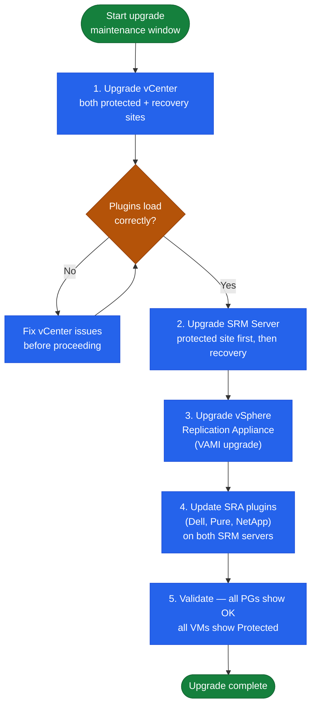

# SRM Operations — Install & Upgrade

## Version Compatibility

SRM version must match vCenter version. Always check the Broadcom Product Interoperability Matrix before any upgrade.

| SRM Version | vCenter Version | vSphere Replication | Notes |
|---|---|---|---|
| SRM 8.8 | vCenter 8.0 U3 | VR 8.8 | Current |
| SRM 8.7 | vCenter 8.0 U2 | VR 8.7 | Supported |
| SRM 8.6 | vCenter 8.0 U1 | VR 8.6 | Check EOS |
| SRM 8.4 | vCenter 7.0 U3 | VR 8.4 | vSphere 7 era |

## Upgrade Sequence

### Upgrade Order Dependency Chain


```

Validate all protection groups show `OK` and all VMs show `Protected` after each upgrade step before proceeding.

## License Management

SRM licenses are per protected VM:
- **Perpetual + SnS**: Annual renewal of Support and Subscription
- **Subscription**: Monthly or annual via Broadcom Advantage portal
- **License compliance threshold**: Review at 80% utilisation; initiate procurement at 90%

Check current protected VM count:
- SRM UI → Inventory → Virtual Machines → Protected (count in top bar)

Track in CMDB:
| Field | Value |
|---|---|
| License type | Perpetual / Subscription |
| Licensed VM count | <number> |
| Current protected VM count | <number from SRM UI> |
| Renewal date | <date> |

## EOL Tracking

SRM lifecycle is tied to vSphere:
- SRM 8.x aligned to vSphere 8.x lifecycle
- vSphere 7.x general support ended: October 2025
- Track End of General Support and End of Technical Guidance dates in CMDB

## Migrating from Array Replication to vSphere Replication

When decommissioning array-based SRA in favour of vSphere Replication:

1. Document all VMs in array-based protection groups
2. Create new vSphere Replication-based protection group
3. Enable vSphere Replication on each VM (configure RPO)
4. Wait for initial sync to complete
5. Remove VMs from old array-based protection group
6. Retire old protection group and delete SRA configuration
7. Deregister old array manager in SRM → Array Managers

Expect initial sync to take hours to days depending on VMDK size and link bandwidth.

## SRM Appliance Backup

Back up the SRM configuration database daily:
```powershell
# Windows-based SRM: back up via SQL Server or embedded DB backup
# Linux-based SRM (8.8+): use VAMI backup or API
Invoke-WebRequest -Uri "https://<srm-appliance>:5480/api/v1/config/export" -OutFile srm-config-backup.zip
```
