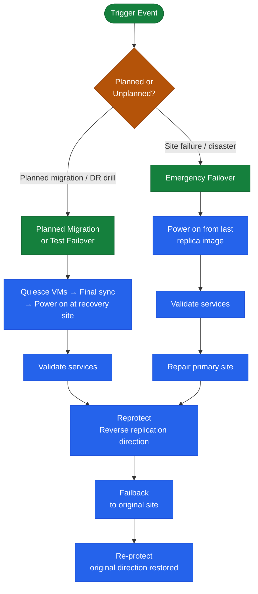

# SRM Operations — Procedures

> Part of the [SRM](../../index.md) > [Operations](../index.md) reference.

VMware Live Site Recovery (formerly Site Recovery Manager) orchestrates disaster recovery workflows between two vCenter-managed sites. This page covers the full operational procedure set: creating protection groups, building recovery plans, running test failovers, performing planned migrations, executing emergency failovers, failing back, and re-protecting.

---

## Operational Flow Overview



---

## Creating Recovery Plans

A recovery plan references one or more protection groups and defines the power-on sequence, IP customisation rules, and pre/post-recovery scripts.

### Recovery Plan Design Rules

| Setting | Standard |
|---|---|
| Name convention | `RP-P<priority>-<tier>-<site-pair>` (e.g., `RP-P1-DB-DC1DC2`) |
| Boot order | Infrastructure (DC/DNS) → DB tier → App tier → Web/presentation tier |
| Step delay | 120 s after DC/DNS; 60 s after DB tier before app start |
| IP customisation | Required for all VMs in non-routed test/recovery networks |
| Max VMs per plan | 500 VMs (VLSR 9.0 supports up to 1500 VMs per protection group) |

### Creating a Recovery Plan

1. Navigate to **Site Recovery** > **Recovery Plans** > **New Recovery Plan**.
2. Enter plan name using the naming convention above.
3. Select the protection group(s) to include.
4. Configure the recovery site.
5. Set the **Test network** — use the dedicated bubble/test portgroup (e.g., `vPG-SRM-Test-Bubble`) to isolate test VMs from production networks.
6. Define VM boot sequence — drag VMs into numbered recovery steps; set per-step delays.
7. Add IP customisation rules for VMs that need different IP configuration at the recovery site.
8. Optionally attach **pre-power-on scripts** (e.g., DNS record update, load balancer pool drain) and **post-power-on scripts** (e.g., application health check, monitoring alert suppression).
9. Finish and run a validation before first use.

### Attaching Custom Scripts

SRM supports PowerShell and shell scripts called as recovery steps:

```powershell
# Example: post-power-on script to verify a Windows service is running
param([string]$ServerName, [string]$ServiceName)
$svc = Get-Service -ComputerName $ServerName -Name $ServiceName -ErrorAction Stop
if ($svc.Status -ne 'Running') {
    throw "Service $ServiceName on $ServerName is not running after failover"
}
Write-Output "Service $ServiceName is running on $ServerName"
```

Place scripts in a location accessible to the SRM server service account and reference the UNC path in the recovery plan step.

---

## Test Failover (Non-Disruptive DR Drill)

Test failover powers on recovered VMs in an isolated bubble network without disrupting production replication or the protected site.

```mermaid
sequenceDiagram
    participant Admin
    participant SRM as SRM Server
    participant SRA as SRA / vSphere Rep
    participant Storage as DR Storage
    participant ESXI as Recovery ESXi

    Admin->>SRM: Click Test on Recovery Plan
    SRM->>SRM: Optional — replicate recent changes
    SRM->>SRA: Create test snapshot / FlexClone of replica LUNs
    SRA->>Storage: Snapshot replica volumes (non-disruptive)
    Storage-->>SRA: Snapshot ready
    SRM->>ESXI: Present snapshot datastores (read-only for production, R/W for test)
    ESXI-->>SRM: Datastores accessible
    SRM->>ESXI: Register VMs from snapshot datastores
    SRM->>ESXI: Power on VMs in defined boot sequence (bubble network)
    ESXI-->>SRM: VMs online
    SRM->>SRM: Execute per-step delays and post-power-on scripts
    SRM-->>Admin: Test running — validate services
    Admin->>SRM: Click Cleanup
    SRM->>ESXI: Power off test VMs
    SRM->>SRA: Remove test snapshot / FlexClone
    SRA->>Storage: Delete snapshot
    SRM-->>Admin: Test cleanup complete; generate test report
```

### Test Failover Procedure

1. Navigate to **Recovery Plans** > select plan > **Test**.
2. When prompted, choose whether to sync recent changes before test (recommended).
3. SRM creates isolated snapshot datastores at the recovery site.
4. Monitor the recovery steps in the **Recovery Steps** tab — each step shows status, duration, and any errors.
5. Once all VMs are powered on, validate application functionality within the bubble network.
6. Click **Cleanup** to tear down the test environment. Do not leave test environments running longer than needed — stale snapshots can fill journal/snapshot space.

!!! tip "RTO Measurement"
    Record the elapsed time shown in the **Recovery Steps** pane at the point when the last application health check passes. This is your actual RTO — compare against the tier target RTO in the standards document.

### Common Test Failover Issues

| Symptom | Likely Cause | Resolution |
|---|---|---|
| VM fails to power on — datastore inaccessible | Snapshot not created by SRA | Check SRA logs; verify array replication is healthy |
| IP customisation not applied | Missing IP customisation rule for VM | Add rule in Recovery Plan > IP Customisation |
| Post-power-on script fails | Script path not accessible from SRM service account | Fix UNC path; verify service account permissions |
| VM registers on wrong datastore | Datastore mapping misconfigured | Update datastore mapping in Site Recovery > Array Managers |
| Test cleanup hangs | Snapshot deletion failed at array | Manually delete snapshot at array; then retry cleanup |

---

## Planned Migration

A planned migration gracefully shuts down VMs at the protected site, performs a final replication sync, then powers them on at the recovery site. Both sites must be operational.

### Pre-Migration Checklist

- [ ] Both sites and SRM servers are reachable and healthy
- [ ] Replication is healthy with zero or acceptable backlog (RPO at target)
- [ ] Recovery plan has been tested successfully within the last quarter
- [ ] Change record approved; maintenance window scheduled
- [ ] Application owners notified; application shutdown pre-steps completed if required
- [ ] DNS/load balancer changes prepared (or scripted in recovery plan)

### Planned Migration Procedure

1. Navigate to **Recovery Plans** > select plan > **Run** > **Planned Migration**.
2. SRM confirms both sites are connected — if the protected site is unreachable, it refuses to run Planned Migration (use Emergency Failover instead).
3. SRM executes pre-power-off scripts (if configured).
4. SRM quiesces and powers off protected-site VMs in reverse boot order (web → app → DB → infra).
5. A final replication sync is triggered and completed — ensuring zero data loss.
6. SRM presents replica datastores at the recovery site.
7. VMs are registered and powered on at the recovery site in the defined boot sequence.
8. Post-power-on scripts execute (DNS updates, load balancer re-point, etc.).
9. Validate services, then close the change record.

!!! warning "No Rollback After Planned Migration"
    Once VMs are powered on at the recovery site, the original protected site is unpowered. To return to the original site, run **Reprotect** followed by a reverse failover.

---

## Emergency Failover (Disaster Recovery)

Used when the protected site is unavailable. VMs are powered on from the most recent replica image. Some data loss is expected depending on RPO at the time of failure.

### Emergency Failover Procedure

1. Declare disaster and invoke the DR change record.
2. Navigate to **Recovery Plans** > select plan > **Run** > **Disaster Recovery**.
3. SRM will warn that the protected site is not reachable and that data loss may occur — confirm.
4. SRM presents the last-good replica datastores at the recovery site.
5. VMs are registered and powered on in the defined boot sequence.
6. No pre-power-off or final sync steps are performed (protected site is down).
7. Post-power-on scripts execute.
8. Validate services and notify stakeholders.
9. Document the actual RPO: check the replication lag or journal timestamp at the time of failure.

```bash
# After failover, check SRDF or RecoverPoint state for data loss assessment
# PowerMax SRDF example
symrdf -sid <SYMID> -rdfg <RDFG> query

# RecoverPoint — check journal recovery point timestamp
boxmgmt cg check_all
```

---

## Reprotect

After any failover (planned or emergency), the recovered VMs are now running at the recovery site without replication. Reprotect reverses the replication direction so the recovery site becomes the new protected site.

### Reprotect Procedure

1. Ensure the original protected site infrastructure (storage, network, vCenter) is restored and reachable.
2. Navigate to **Recovery Plans** > select plan > **Reprotect**.
3. SRM coordinates with the SRA or vSphere Replication to establish reverse replication:
   - For SRDF: SRDF pairs are re-established with the original R2 becoming R1.
   - For vSphere Replication: new replication sessions are created from recovery site back to original site.
   - For RecoverPoint: replication direction is reversed via the RecoverPoint API.
4. Initial sync (full or delta) from recovery site back to original site begins.
5. Monitor sync progress in vSphere Replication or the array management UI.
6. Once sync completes and RPO is at target, the environment is ready for failback.

!!! note "Reprotect Does Not Move VMs"
    Reprotect only reverses replication — VMs continue running at the recovery site. The original site datastores now receive replicated writes from the recovery site.

---

## Failback

Failback returns VMs to the original protected site. Mechanically, it is a planned migration in the reverse direction, using the reprotected recovery plan.

### Failback Procedure

1. Confirm replication from recovery site → original site is healthy and RPO is at target.
2. Navigate to **Recovery Plans** > select the **reverse/failback recovery plan** (SRM creates this automatically during Reprotect, or you create a new plan in the reverse direction).
3. Run as **Planned Migration**.
4. VMs are quiesced at the recovery site, a final sync is performed to the original site, and VMs are powered on at the original site.
5. After failback, run **Reprotect** again to restore the original replication direction (original site → recovery site).
6. Validate the environment; close the DR incident record.

### Failback Go/No-Go Criteria

| Criteria | Required State |
|---|---|
| Original site vCenter reachable | Yes |
| Original site storage presenting correctly to hosts | Yes |
| Reverse replication RPO at target | Yes — zero or within tier RPO |
| Application owner sign-off on recovery-site validation | Yes |
| Change record approved for failback window | Yes |

---

## SRM Alarms and Monitoring

SRM generates vCenter alarms for key events. Monitor these in the vCenter Alarms view or your external monitoring system.

| Alarm | Trigger | Action |
|---|---|---|
| Protection group error | One or more VMs in error state | Check vSphere Replication or SRA; resolve replication issue |
| Recovery plan cannot be tested | Validation failure (mapping issue, etc.) | Run recovery plan validation; fix errors listed |
| RPO violation | Replication lag exceeds RPO target | Check WAN bandwidth; check storage performance; resolve blocking errors |
| SRM server unreachable | SRM service down or certificate issue | Restart SRM service; check certificate expiry |
| Array manager communication failure | SRA cannot reach array | Check SRA service; verify array credentials and network |

```powershell
# Check SRM service status on Windows SRM server
Get-Service -Name vmware-dr

# Restart SRM service if needed
Restart-Service -Name vmware-dr

# Review SRM logs
# Default log path: C:\ProgramData\VMware\VMware vCenter Site Recovery Manager\Logs\
Get-Content "C:\ProgramData\VMware\VMware vCenter Site Recovery Manager\Logs\vmware-dr.log" -Tail 100
```

---

## Quarterly DR Drill Process

| Step | Owner | Timing |
|---|---|---|
| Schedule maintenance window | Change Manager | T-4 weeks |
| Notify application owners | Infra Lead | T-2 weeks |
| Pre-test validation (run SRM validation wizard) | SRM Admin | T-1 day |
| Execute test failover | SRM Admin | During window |
| Application validation | App owners | During window |
| Record RTO achieved vs. target | SRM Admin | During window |
| Cleanup test environment | SRM Admin | End of window |
| Produce test report (RTO, issues, actions) | SRM Admin | T+2 days |
| Update action items in JIRA/ticketing | Infra Lead | T+5 days |
