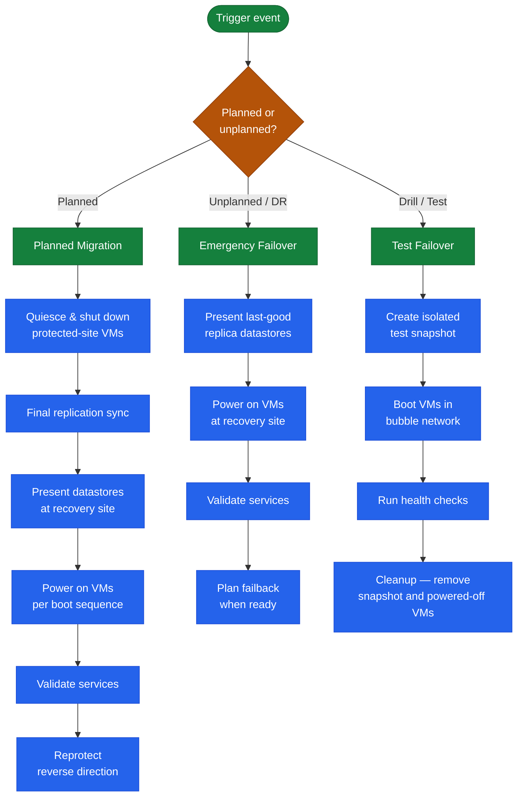
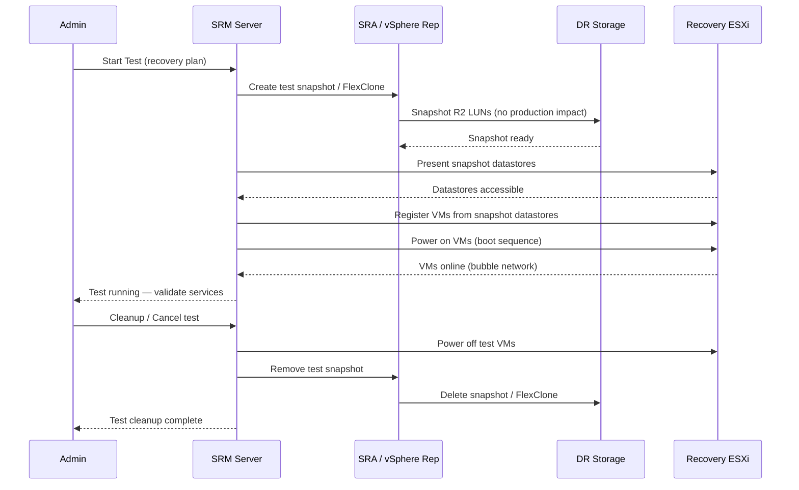
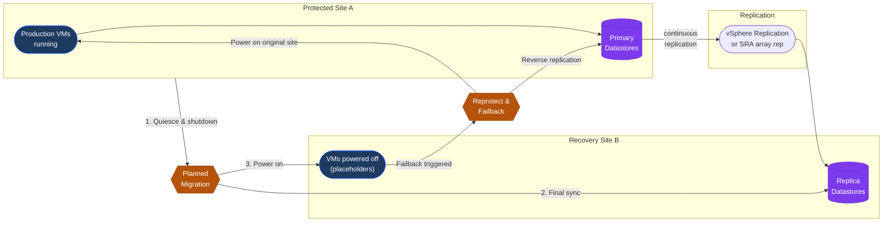

# SRM Operations — Procedures

## SRM Operational Flow Overview

The three primary SRM operations — Recovery Plan test, planned migration, and cleanup — each follow a distinct sequence governed by the same underlying orchestration engine.

---

## Recovery Plans

Use this section for practical SRM Recovery Plans notes, checks, troubleshooting, commands, change notes, and field references.

### Common Checks

- Confirm current health
- Review active alerts
- Check recent changes
- Confirm dependencies
- Check logs, events, and monitoring
- Capture current state before changes

### Incident Notes

Capture:

- Symptom
- Start time
- Impact
- System or service name
- Error message
- What changed
- What was checked
- Next action

### Change Notes

- Confirm change approval
- Confirm maintenance window
- Confirm rollback plan
- Capture current state
- Make one change at a time
- Validate after the change

### Useful Commands

Add tested commands here.

### Known Issues

Add known issues here as they come up.

---

## Test Failover

### Test Failover Sequence

Use this section for practical SRM Test Failover notes, checks, troubleshooting, commands, change notes, and field references.

### Common Checks

- Confirm current health
- Review active alerts
- Check recent changes
- Confirm dependencies
- Check logs, events, and monitoring
- Capture current state before changes

### Incident Notes

Capture:

- Symptom
- Start time
- Impact
- System or service name
- Error message
- What changed
- What was checked
- Next action

### Change Notes

- Confirm change approval
- Confirm maintenance window
- Confirm rollback plan
- Capture current state
- Make one change at a time
- Validate after the change

### Useful Commands

Add tested commands here.

### Known Issues

Add known issues here as they come up.

---

## Planned Migration

### Planned Migration vs Failback Flow

Use this section for practical SRM Planned Migration notes, checks, troubleshooting, commands, change notes, and field references.

### Common Checks

- Confirm current health
- Review active alerts
- Check recent changes
- Confirm dependencies
- Check logs, events, and monitoring
- Capture current state before changes

### Incident Notes

Capture:

- Symptom
- Start time
- Impact
- System or service name
- Error message
- What changed
- What was checked
- Next action

### Change Notes

- Confirm change approval
- Confirm maintenance window
- Confirm rollback plan
- Capture current state
- Make one change at a time
- Validate after the change

### Useful Commands

Add tested commands here.

### Known Issues

Add known issues here as they come up.

---

## Cleanup

Use this section for practical SRM Cleanup notes, checks, troubleshooting, commands, change notes, and field references.

### Common Checks

- Confirm current health
- Review active alerts
- Check recent changes
- Confirm dependencies
- Check logs, events, and monitoring
- Capture current state before changes

### Incident Notes

Capture:

- Symptom
- Start time
- Impact
- System or service name
- Error message
- What changed
- What was checked
- Next action

### Change Notes

- Confirm change approval
- Confirm maintenance window
- Confirm rollback plan
- Capture current state
- Make one change at a time
- Validate after the change

### Useful Commands

Add tested commands here.

### Known Issues

Add known issues here as they come up.
