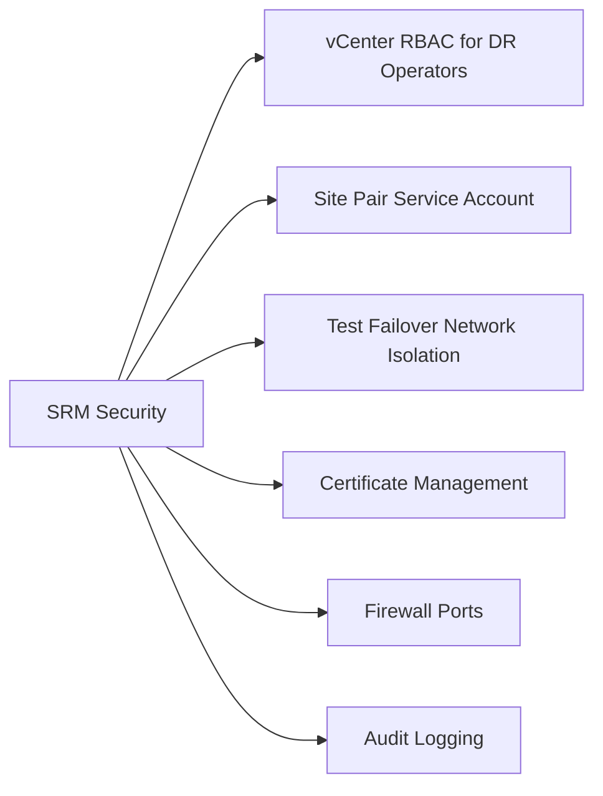

# SRM Security



## vCenter RBAC for DR Operators

Define a dedicated `DR-Operator` role in vCenter with only the privileges required for SRM operations:

```
Privileges to include:
  Site Recovery Manager:
    - Site Recovery.Manage
    - Site Recovery.Test
    - Site Recovery.Recovery
  Datastore:
    - Datastore.AllocateSpace
  Network:
    - Network.Assign (for network customisation)
  Virtual Machine:
    - Virtual Machine.Provisioning.* (for recovery)
```

Assign the role at the SRM inventory root — do not grant broad vCenter Admin privileges to DR operators.

## Site Pair Service Account

The SRM site pair connection uses a service account on each vCenter:

```
Account: svc-srm-pair@domain.local
Privileges: SRM plug-in permissions + read access to vCenter inventory
```

- Do not use a named personal account — must survive staff changes
- Rotate password every 90 days (coordinate rotation on both sites simultaneously to avoid pair disconnect)
- Document the account in the service account inventory in CMDB

To update credentials after rotation: SRM UI → Site Recovery → Sites → Edit Site Pair Credentials

## Test Failover Network Isolation

Recovery plan tests must never reach production networks. Enforce this:

1. Create an isolated port group on the recovery site ESXi cluster: `vPG-SRM-Test-Bubble` (no uplinks)
2. Configure network mapping in SRM: source production network → `vPG-SRM-Test-Bubble`
3. Verify no routing exists from the test bubble to production VLANs
4. If using NSX: create a dedicated overlay segment with no uplink for test failover

```powershell
# Verify test network mapping
Get-SrmRecoveryPlan | Get-SrmNetworkMapping | Select Name, RecoveryNetwork
```

## Certificate Management

Replace default self-signed certificates in production deployments:

1. Generate CSR on SRM server
2. Sign with internal CA (or public CA for partner-site connections)
3. Install certificate: SRM → vCenter → Site Recovery → Certificates → Replace

Certificates used by SRM:
- SRM ↔ vCenter: VMCA-issued or custom
- SRM ↔ SRM (inter-site): Must be mutually trusted (both sites' CAs in trust stores)
- SRM ↔ SRA: Inherits SRM trust store

Track expiry dates in certificate inventory; SRM stops functioning if certificates expire.

## Firewall Ports

| Source | Destination | Port | Purpose |
|---|---|---|---|
| SRM Server | vCenter | 443 | vSphere API |
| SRM Server | Remote SRM Server | 443, 8095 | Site pair communication |
| SRM Server | Array/SRA | 443, 9090 | SRA API calls |
| vSphere Replication | Remote vSphere Replication | 44046 | Replication traffic |

## Audit Logging

SRM logs all recovery plan events. Ensure logs are forwarded to SIEM:

- SRM logs location: `C:\ProgramData\VMware\VMware vCenter Site Recovery Manager\Logs\`
- Forward using a log collector agent (Filebeat, Splunk UF) on the SRM server
- SIEM alert rules:
  - Recovery plan started outside business hours or without change ticket
  - Recovery plan started on production (non-test) mode
  - Failed recovery plan steps (suggests misconfiguration before actual DR event)
