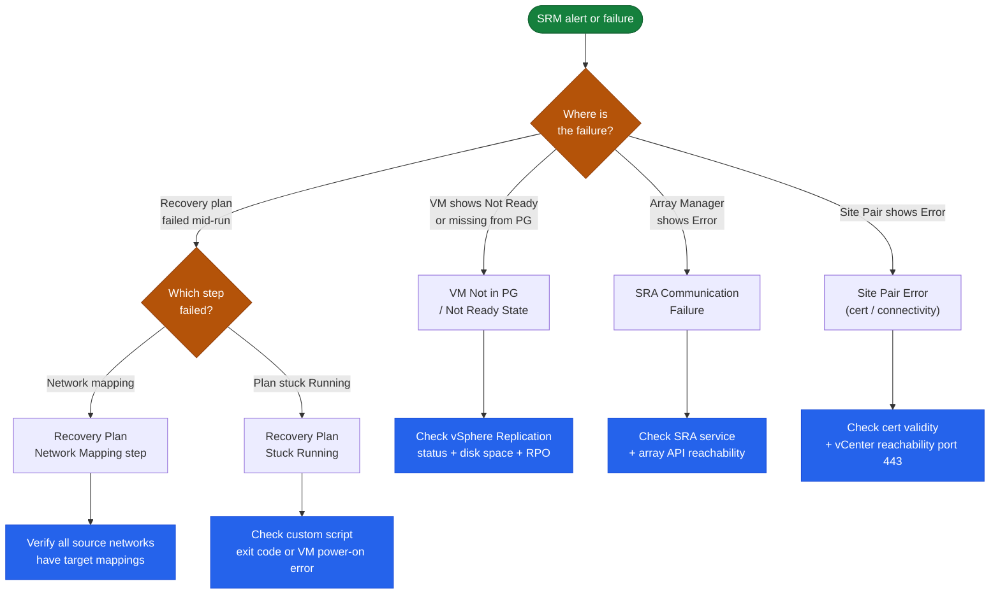

# SRM Troubleshooting — Common Issues

## Triage Decision Tree

Use this flowchart to quickly route to the correct troubleshooting section.



---

## VM Not in Protection Group / `Not Ready` State

```text
Cause: vSphere Replication synchronisation error or initial sync not complete
```

1. vSphere Client → Site Recovery → Replications → find the VM → check status
2. If status is `Error`: click the VM → History tab → view error detail
3. Common sub-causes:
   - Insufficient disk space on recovery datastore
   - RPO set too aggressively for available bandwidth
   - vSphere Replication appliance connectivity issue

```bash
# Check VR appliance is reachable from recovery site ESXi
ping <vr-appliance-ip>
# Check VR port 31031 is open (replication traffic)
nc -zv <vr-appliance-recovery-ip> 31031
```

## Recovery Plan Fails at Network Mapping Step

1. SRM UI → Recovery Plans → select plan → Recent Tasks → view failed step
2. Verify network mappings: SRM → Configure → Network Mappings — ensure every source network has a target mapping
3. Confirm target port groups exist on recovery site ESXi cluster
4. For NSX: confirm overlay segment exists at recovery site

## SRA Communication Failure

```text
Symptom: Array Manager shows "Error" or "Unknown" state in SRM UI
```

1. SRM → Configure → Array Managers → check status
2. Verify SRA service is running:
   ```powershell
   Get-Service vmware-sra-*   # Windows SRM
   ```
3. Re-test array credentials: Array Manager → Edit → Test Connection
4. Check SRA log for specific error (Dell SRA logs: see above path)
5. Verify Unisphere/FlashArray/ONTAP API is accessible from SRM server:
   ```powershell
   Invoke-WebRequest -Uri "https://<array-ip>/univmax/restapi/system/version" -SkipCertificateCheck
   ```

## Recovery Plan Stuck `Running`

```text
Cause: Custom script step timed out, or a VM failed to power on
```

1. SRM → Recovery Plans → running plan → Steps tab — identify which step is stuck
2. If a custom script step: check the script exit code in task details; a non-zero exit causes indefinite wait
3. If a VM power-on step: check vCenter tasks for that VM — may have a configuration issue (missing network, snapshot)
4. As a last resort (during actual DR): manually advance the plan past the stuck step using "Force Next Step"

## Site Pair Shows `Error`

```text
Cause: Certificate mismatch, vCenter connectivity, or credential expiry
```

1. From SRM server, verify vCenter is reachable:
   ```powershell
   Test-NetConnection -ComputerName <vcenter-fqdn> -Port 443
   ```
2. Check certificate validity:
   ```powershell
   $cert = [Net.ServicePointManager]::ServerCertificateValidationCallback
   Invoke-WebRequest "https://<vcenter-fqdn>" -UseBasicParsing
   ```
3. Re-enter site pair credentials: SRM → Sites → Edit Credentials
