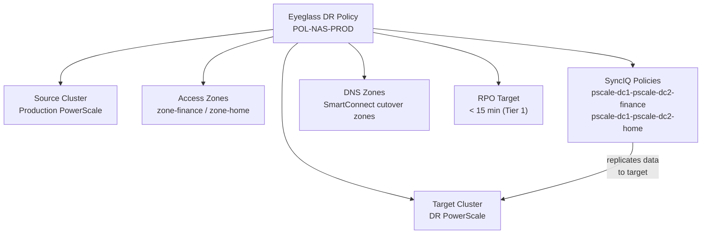

# Superna Eyeglass — Standards

## SyncIQ Policy Naming

SyncIQ policy names must be consistent between primary and DR clusters and follow the format:

```text
<source-cluster>-<target-cluster>-<zone-or-path>
```
┌───────────────────────────────── Superna Eyeglass — Design Standards ─────────────────────────────────┐
│                                                                                                       │
│   ┌──────────────────────────────────────────────┐  ┌─────────────────────────────────────────────┐   │
│   │              Sizing Guidelines               │  │               HA Requirements               │   │
│   │         Deduplicate where supported          │  │           N+1 component redundancy          │   │
│   │          Bandwidth: 10 GbE minimum           │  │          Heartbeat / health monitor         │   │
│   │          Storage: 130% of raw data           │  │          Separate mgmt / data VLANs         │   │
│   │         Latency: < 10 ms to storage          │  │          Out-of-band access (IPMI)          │   │
│   │           CPU: 8+ vCPU for engine            │  │          Anti-affinity VM placement         │   │
│   └──────────────────────────────────────────────┘  └─────────────────────────────────────────────┘   │
│                                                                                                       │
│    Ports: 443 (Eyeglass web UI) · 8080 (REST API) · 8116 (Isilon/PowerScale mgmt)                     │
│                                                                                                       │
│   ┌───────────────────────────────────────────────────────────────────────────────────────────────┐   │
│   │                             Standard Superna Eyeglass Design Rules                            │   │
│   │            RPO target drives snapshot/cycle frequency — document in service design            │   │
│   │            RTO target drives recovery tier: instant, warm standby, or cold restore            │   │
│   │                  Dedicated backup network VLAN — no shared production traffic                 │   │
│   │       Encryption: HTTPS/TLS for all management; SyncIQ replication encryption (AES-256)       │   │
│   │               Service accounts: minimum privilege; rotate credentials quarterly               │   │
│   └───────────────────────────────────────────────────────────────────────────────────────────────┘   │
│                                                                                                       │
│  Physical Infrastructure:                                                                             │
│  ESXi VM (Eyeglass appliance) · PowerScale cluster pair (production + DR) · SyncIQ replication link   │
│  Key terms:                                                                                           │
│                                                                                                       │
│  Eyeglass      = Superna Eyeglass; software appliance for NAS DR and ransomware protection            │
│  RAPA          = Ransomware Protection with Automated Response; detects and quarantines threats       │
│  SyncIQ        = PowerScale built-in replication; Eyeglass monitors and orchestrates policies         │
│  DFS-N         = Windows Distributed File System Namespace; Eyeglass automates failover of DFS        │
│  Failover      = Eyeglass-orchestrated shift of NAS access from production to DR cluster              │
│  Failback      = reversing failover; Eyeglass re-syncs DR changes back and cuts back to product       │
│  Quota Sync    = Eyeglass replicates SmartQuotas from source to DR to preserve user limits            │
│  Export Sync   = NFS exports and SMB shares replicated so clients can reconnect at DR site            │
│  Quarantine    = RAPA isolation of suspect directory; blocks writes, alerts ops team                  │
│  Shadow Copy   = Eyeglass exposes PowerScale snapshots as Windows Previous Versions for NFS sha       │
│  Runbook       = Eyeglass DR Assistant guided checklist for pre-checks, failover, and validation      │
│  igls          = Eyeglass CLI; used for status, sync, DR, and RAPA operations                         │
│  SmartConnect  = PowerScale DNS load balancing; failover changes SmartConnect zone delegation         │
│  Configuration = shares, exports, quotas, NFS aliases; Eyeglass syncs these between clusters          │
│                                                                                                       │
└───────────────────────────────────────────────────────────────────────────────────────────────────────┘

## DR Readiness Score

The Eyeglass DR Readiness Score must be 100% before any scheduled failover test or before declaring DR capability for the environment.

Score < 100% indicates one or more missing mappings or replication lag beyond threshold — investigate and resolve before proceeding with DR exercises.

## Failover Test Frequency

| Test Type | Minimum Frequency |
|---|---|
| DNS cutover test (non-disruptive) | Quarterly |
| Share/quota validation on DR cluster (read-only check) | Monthly |
| Full failover test (maintenance window, with data) | Annually |
| Failback validation | After each full failover test |

Document all failover test results in the change management system.

## Operational Standards

| Item | Standard |
|---|---|
| Eyeglass appliance backup | Daily configuration backup exported and stored off-appliance |
| Monitoring | Eyeglass SNMP traps integrated with Aria Operations or equivalent |
| Notifications | Email notifications active for DR team distribution list |
| Service account rotation | Eyeglass service account credentials rotated every 90 days (coordinate with CyberArk policy) |
| Post-change validation | Re-run Eyeglass readiness scan after any SyncIQ or PowerScale configuration change |

## Policy Configuration

An Eyeglass DR policy defines the mapping between a production PowerScale cluster and a DR cluster, including which access zones, SyncIQ policies, NFS exports, SMB shares, and DNS zones are part of the DR relationship. Policies are configured in the Eyeglass management UI or via `egcli`.

| Policy Component | Description |
|---|---|
| Source cluster | Production PowerScale cluster |
| Target cluster | DR PowerScale cluster |
| Access zones | Which access zones are included in DR |
| SyncIQ policy mapping | Which SyncIQ policies provide the replication |
| DNS zones | SmartConnect zones managed as part of failover |
| RPO target | Maximum acceptable replication lag |



### Viewing Policies

```bash
# List all DR policies
egcli drpolicy list

# Detailed view of a specific policy
egcli drpolicy view --policy <policy_name>

# Status of all policies (replication state, lag, last test)
egcli drpolicy status --all

# List access zones included in a policy
egcli accesszone list --policy <policy_name>

# List SyncIQ policies mapped to a DR policy
egcli synciq list --policy <policy_name>
```

### Creating a DR Policy

DR policies are typically created via the Eyeglass web UI. CLI equivalent:

```bash
# Create a new DR policy (basic parameters)
egcli drpolicy create \
  --name POL-NAS-PROD \
  --source-cluster <production-cluster> \
  --target-cluster <dr-cluster> \
  --access-zone <zone_name> \
  --synciq-policy <synciq_policy_name> \
  --rpo-seconds 300

# Add additional access zones to an existing policy
egcli drpolicy addzone --policy POL-NAS-PROD --access-zone <zone2_name>

# Add additional SyncIQ policies to an existing policy
egcli drpolicy addsync --policy POL-NAS-PROD --synciq-policy <synciq_policy2>

# Enable the policy
egcli drpolicy enable --policy POL-NAS-PROD
```

### SyncIQ Integration

Eyeglass monitors and manages SyncIQ policies as part of DR orchestration. SyncIQ policies must be pre-configured on the production PowerScale cluster.

```bash
# On production PowerScale — view SyncIQ policy configuration
isi sync policies view <synciq_policy_name>

# Confirm policy target is the DR cluster
# Confirm schedule (should be frequent enough to meet RPO)
# Confirm source/target paths match the access zone directories

# Check last run time and status
isi sync reports list --policy <synciq_policy_name> --limit 5

# Manually trigger a SyncIQ sync (e.g., before a planned failover)
isi sync jobs start <synciq_policy_name>

# Monitor sync job completion
isi sync jobs list
```

| SyncIQ Setting | Recommended Value |
|---|---|
| Schedule | Every 5–15 minutes (match RPO target) |
| Source root | Access zone base directory |
| Target path | Matching path on DR cluster |
| Workers per node | 3 (default; increase for high-throughput environments) |
| Log level | Info |

### Policy RPO Monitoring

```bash
# Check current replication lag vs RPO target per policy
egcli drpolicy status --all

# Alert if lag exceeds RPO
# Eyeglass sends SNMP traps or syslog events on RPO breach
# Forward events to monitoring: Settings → Notifications in Eyeglass UI

# Manually check SyncIQ lag on production cluster
isi sync policies list | grep -E "Name|Last|Status"
```

### Modifying and Disabling Policies

```bash
# Update RPO target for a policy
egcli drpolicy modify --policy <policy_name> --rpo-seconds 600

# Disable a policy (e.g., when decommissioning a workload)
egcli drpolicy disable --policy <policy_name>

# Remove an access zone from a policy
egcli drpolicy removezone --policy <policy_name> --access-zone <zone_name>

# Delete a policy (caution — removes Eyeglass orchestration but does not
# remove underlying SyncIQ policies from PowerScale)
egcli drpolicy delete --policy <policy_name> --confirm

# After deletion: verify remaining SyncIQ policies on PowerScale are correct
isi sync policies list
```
