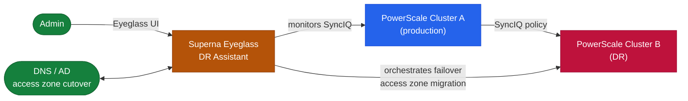

# Superna Eyeglass — How It Works


<div class="kb-summary">
How It Works reference covering Overview, Component Topology, Connectivity, Key CLI Commands, Sizing and 1 more sections.
</div>

## Overview

Superna Eyeglass is a DR orchestration platform purpose-built for NetApp PowerScale (Isilon). It automates the share, quota, and DNS reconfiguration steps that previously required hours of manual work during a SyncIQ failover. Eyeglass continuously monitors DR readiness and scores it at 100% only when all shares, exports, quotas, and DNS zones are aligned between primary and DR clusters.

## Component Topology


┌─────────────────────────────────── Superna Eyeglass — How It Works ───────────────────────────────────┐
│                                                                                                       │
│    Superna Eyeglass data flow — from source to target through the protection pipeline:                │
│                                                                                                       │
│   ┌───────────────────────────────────────────────────────────────────────────────────────────────┐   │
│   │                                 1  Source / Production System                                 │   │
│   │             Eyeglass Appliance   — VM monitoring PowerScale clusters; REST API-driven         │   │
│   │          Host writes are intercepted or snapshotted by the Superna Eyeglass agent/proxy       │   │
│   │                  Changed blocks tracked via CBT / journal / delta-set mechanism               │   │
│   │                 Consistency ensured at quiesce point before data transfer begins              │   │
│   └───────────────────────────────────────────────────────────────────────────────────────────────┘   │
│                                                                                                       │
│    Changed data forwarded to Superna Eyeglass — compression and encryption in transit                 │
│                                                                                                       │
│                                                   ▼                                                   │
│                                                                                                       │
│   ┌───────────────────────────────────────────────────────────────────────────────────────────────┐   │
│   │                                   2  Superna Eyeglass Engine                                  │   │
│   │     RAPA Engine          — Ransomware Protection with Automated Response; quarantine on dete  │   │
│   │                    Data compressed, deduplicated, and encrypted before storage                │   │
│   │                  Metadata catalog updated; job status reported to control plane               │   │
│   │                                          igls quota list                                      │   │
│   └───────────────────────────────────────────────────────────────────────────────────────────────┘   │
│                                                                                                       │
│                                                   ▼                                                   │
│                                                                                                       │
│   ┌───────────────────────────────────────────────────────────────────────────────────────────────┐   │
│   │                                     3  Target / Repository                                    │   │
│   │       DFS Namespace Mgr    — Windows DFS-N failover automation; transparent client redirect   │   │
│   │                  Recovery point written; retention policy applied automatically               │   │
│   │                                     Restore: igls dr runbook                                  │   │
│   │                     RTO driven by target storage performance and data volume                  │   │
│   └───────────────────────────────────────────────────────────────────────────────────────────────┘   │
│                                                                                                       │
│  Physical Infrastructure:                                                                             │
│  ESXi VM (Eyeglass appliance) · PowerScale cluster pair (production + DR) · SyncIQ replication link   │
│  Key terms:                                                                                           │
│                                                                                                       │
│  Eyeglass      = Superna Eyeglass; software appliance for NAS DR and ransomware protection            │
│  RAPA          = Ransomware Protection with Automated Response; detects and quarantines threats       │
│  SyncIQ        = PowerScale built-in replication; Eyeglass monitors and orchestrates policies         │
│  DFS-N         = Windows Distributed File System Namespace; Eyeglass automates failover of DFS        │
│  Failover      = Eyeglass-orchestrated shift of NAS access from production to DR cluster              │
│  Failback      = reversing failover; Eyeglass re-syncs DR changes back and cuts back to product       │
│  Quota Sync    = Eyeglass replicates SmartQuotas from source to DR to preserve user limits            │
│  Export Sync   = NFS exports and SMB shares replicated so clients can reconnect at DR site            │
│  Quarantine    = RAPA isolation of suspect directory; blocks writes, alerts ops team                  │
│  Shadow Copy   = Eyeglass exposes PowerScale snapshots as Windows Previous Versions for NFS sha       │
│  Runbook       = Eyeglass DR Assistant guided checklist for pre-checks, failover, and validation      │
│  igls          = Eyeglass CLI; used for status, sync, DR, and RAPA operations                         │
│  SmartConnect  = PowerScale DNS load balancing; failover changes SmartConnect zone delegation         │
│  Configuration = shares, exports, quotas, NFS aliases; Eyeglass syncs these between clusters          │
│                                                                                                       │
└───────────────────────────────────────────────────────────────────────────────────────────────────────┘
```

## Sizing

| Environment | Eyeglass VM Size |
|---|---|
| < 500 shares | 4 vCPU, 8 GB RAM |
| 500–2,000 shares | 8 vCPU, 16 GB RAM |
| > 2,000 shares | 8 vCPU, 32 GB RAM |

## RPO Tiers

| Data Tier | SyncIQ Schedule | RPO Target | Alert Threshold |
|---|---|---|---|
| Tier 1 (critical file services) | Continuous | < 15 minutes | > 10 minutes lag |
| Tier 2 (departmental shares) | Every 4 hours | < 4 hours | > 3.5 hours lag |
| Tier 3 (archival) | Daily | < 24 hours | > 20 hours lag |
