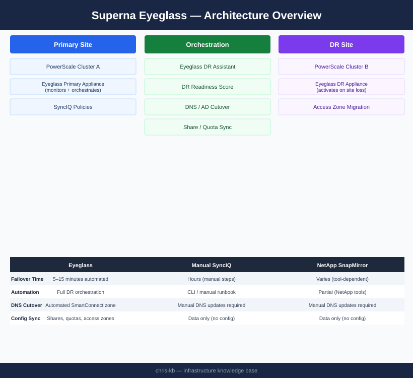
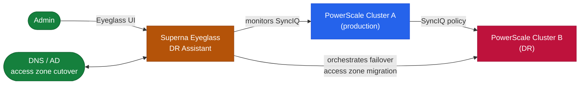

# Superna Eyeglass — Architecture

Superna Eyeglass DR orchestration for NetApp PowerScale — automates SyncIQ failover, SMB/NFS share reconfiguration, quota migration, and DNS cutover in 5–15 minutes.

<a class="kb-card" href="how-it-works/"><strong>How It Works</strong>Failover execution flow, DR readiness scoring, CLI commands, sizing, and RPO tiers.</a>
<a class="kb-card" href="integrations/"><strong>Integrations</strong>PowerScale SyncIQ, Active Directory DNS, and SNMP/email alerting.</a>
<a class="kb-card" href="design-standards/"><strong>Design Standards</strong>Policy naming, RPO tier assignments, readiness thresholds, and test schedule.</a>

| Component | Role | Location |
|---|---|---|
| Eyeglass Primary Appliance | Monitors SyncIQ; syncs share/quota config; DR orchestration control | Primary site |
| Eyeglass DR Appliance | Standby node; activates when primary site unavailable | DR site |
| PowerScale SyncIQ | Underlying data replication engine | Both sites |
| DNS Integration | Automated SmartConnect zone cutover during failover | Primary / DR DNS |

