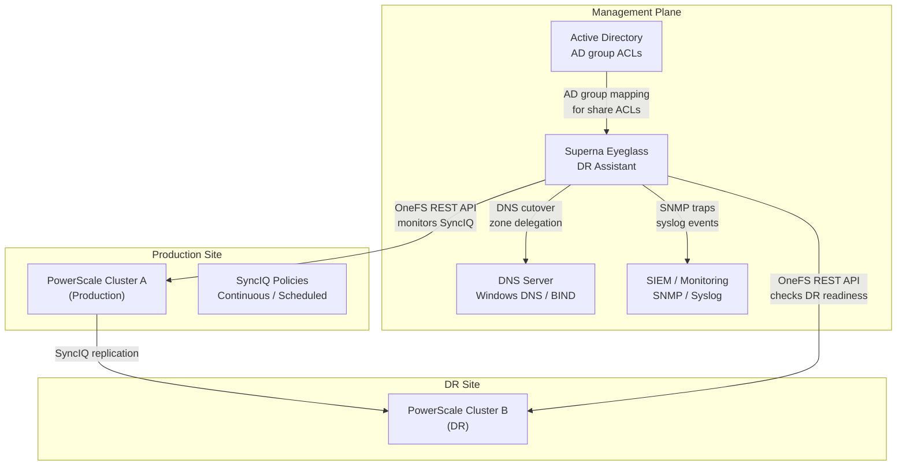
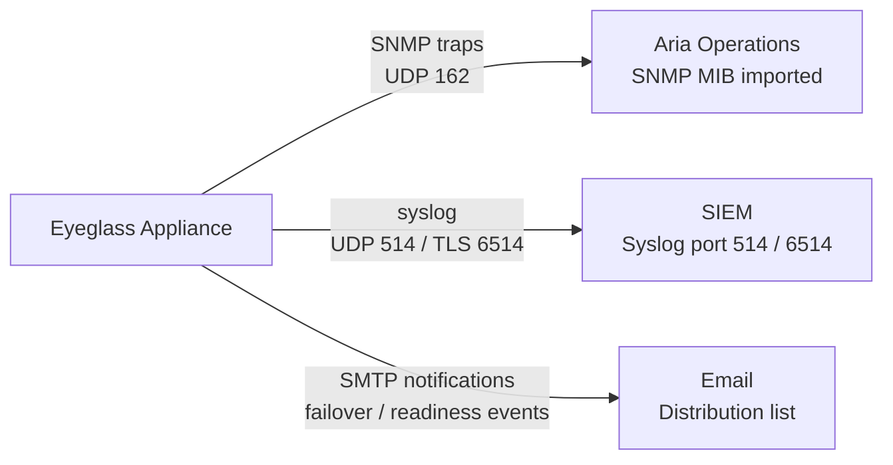

# Superna Eyeglass — Integrations

## NetApp PowerScale (SyncIQ)



Eyeglass uses the OneFS REST API to discover and monitor SyncIQ replication policies:

1. Add the PowerScale cluster in Eyeglass Admin UI: Configuration → Cluster → Add Cluster
2. Provide:
   - Cluster management IP or SmartConnect zone FQDN
   - Service account credentials (svc_eyeglass with minimum required role)
   - Site designation: Primary or DR

Required PowerScale permissions for the Eyeglass service account:
```bash
# On PowerScale: create dedicated role for Eyeglass
isi auth roles create --name EyeglassIntegration --description "Superna Eyeglass service account"
isi auth roles modify EyeglassIntegration --add-priv ISI_PRIV_READ_FILE_POLICIES
isi auth roles modify EyeglassIntegration --add-priv ISI_PRIV_READ_NETWORK
isi auth roles modify EyeglassIntegration --add-priv ISI_PRIV_SYNC
isi auth users modify svc_eyeglass --add-role EyeglassIntegration
```

Verify Eyeglass can see SyncIQ policies: DR → Replication Policies — all SyncIQ policies should appear.

## Active Directory

AD integration ensures SMB shares on the DR cluster inherit correct AD security principals after failover — no manual re-permissioning required:

1. Eyeglass Admin UI: Configuration → Active Directory → Add Domain
2. Provide domain FQDN and credentials for a domain account with read access
3. Eyeglass maps AD users/groups from the primary share ACLs to the DR share configuration

Verify: DR → Shares — each share should show "AD Mapped: Yes".

## Windows DNS

Windows DNS integration enables automated zone cutover:

1. Eyeglass Admin UI: Configuration → DNS → Add DNS Server
2. Select type: Windows DNS
3. Provide DNS server IP and a service account with DNS Administrator role
4. Define zone cutover rules: which DNS zones/records to update on failover

Test DNS integration without failover: DR → DNS Preview — shows what records Eyeglass will update.

## BIND DNS

For Linux-based DNS (BIND):

1. Configure `nsupdate` credentials on the BIND server
2. Eyeglass Admin UI: Configuration → DNS → Add DNS Server → type: BIND
3. Provide TSIG key name and key material

## Aria Operations / SNMP

Forward Eyeglass alerts to monitoring:

1. Eyeglass Admin UI: Configuration → Notifications → SNMP
2. Provide SNMP trap destination (Aria Operations collector IP), community string or v3 credentials
3. Import Eyeglass SNMP MIB into Aria Operations or network management system

Key traps to monitor:
- `eyeglassDRReadinessChanged` — readiness score drops below 100%
- `eyeglassSyncIQLagAlarm` — RPO threshold breached
- `eyeglassFailoverStarted` / `eyeglassFailoverCompleted`



## Syslog / SIEM

Forward Eyeglass audit trail to SIEM:

1. Eyeglass Admin UI: Configuration → Syslog
2. Enter SIEM IP, port 514 (UDP) or 6514 (TLS)

Alert in SIEM on:
- Failover initiated (any event)
- DR readiness score < 100% for > 15 minutes
- Eyeglass appliance unreachable

## Email Notifications

Eyeglass Admin UI: Configuration → Notifications → Email:
- Configure SMTP relay
- Add distribution lists for DR team and on-call
- Enable notifications for: failover events, readiness changes, SyncIQ policy errors
