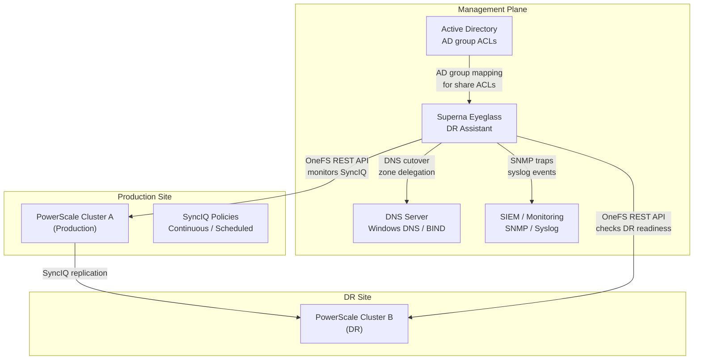
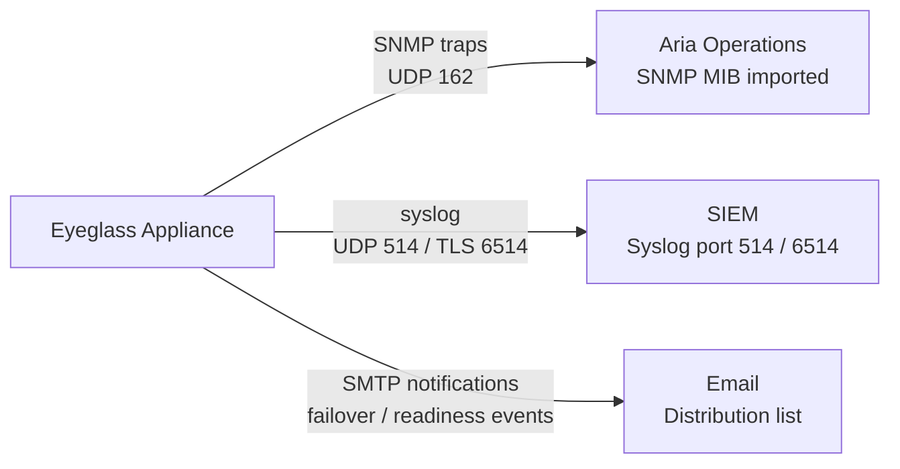

# Superna Eyeglass — Integrations

## NetApp PowerScale (SyncIQ)


┌──────────────────────────── Superna Eyeglass — Architecture Integrations ─────────────────────────────┐
│                                                                                                       │
│   ┌───────────────────────────────────────────────────────────────────────────────────────────────┐   │
│   │                         Superna Eyeglass — External Integration Points                        │   │
│   │ Auth: Eyeglass admin roles; PowerScale admin credentials; AD integration for DFS-N management │   │
│   │                 Storage: connected via 443 (Eyeglass web UI) · 8080 (REST API)                │   │
│   │            Monitoring: SNMP traps / syslog / REST API to ITSM and alerting systems            │   │
│   │Encryption: HTTPS/TLS for all management; SyncIQ data replication encryption (AES-256 in transi│   │
│   └───────────────────────────────────────────────────────────────────────────────────────────────┘   │
│                                                                                                       │
│                          ▼                        ▼                        ▼                          │
│                                                                                                       │
│   ┌─────────────────────────────┐  ┌─────────────────────────────┐  ┌─────────────────────────────┐   │
│   │           Identity          │  │           Storage           │  │          Monitoring         │   │
│   │          AD / LDAP          │  │    443 (Eyeglass web UI)    │  │        SNMP / syslog        │   │
│   │           SAML SSO          │  │       8080 (REST API)       │  │         REST webhook        │   │
│   │          RBAC roles         │  │       NFS / iSCSI / FC      │  │         Email alerts        │   │
│   │         MFA optional        │  │       Dedup appliance       │  │          ServiceNow         │   │
│   │          Cert auth          │  │        Object storage       │  │          Prometheus         │   │
│   └─────────────────────────────┘  └─────────────────────────────┘  └─────────────────────────────┘   │
│                                                                                                       │
│  Physical Infrastructure:                                                                             │
│  ESXi VM (Eyeglass appliance) · PowerScale cluster pair (production + DR) · SyncIQ replication link   │
│  Key terms:                                                                                           │
│                                                                                                       │
│  Eyeglass      = Superna Eyeglass; software appliance for NAS DR and ransomware protection            │
│  RAPA          = Ransomware Protection with Automated Response; detects and quarantines threats       │
│  SyncIQ        = PowerScale built-in replication; Eyeglass monitors and orchestrates policies         │
│  DFS-N         = Windows Distributed File System Namespace; Eyeglass automates failover of DFS        │
│  Failover      = Eyeglass-orchestrated shift of NAS access from production to DR cluster              │
│  Failback      = reversing failover; Eyeglass re-syncs DR changes back and cuts back to product       │
│  Quota Sync    = Eyeglass replicates SmartQuotas from source to DR to preserve user limits            │
│  Export Sync   = NFS exports and SMB shares replicated so clients can reconnect at DR site            │
│  Quarantine    = RAPA isolation of suspect directory; blocks writes, alerts ops team                  │
│  Shadow Copy   = Eyeglass exposes PowerScale snapshots as Windows Previous Versions for NFS sha       │
│  Runbook       = Eyeglass DR Assistant guided checklist for pre-checks, failover, and validation      │
│  igls          = Eyeglass CLI; used for status, sync, DR, and RAPA operations                         │
│  SmartConnect  = PowerScale DNS load balancing; failover changes SmartConnect zone delegation         │
│  Configuration = shares, exports, quotas, NFS aliases; Eyeglass syncs these between clusters          │
│                                                                                                       │
└───────────────────────────────────────────────────────────────────────────────────────────────────────┘
```

Verify Eyeglass can see SyncIQ policies: DR → Replication Policies — all SyncIQ policies should appear.

## Active Directory

AD integration ensures SMB shares on the DR cluster inherit correct AD security principals after failover — no manual re-permissioning required:

1. Eyeglass Admin UI: Configuration → Active Directory → Add Domain
2. Provide domain FQDN and credentials for a domain account with read access
3. Eyeglass maps AD users/groups from the primary share ACLs to the DR share configuration

Verify: DR → Shares — each share should show "AD Mapped: Yes".

## Windows DNS

Windows DNS integration enables automated zone cutover:

1. Eyeglass Admin UI: Configuration → DNS → Add DNS Server
2. Select type: Windows DNS
3. Provide DNS server IP and a service account with DNS Administrator role
4. Define zone cutover rules: which DNS zones/records to update on failover

Test DNS integration without failover: DR → DNS Preview — shows what records Eyeglass will update.

## BIND DNS

For Linux-based DNS (BIND):

1. Configure `nsupdate` credentials on the BIND server
2. Eyeglass Admin UI: Configuration → DNS → Add DNS Server → type: BIND
3. Provide TSIG key name and key material

## Aria Operations / SNMP

Forward Eyeglass alerts to monitoring:

1. Eyeglass Admin UI: Configuration → Notifications → SNMP
2. Provide SNMP trap destination (Aria Operations collector IP), community string or v3 credentials
3. Import Eyeglass SNMP MIB into Aria Operations or network management system

Key traps to monitor:
- `eyeglassDRReadinessChanged` — readiness score drops below 100%
- `eyeglassSyncIQLagAlarm` — RPO threshold breached
- `eyeglassFailoverStarted` / `eyeglassFailoverCompleted`



## Syslog / SIEM

Forward Eyeglass audit trail to SIEM:

1. Eyeglass Admin UI: Configuration → Syslog
2. Enter SIEM IP, port 514 (UDP) or 6514 (TLS)

Alert in SIEM on:
- Failover initiated (any event)
- DR readiness score < 100% for > 15 minutes
- Eyeglass appliance unreachable

## Email Notifications

Eyeglass Admin UI: Configuration → Notifications → Email:
- Configure SMTP relay
- Add distribution lists for DR team and on-call
- Enable notifications for: failover events, readiness changes, SyncIQ policy errors
