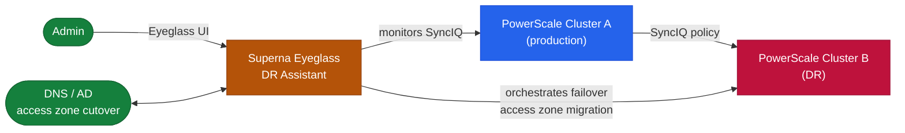
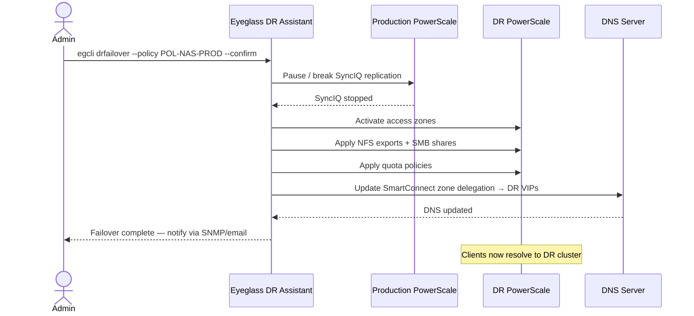

# Superna Eyeglass — Architecture Overview

## Overview

Superna Eyeglass is a DR orchestration platform purpose-built for NetApp PowerScale (Isilon). It automates the share, quota, and DNS reconfiguration steps that previously required hours of manual work during a SyncIQ failover.

## Component Topology



## DR Readiness Dashboard

Eyeglass continuously monitors and scores DR readiness:

```
DR Readiness Score = 100% when:
  ✓ All SyncIQ policies in sync state (not lagging beyond RPO threshold)
  ✓ All SMB shares mirrored on DR cluster
  ✓ All NFS exports mirrored on DR cluster
  ✓ All quotas aligned between primary and DR cluster
  ✓ DNS zones pre-configured for cutover
  ✓ Both Eyeglass appliances healthy and communicating
```

Access readiness dashboard: `https://<eyeglass-ip>` → DR → Readiness.

## Failover Execution Flow

When a failover is triggered:

1. Eyeglass breaks SyncIQ replication (makes DR cluster writable)
2. Reconfigures SMB shares and NFS exports on DR cluster to match primary settings
3. Applies quota policies on DR cluster
4. Executes DNS zone cutover (delegate authority to DR DNS entries)
5. Notifies operations via email/SNMP

RTO: typically 5–15 minutes for file services, depending on share count.



## Appliance Sizing

| Environment | Eyeglass VM Size |
|---|---|
| < 500 shares | 4 vCPU, 8 GB RAM |
| 500–2,000 shares | 8 vCPU, 16 GB RAM |
| > 2,000 shares | 8 vCPU, 32 GB RAM (or contact Superna for sizing) |

## Networking

| Traffic | Port | Notes |
|---|---|---|
| Eyeglass Admin UI | 443 (HTTPS) | From management network |
| PowerScale OneFS API | 8080 / 443 | From Eyeglass to each cluster |
| Eyeglass appliance sync | 9000 | Between primary and DR Eyeglass appliances |
| DNS management | 53, 445 (Windows DNS WMI) | From Eyeglass to DNS servers |
