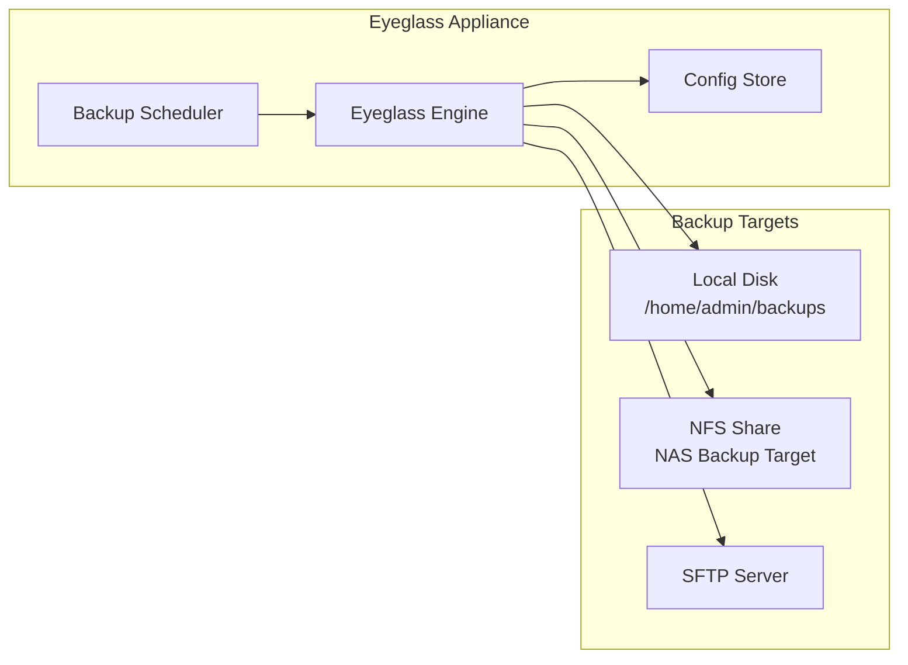

# Superna Eyeglass — Backup & Restore

Eyeglass configuration backup preserves replication policies, SyncIQ jobs, share/export configurations, access zone mappings, and SmartConnect zone settings. Without a current backup, DR failover configuration must be manually re-created.

---

## What Eyeglass Backs Up

| Category | Backed Up | Notes |
|---|---|---|
| Replication policies (SyncIQ) | Yes | Policy rules, schedules, paths |
| Share/export configuration | Yes | SMB shares, NFS exports, ACLs |
| Access zone mappings | Yes | Source → target zone mapping |
| SmartConnect zone configuration | Yes | DNS zone, subnet, pool mapping |
| DFS namespace configuration | Yes | DFS targets and referrals |
| Quota configuration | Yes | Quota policies and alerts |
| Eyeglass appliance config | Yes | Clusters, credentials, settings |
| PowerScale data | No | Data is replicated by SyncIQ, not Eyeglass |

---

## Backup Architecture



---

## Configuring Scheduled Backups

Navigate to: **Admin → Backup & Restore → Schedule**

**Recommended schedule:**

| Setting | Value |
|---|---|
| Frequency | Daily |
| Time | 02:00 (outside replication windows) |
| Retention | 7 backups |
| Remote target | NFS share or SFTP (off-appliance) |

```bash
# Configure remote backup target via CLI
igls backup configure-remote \
  --type nfs \
  --host <nfs-server-ip> \
  --path /exports/eyeglass-backups

# Verify remote target connectivity
igls backup test-remote
```

---

## Restoring Eyeglass Configuration

### Restore to Same Appliance

```bash
# 1. Log in to Eyeglass CLI
ssh admin@<eyeglass-ip>

# 2. List available backups
igls backup list

# 3. Restore from a specific backup
igls backup restore --id <backup-id>

# 4. Confirm restore completed
igls status
```

### Restore to New/Replacement Appliance

```bash
# 1. Deploy new Eyeglass OVA (same version as backup)
# 2. Complete initial setup wizard (network, hostname)

# 3. Copy backup file to new appliance
scp eyeglass-backup-<date>.tar.gz admin@<new-eyeglass-ip>:/home/admin/

# 4. SSH to new appliance
ssh admin@<new-eyeglass-ip>

# 5. Import and restore the backup
igls backup import --file /home/admin/eyeglass-backup-<date>.tar.gz
igls backup restore --id <imported-backup-id>

# 6. Verify cluster connections
igls clusters list

# 7. Re-enter cluster credentials (passwords are not stored in backup)
igls clusters update-credentials --cluster <cluster-name>
```

**Note:** Cluster passwords and API tokens are not included in backups for security. After restore, re-enter credentials for each managed PowerScale cluster.

---

## Post-Restore Validation

```bash
# Check Eyeglass service health
igls status

# Verify all clusters are connected
igls clusters list

# Verify replication jobs are visible
igls jobs list

# Check share/export configuration loaded correctly
igls shares list
igls exports list

# Run a configuration sync to verify policies are intact
igls sync run --cluster <cluster-name>
```

**GUI validation:**

- [ ] All clusters show as Connected (green)
- [ ] Replication policies visible under DR → Replication
- [ ] Share configurations visible under Configuration → Shares
- [ ] SmartConnect zones mapped correctly
- [ ] Scheduled jobs appear in job monitor

---

## Policy Backup Export (Manual)

For additional protection, export individual policy configurations:

```bash
# Export all SyncIQ policy mappings
igls dr export --format json > eyeglass-policy-export-$(date +%Y%m%d).json

# Export DFS configuration
igls dfs export > eyeglass-dfs-export-$(date +%Y%m%d).json

# Store exports off-appliance
scp eyeglass-policy-export-*.json admin@nas:/backups/eyeglass/
```

---

## Backup Verification Testing

Test backup integrity quarterly:

1. Identify a non-production or DR Eyeglass appliance
2. Restore the latest production backup
3. Verify cluster connectivity (with read-only credentials)
4. Confirm all replication policies, shares, and access zone mappings load correctly
5. Document test result in ITSM

---

## Related Pages

- [Superna Eyeglass — Architecture](../../architecture/how-it-works/index.md)
- [Superna Eyeglass — Health Checks](../health-checks/index.md)
- [PowerScale — Backup & Restore](../../../../storage/dell/powerscale/operations/backup-restore/index.md)
