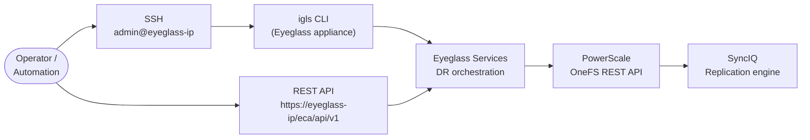

# Superna Eyeglass — CLI Reference

Eyeglass provides the `igls` CLI accessible from the appliance shell via SSH and a REST API for automation. OneFS SyncIQ CLI commands are used alongside Eyeglass operations to verify the underlying replication state. SSH to the Eyeglass appliance as the `admin` user.



---

## Appliance Status

```bash
# Show Eyeglass service status
igls status

# Show appliance version and build
igls version

# Show license status
igls license show

# Show cluster nodes (for multi-node deployments)
igls cluster show

# Show network configuration
igls network show
```

---

## Replication & Sync Status

Monitor SyncIQ policy replication state from Eyeglass.

```bash
# List all monitored SyncIQ policies and their status
igls sync show

# Show sync status for a specific policy
igls sync show --policy <policy_name>

# Force a manual sync check
igls sync refresh

# Show last replication run times
igls sync history
```

---

## Failover

Eyeglass-managed failover delegates SyncIQ policy operations and DNS updates to the appliance. Run failover from the UI when possible; CLI is for automation.

```bash
# List available failover jobs
igls failover list

# Run a failover job
igls failover run --job <job_name>

# Check failover job status
igls failover status --job <job_name>

# Cancel an in-progress failover
igls failover cancel --job <job_name>
```

---

## Failback

Failback restores the original source cluster as the active side after a failover.

```bash
# List available failback jobs
igls failback list

# Run a failback
igls failback run --job <job_name>

# Monitor failback progress
igls failback status --job <job_name>
```

---

## OneFS SyncIQ (Supporting Commands)

Run these on the PowerScale/Isilon cluster to verify the underlying replication state that Eyeglass monitors.

```bash
# List all SyncIQ policies and their status
isi sync policies list

# Show detail for a policy
isi sync policies view <policy_name>

# List recent sync reports
isi sync reports list

# Start a manual SyncIQ sync
isi sync policies start <policy_name>

# Check SyncIQ service status
isi sync settings view
```

---

## REST API

The Eyeglass REST API is available at `https://<eyeglass_ip>/eca/api/v1`.

```bash
# Authenticate
curl -k -X POST https://<eyeglass_ip>/eca/api/v1/auth/login \
  -H "Content-Type: application/json" \
  -d '{"username":"admin","password":"<pass>"}'

# List sync jobs
curl -k -X GET https://<eyeglass_ip>/eca/api/v1/jobs/sync \
  -H "Authorization: Bearer <token>"

# List failover jobs
curl -k -X GET https://<eyeglass_ip>/eca/api/v1/jobs/failover \
  -H "Authorization: Bearer <token>"
```
