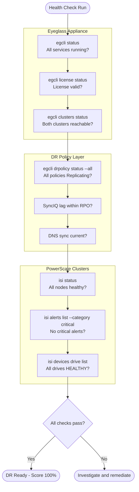
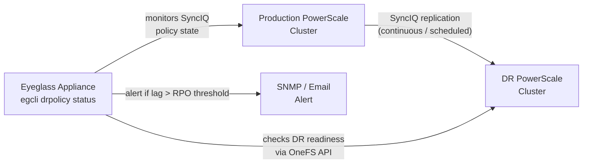
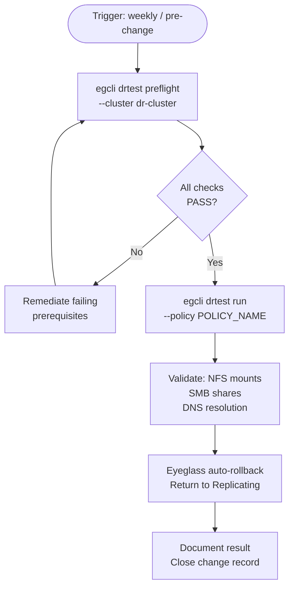

# Superna Eyeglass — Health Checks


<div class="kb-summary">
Health Checks reference covering Overview, SyncIQ Replication Health, PowerScale Cluster Health, Weekly DR Readiness Check, Health Check Summary Table and 1 more sections.
</div>

## Overview

Eyeglass health checks cover the Eyeglass appliance itself, PowerScale cluster connectivity, SyncIQ policy status, and DR policy readiness. Run daily as a minimum; automated checks should run every 15–30 minutes.


┌────────────────────────────────── Superna Eyeglass — Health Checks ───────────────────────────────────┐
│                                                                                                       │
│   ┌───────────────────────────────────────────────────────────────────────────────────────────────┐   │
│   │                           Superna Eyeglass — Health Check Procedures                          │   │
│   │                 Run these checks daily/weekly to confirm protection is working                │   │
│   │                                         igls sync status                                      │   │
│   │                  Review job completion rate — target 100%; investigate failures               │   │
│   │                         Check replication/backup lag against RPO target                       │   │
│   └───────────────────────────────────────────────────────────────────────────────────────────────┘   │
│                                                                                                       │
│   │      Check       │  What to verify  │      Expected     │    Frequency     │  Action if bad   │   │
│   │    Job status    │All jobs complete │    100% success   │      Daily       │ Triage failures  │   │
│   │    Lag / RPO     │ Replication lag  │    < RPO target   │      Daily       │  Tune bandwidth  │   │
│   │     Capacity     │ Repo space used  │     < 80% full    │      Weekly      │ Expand or expire │   │
│   │   Restore test   │  Random restore  │    Data intact    │     Monthly      │ Fix backup chain │   │
│   └───────────────────────────────────────────────────────────────────────────────────────────────┘   │
│                                                                                                       │
│  Physical Infrastructure:                                                                             │
│  ESXi VM (Eyeglass appliance) · PowerScale cluster pair (production + DR) · SyncIQ replication link   │
│  Key terms:                                                                                           │
│                                                                                                       │
│  Eyeglass      = Superna Eyeglass; software appliance for NAS DR and ransomware protection            │
│  RAPA          = Ransomware Protection with Automated Response; detects and quarantines threats       │
│  SyncIQ        = PowerScale built-in replication; Eyeglass monitors and orchestrates policies         │
│  DFS-N         = Windows Distributed File System Namespace; Eyeglass automates failover of DFS        │
│  Failover      = Eyeglass-orchestrated shift of NAS access from production to DR cluster              │
│  Failback      = reversing failover; Eyeglass re-syncs DR changes back and cuts back to product       │
│  Quota Sync    = Eyeglass replicates SmartQuotas from source to DR to preserve user limits            │
│  Export Sync   = NFS exports and SMB shares replicated so clients can reconnect at DR site            │
│  Quarantine    = RAPA isolation of suspect directory; blocks writes, alerts ops team                  │
│  Shadow Copy   = Eyeglass exposes PowerScale snapshots as Windows Previous Versions for NFS sha       │
│  Runbook       = Eyeglass DR Assistant guided checklist for pre-checks, failover, and validation      │
│  igls          = Eyeglass CLI; used for status, sync, DR, and RAPA operations                         │
│  SmartConnect  = PowerScale DNS load balancing; failover changes SmartConnect zone delegation         │
│  Configuration = shares, exports, quotas, NFS aliases; Eyeglass syncs these between clusters          │
│                                                                                                       │
└───────────────────────────────────────────────────────────────────────────────────────────────────────┘
```
```text

| SyncIQ Status | Meaning | Action |
|---|---|---|
| running | Active sync in progress | Monitor; confirm completion |
| finished | Last run completed successfully | OK |
| failed | Last run failed | Check reports for errors; restart if needed |
| paused | Policy is paused | Confirm intentional; resume if not |
| disabled | Policy is disabled | Confirm intentional; enable if DR policy |



---

## PowerScale Cluster Health

```bash
# On each PowerScale cluster (production and DR)
isi status

# Check for critical alerts
isi alerts list --category critical

# Check for failed or degraded drives
isi devices node list
isi devices drive list | grep -v HEALTHY

# Check SmartConnect VIP pool health (for client access)
isi network pools list

# Confirm SyncIQ service is running
isi sync service view
```

---

## Weekly DR Readiness Check

```bash
# Run Eyeglass preflight on DR cluster — confirms all DR prerequisites are met
egcli drtest preflight --cluster <dr-cluster>

# Expected output: all checks PASS
# Common checks include:
#   - SyncIQ policies configured and running
#   - Access zones configured at DR site
#   - NFS/SMB export/share definitions replicated
#   - DNS integration (if configured) operational
#   - Eyeglass connectivity to both clusters confirmed

# Review Eyeglass DR readiness dashboard
# Eyeglass UI: https://<eyeglass-ip>:8443 → DR Dashboard
```

---

## Health Check Summary Table

| Check | Command | Expected |
|---|---|---|
| Eyeglass services | `egcli status` | All services running |
| DR policy state | `egcli drpolicy status --all` | All in Replicating state |
| SyncIQ jobs | `isi sync jobs list` | No failed jobs |
| Cluster health | `isi status` | All nodes healthy |
| Critical alerts | `isi alerts list --category critical` | No critical alerts |
| Drive health | `isi devices drive list` | All HEALTHY |
| License | `egcli license status` | Valid, not expiring |

---

## Validation

DR validation for Eyeglass covers three scenarios: pre-failover readiness, DR test (rehearsal), and post-failover/failback confirmation. Run a full validation at least quarterly and before any planned failover.

| Validation Type | Frequency | Tool |
|---|---|---|
| DR preflight | Weekly / pre-change | `egcli drtest preflight` |
| DR test (rehearsal) | Quarterly | `egcli drtest run` |
| Post-failover validation | After every failover | Manual + `egcli` |
| Post-failback validation | After every failback | Manual + `egcli` |



### Eyeglass DR Preflight

The preflight check verifies all prerequisites for a failover without making any changes.

```bash
# Run preflight against the DR cluster
egcli drtest preflight --cluster <dr-cluster>

# Run preflight for a specific policy
egcli drtest preflight --policy <policy_name>

# Expected output — all items should show PASS:
#   [PASS] SyncIQ policy last run: 3 minutes ago
#   [PASS] Access zones configured on DR cluster
#   [PASS] NFS exports replicated to DR cluster
#   [PASS] SMB shares replicated to DR cluster
#   [PASS] DNS zones configured
#   [PASS] Eyeglass connectivity to both clusters confirmed
#   [PASS] SyncIQ service running on both clusters

# Review any WARN or FAIL items and remediate before proceeding
```

### DR Test (Rehearsal)

A DR test performs all failover steps but rolls back at the end, returning to normal replication.

```bash
# Step 1 — Run Eyeglass DR test (non-destructive rehearsal)
egcli drtest run --policy <policy_name>

# Step 2 — Monitor test progress
egcli drtest status --policy <policy_name>

# Step 3 — Validate access zones activated on DR cluster
egcli accesszone status --cluster <dr-cluster>

# Step 4 — Validate NFS exports on DR cluster
ssh admin@<dr-cluster> "isi nfs exports list"

# Step 5 — Validate SMB shares on DR cluster
ssh admin@<dr-cluster> "isi smb shares list"

# Step 6 — Confirm DNS resolution (if Eyeglass DNS integration active)
nslookup <smartconnect_zone_name>

# Step 7 — After validation, confirm DR test rollback is complete
egcli drtest status --policy <policy_name>
# Expected: State = Rolled Back / Replicating
```

### Post-Failover Validation

Run after a declared DR failover to confirm the DR cluster is fully operational.

```bash
# Confirm DR policy is in Failed Over state
egcli drpolicy status --all

# Confirm DR cluster is healthy
ssh admin@<dr-cluster> "isi status"
ssh admin@<dr-cluster> "isi alerts list --category critical"

# Confirm access zones are active on DR cluster
egcli accesszone status --cluster <dr-cluster>

# Confirm NFS/SMB access for clients
ssh admin@<dr-cluster> "isi nfs exports list"
ssh admin@<dr-cluster> "isi smb shares list"

# Test NFS mount from a client
mount -t nfs <dr-smartconnect-ip>:/<export_path> /mnt/drtest
ls -la /mnt/drtest

# Confirm SyncIQ is stopped on original production policy (not running)
ssh admin@<production-cluster> "isi sync policies list"
```

### Post-Failback Validation

```bash
# Confirm DR policy is back to Replicating state
egcli drpolicy status --all

# Confirm production cluster is healthy
ssh admin@<production-cluster> "isi status"

# Confirm access zones are back on production cluster
egcli accesszone status --cluster <production-cluster>

# Confirm SyncIQ is running in the normal direction (production → DR)
ssh admin@<production-cluster> "isi sync policies list"

# Confirm last SyncIQ run completed successfully
ssh admin@<production-cluster> "isi sync reports list --limit 5"

# Confirm client access is restored to production
nslookup <production-smartconnect-zone>
```

### Validation Record Template

| Check | Date | Result | Notes |
|---|---|---|---|
| DR preflight passed | | | |
| DR test completed successfully | | | |
| NFS exports accessible at DR site | | | |
| SMB shares accessible at DR site | | | |
| DNS failover confirmed | | | |
| Failback completed | | | |
| SyncIQ replicating (prod → DR) | | | |
| Client access restored to production | | | |
