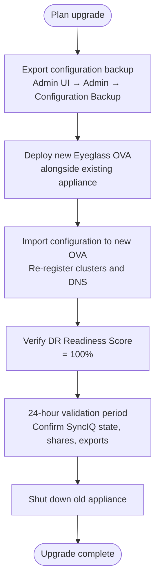

# Superna Eyeglass — Install & Upgrade


<div class="kb-summary">
Install & Upgrade reference covering Version Compatibility Matrix, EOL Tracking, License Management.
</div>

## Version Compatibility Matrix

Eyeglass version must be compatible with the deployed PowerScale OneFS version. Always verify before upgrading either system.


```
┌──────────────────────────────── Superna Eyeglass — Install & Upgrade ─────────────────────────────────┐
│                                                                                                       │
│   ┌───────────────────────────────────────────────────────────────────────────────────────────────┐   │
│   │                         Superna Eyeglass — Installation Prerequisites                         │   │
│   │             OS: supported Linux or Windows Server (see vendor compatibility matrix)           │   │
│   │         Network: 443 (Eyeglass web UI) · 8080 (REST API) — ensure firewall allows these       │   │
│   │  Auth: Eyeglass admin roles; PowerScale admin credentials; AD integration for DFS-N management│   │
│   │           Storage: Eyeglass VM · PowerScale pair (prod + DR) · SyncIQ replication link        │   │
│   └───────────────────────────────────────────────────────────────────────────────────────────────┘   │
│                                                                                                       │
│                                                   ▼                                                   │
│                                                                                                       │
│   ┌───────────────────────────────────────────────────────────────────────────────────────────────┐   │
│   │                                        Install Sequence                                       │   │
│   │                  1  Deploy control plane component and configure network access               │   │
│   │                          2  Configure storage and network connectivity                        │   │
│   │                        3  Install agent/proxy/splitter on protected hosts                     │   │
│   │                      4  Register sources and configure protection policies                    │   │
│   │                        5  Run first job; verify completion; test restore                      │   │
│   └───────────────────────────────────────────────────────────────────────────────────────────────┘   │
│                                                                                                       │
│   ┌───────────────────────────────────────────────────────────────────────────────────────────────┐   │
│   │                                        Upgrade Sequence                                       │   │
│   │                 1  Review release notes and compatibility matrix before upgrade               │   │
│   │                   2  Snapshot or backup the control plane VM before upgrading                 │   │
│   │                  3  Upgrade control plane first, then proxies/agents/appliances               │   │
│   │                       4  Validate jobs resume automatically after upgrade                     │   │
│   │                        5  Document version change and update CMDB record                      │   │
│   └───────────────────────────────────────────────────────────────────────────────────────────────┘   │
│                                                                                                       │
│  Physical Infrastructure:                                                                             │
│  ESXi VM (Eyeglass appliance) · PowerScale cluster pair (production + DR) · SyncIQ replication link   │
│  Key terms:                                                                                           │
│                                                                                                       │
│  Eyeglass      = Superna Eyeglass; software appliance for NAS DR and ransomware protection            │
│  RAPA          = Ransomware Protection with Automated Response; detects and quarantines threats       │
│  SyncIQ        = PowerScale built-in replication; Eyeglass monitors and orchestrates policies         │
│  DFS-N         = Windows Distributed File System Namespace; Eyeglass automates failover of DFS        │
│  Failover      = Eyeglass-orchestrated shift of NAS access from production to DR cluster              │
│  Failback      = reversing failover; Eyeglass re-syncs DR changes back and cuts back to product       │
│  Quota Sync    = Eyeglass replicates SmartQuotas from source to DR to preserve user limits            │
│  Export Sync   = NFS exports and SMB shares replicated so clients can reconnect at DR site            │
│  Quarantine    = RAPA isolation of suspect directory; blocks writes, alerts ops team                  │
│  Shadow Copy   = Eyeglass exposes PowerScale snapshots as Windows Previous Versions for NFS sha       │
│  Runbook       = Eyeglass DR Assistant guided checklist for pre-checks, failover, and validation      │
│  igls          = Eyeglass CLI; used for status, sync, DR, and RAPA operations                         │
│  SmartConnect  = PowerScale DNS load balancing; failover changes SmartConnect zone delegation         │
│  Configuration = shares, exports, quotas, NFS aliases; Eyeglass syncs these between clusters          │
│                                                                                                       │
└───────────────────────────────────────────────────────────────────────────────────────────────────────┘
```

If Eyeglass shows API errors after OneFS upgrade, check if an Eyeglass update is required to support the new OneFS version.

## EOL Tracking

| Item | Check Location | Action Threshold |
|---|---|---|
| Eyeglass appliance version | support.superna.net → EOL | Upgrade plan at 6 months before EOL |
| OneFS compatibility | Superna compatibility matrix | Verify before any OneFS upgrade |
| License expiry | Admin UI → License | Renew 60 days before expiry |
| VM guest OS (Eyeglass appliance) | Admin UI → System Info | Align with Superna supported OS list |

## License Management

Eyeglass licensing is per-cluster (primary and DR) and per-node count:

1. Download license file from Superna licensing portal
2. Admin UI → License → Import License
3. Verify license file UUID matches the appliance UUID shown in the UI

If appliance shows "Unlicensed" after an upgrade, re-import the license — appliance UUID may have changed if deployed from new OVA.
