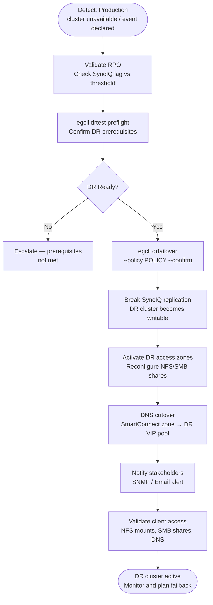

# Superna Eyeglass — Procedures

## Failover

Eyeglass DR Assistant orchestrates failover of PowerScale (Isilon) access zones from a production cluster to a DR cluster. Failover includes stopping SyncIQ replication, activating DR access zones, and remapping NFS/SMB shares and DNS entries.


┌──────────────────────────────────── Superna Eyeglass — Procedures ────────────────────────────────────┐
│                                                                                                       │
│   ┌──────────────────────────────────────────────┐  ┌─────────────────────────────────────────────┐   │
│   │              Routine Procedures              │  │                DR Procedures                │   │
│   │          Add new protection source           │  │              Initiate failover              │   │
│   │           Modify retention policy            │  │               Validate replica              │   │
│   │          Expire old recover points           │  │              Redirect host I/O              │   │
│   │             Add storage capacity             │  │         Test failover (non-disrupt)         │   │
│   │           Service account rotation           │  │            Failback to production           │   │
│   └──────────────────────────────────────────────┘  └─────────────────────────────────────────────┘   │
│                                                                                                       │
│   ┌───────────────────────────────────────────────────────────────────────────────────────────────┐   │
│   │                        Change Control Requirements for Superna Eyeglass                       │   │
│   │           All changes to protection policies require change ticket with rollback plan         │   │
│   │                      Failover tests must be scheduled in maintenance window                   │   │
│   │              Firmware/software upgrades need 48 h pre-approval and backup snapshot            │   │
│   │                  Post-change: verify jobs run successfully for 2 backup cycles                │   │
│   └───────────────────────────────────────────────────────────────────────────────────────────────┘   │
│                                                                                                       │
│  Physical Infrastructure:                                                                             │
│  ESXi VM (Eyeglass appliance) · PowerScale cluster pair (production + DR) · SyncIQ replication link   │
│  Key terms:                                                                                           │
│                                                                                                       │
│  Eyeglass      = Superna Eyeglass; software appliance for NAS DR and ransomware protection            │
│  RAPA          = Ransomware Protection with Automated Response; detects and quarantines threats       │
│  SyncIQ        = PowerScale built-in replication; Eyeglass monitors and orchestrates policies         │
│  DFS-N         = Windows Distributed File System Namespace; Eyeglass automates failover of DFS        │
│  Failover      = Eyeglass-orchestrated shift of NAS access from production to DR cluster              │
│  Failback      = reversing failover; Eyeglass re-syncs DR changes back and cuts back to product       │
│  Quota Sync    = Eyeglass replicates SmartQuotas from source to DR to preserve user limits            │
│  Export Sync   = NFS exports and SMB shares replicated so clients can reconnect at DR site            │
│  Quarantine    = RAPA isolation of suspect directory; blocks writes, alerts ops team                  │
│  Shadow Copy   = Eyeglass exposes PowerScale snapshots as Windows Previous Versions for NFS sha       │
│  Runbook       = Eyeglass DR Assistant guided checklist for pre-checks, failover, and validation      │
│  igls          = Eyeglass CLI; used for status, sync, DR, and RAPA operations                         │
│  SmartConnect  = PowerScale DNS load balancing; failover changes SmartConnect zone delegation         │
│  Configuration = shares, exports, quotas, NFS aliases; Eyeglass syncs these between clusters          │
│                                                                                                       │
└───────────────────────────────────────────────────────────────────────────────────────────────────────┘
```

### Initiating Failover via Eyeglass CLI

```bash
# List all configured DR policies
egcli drpolicy list

# Check the current state of all DR policies
egcli drpolicy status --all

# Run a DR test (non-disruptive rehearsal — confirms readiness without cutting over DNS)
egcli drtest run --policy <policy_name>

# Initiate a full failover (disruptive — activates DR cluster)
egcli drfailover --policy <policy_name> --confirm

# Monitor failover progress
egcli drfailover status --policy <policy_name>

# Watch Eyeglass job log for failover steps
egcli jobs list --type failover
```

### Access Zone Activation at DR Site

```bash
# After failover is triggered — confirm DR access zones are active
egcli accesszone status --cluster <dr-cluster>

# Confirm NFS exports are present on DR cluster
ssh admin@<dr-cluster> "isi nfs exports list"

# Confirm SMB shares are present on DR cluster
ssh admin@<dr-cluster> "isi smb shares list"

# Confirm SmartConnect zones are responding on DR VIP pool
nslookup <dr-smartconnect-zone-name>

# Test NFS mount from a client (Linux)
mount -t nfs <dr-smartconnect-ip>:/<export_path> /mnt/test
ls /mnt/test

# Test SMB access from a client (Windows)
net use Z: \\<dr-cluster-ip>\<share_name>
```

### DNS Cutover

Eyeglass automates DNS delegation updates if integrated with DNS; manual steps if not.

```bash
# Verify Eyeglass DNS integration is configured
egcli dns status

# If using Eyeglass automated DNS failover — confirm DNS record updated
egcli dns records list --zone <smartconnect_zone>

# If managing DNS manually — update the SmartConnect delegation NS record
# to point to the DR cluster IP pool
# Verify propagation
dig <smartconnect_zone_name> @<internal-dns-server>
nslookup <smartconnect_zone_name>
```

### Failover State Reference

| State | Meaning | Action |
|---|---|---|
| Replicating | Normal — SyncIQ running; production active | No action |
| DR Test Running | Preflight or DR test in progress | Monitor to completion |
| Failing Over | Failover in progress | Monitor; do not interrupt |
| Failed Over | DR cluster is active; SyncIQ stopped | Validate client access; plan failback |
| Failback Running | Reverse sync in progress | Monitor to completion |

```bash
# Check policy state at any time
egcli drpolicy status --policy <policy_name>
```

---

## Failback

Failback is the process of returning data and user access from the DR PowerScale cluster back to the production cluster after a failover. Eyeglass orchestrates failback by reversing the SyncIQ replication direction and reassigning access zone configurations.

| Phase | Description |
|---|---|
| Production readiness | Verify production cluster is healthy and storage is ready |
| Reverse replication | Run SyncIQ from DR back to production to sync changes made during failover |
| Access zone failback | Re-map access zones, NFS exports, and SMB shares to production |
| DNS cutover | Return DNS entries to production SmartConnect zones |
| Validation | Confirm client access and data integrity on production |


### Pre-Failback Checklist

```bash
# Confirm production PowerScale cluster is online and healthy
isi status

# Confirm all nodes are up and no critical alerts
isi devices node list
isi alerts list --category critical

# Confirm SyncIQ service is running on production
isi sync service view

# Confirm network interfaces and SmartConnect zones are configured on production
isi network interfaces list
isi network pools list

# Check Eyeglass DR assistant readiness on production Eyeglass instance
egcli drtest preflight --cluster <production-cluster>
```

### Initiating Failback via Eyeglass

```bash
# Log in to Eyeglass DR Assistant (web UI or CLI)
# Eyeglass UI: https://<eyeglass-ip>:8443

# List configured DR policies — confirm current state (failed over)
egcli drpolicy list

# Check which policies are in DR state
egcli drpolicy status --all

# Initiate failback for a specific DR policy
egcli drfailback --policy <policy_name> --confirm

# Monitor failback progress
egcli drfailback status --policy <policy_name>
```

### Reversing SyncIQ Replication

During the DR period, users may have written data to the DR cluster. This data must be synced back to production before access is cut back.

```bash
# On DR PowerScale cluster — create a reverse SyncIQ policy
# (Eyeglass automates this, but manual verification is required)
isi sync policies list

# Confirm reverse SyncIQ policy exists and is enabled
isi sync policies view <reverse_policy_name>

# Run the reverse sync manually to trigger immediate catchup
isi sync jobs start <reverse_policy_name>

# Monitor reverse sync job completion
isi sync jobs list
watch -n 30 "isi sync jobs list"
```

### Access Zone Cutover Back to Production

```bash
# On production PowerScale — confirm access zones are configured
isi zone zones list

# Eyeglass: re-activate access zones on production
egcli accesszone activate --cluster <production-cluster> --zone <zone_name>

# Update DNS to point SmartConnect zone back to production VIP pool
# (DNS delegation record update — done at DNS server level)
# Verify DNS resolution for NFS/SMB clients resolves to production IPs
nslookup <smartconnect_zone_name>

# Confirm NFS exports are accessible on production
isi nfs exports list

# Confirm SMB shares are accessible on production
isi smb shares list
```

### Post-Failback Validation

| Check | Command | Expected |
|---|---|---|
| Production cluster health | `isi status` | All nodes active |
| SyncIQ policies | `isi sync policies list` | All enabled, last run success |
| Access zones | `isi zone zones list` | All zones on production |
| NFS exports | `isi nfs exports list` | All exports present |
| SMB shares | `isi smb shares list` | All shares accessible |
| DR policy state | `egcli drpolicy status --all` | Back to normal (production) |
| Client access test | Mount and write a test file | Success, no errors |

```bash
# Final confirmation: run Eyeglass preflight on production
egcli drtest preflight --cluster <production-cluster>

# Disable reverse SyncIQ policy (DR-to-prod direction) after failback is confirmed
isi sync policies disable <reverse_policy_name>
```

---

## Day-to-Day Operations

Daily operations focus on the Eyeglass dashboard: check SyncIQ policy health (all policies in a healthy replication state), verify RPO compliance per policy (confirm replication lag is within defined thresholds), review the overall DR readiness score, confirm DNS sync status is current, and check quota policy sync status. Any policies showing degraded or failed state require immediate investigation.

Weekly operations include running the Eyeglass DR readiness report to confirm all shares, quotas, and DNS mappings are synchronised and the environment is ready for a failover if needed.
