# Superna Eyeglass — Procedures


<div class="kb-summary">
Procedures reference covering Failover, Failback, Day-to-Day Operations.
</div>

## Failover

Eyeglass DR Assistant orchestrates failover of PowerScale (Isilon) access zones from a production cluster to a DR cluster. Failover includes stopping SyncIQ replication, activating DR access zones, and remapping NFS/SMB shares and DNS entries.


```text
┌──────────────────────────────────── Superna Eyeglass — Procedures ────────────────────────────────────┐
│                                                                                                       │
│   ┌──────────────────────────────────────────────┐  ┌─────────────────────────────────────────────┐   │
│   │              Routine Procedures              │  │                DR Procedures                │   │
│   │          Add new protection source           │  │              Initiate failover              │   │
│   │           Modify retention policy            │  │               Validate replica              │   │
│   │          Expire old recover points           │  │              Redirect host I/O              │   │
│   │             Add storage capacity             │  │         Test failover (non-disrupt)         │   │
│   │           Service account rotation           │  │            Failback to production           │   │
│   └──────────────────────────────────────────────┘  └─────────────────────────────────────────────┘   │
│                                                                                                       │
│   ┌───────────────────────────────────────────────────────────────────────────────────────────────┐   │
│   │                        Change Control Requirements for Superna Eyeglass                       │   │
│   │           All changes to protection policies require change ticket with rollback plan         │   │
│   │                      Failover tests must be scheduled in maintenance window                   │   │
│   │              Firmware/software upgrades need 48 h pre-approval and backup snapshot            │   │
│   │                  Post-change: verify jobs run successfully for 2 backup cycles                │   │
│   └───────────────────────────────────────────────────────────────────────────────────────────────┘   │
│                                                                                                       │
│  Physical Infrastructure:                                                                             │
│  ESXi VM (Eyeglass appliance) · PowerScale cluster pair (production + DR) · SyncIQ replication link   │
│  Key terms:                                                                                           │
│                                                                                                       │
│  Eyeglass      = Superna Eyeglass; software appliance for NAS DR and ransomware protection            │
│  RAPA          = Ransomware Protection with Automated Response; detects and quarantines threats       │
│  SyncIQ        = PowerScale built-in replication; Eyeglass monitors and orchestrates policies         │
│  DFS-N         = Windows Distributed File System Namespace; Eyeglass automates failover of DFS        │
│  Failover      = Eyeglass-orchestrated shift of NAS access from production to DR cluster              │
│  Failback      = reversing failover; Eyeglass re-syncs DR changes back and cuts back to product       │
│  Quota Sync    = Eyeglass replicates SmartQuotas from source to DR to preserve user limits            │
│  Export Sync   = NFS exports and SMB shares replicated so clients can reconnect at DR site            │
│  Quarantine    = RAPA isolation of suspect directory; blocks writes, alerts ops team                  │
│  Shadow Copy   = Eyeglass exposes PowerScale snapshots as Windows Previous Versions for NFS sha       │
│  Runbook       = Eyeglass DR Assistant guided checklist for pre-checks, failover, and validation      │
│  igls          = Eyeglass CLI; used for status, sync, DR, and RAPA operations                         │
│  SmartConnect  = PowerScale DNS load balancing; failover changes SmartConnect zone delegation         │
│  Configuration = shares, exports, quotas, NFS aliases; Eyeglass syncs these between clusters          │
│                                                                                                       │
└───────────────────────────────────────────────────────────────────────────────────────────────────────┘
```

### DNS Cutover

Eyeglass automates DNS delegation updates if integrated with DNS; manual steps if not.

```bash
# Verify Eyeglass DNS integration is configured
egcli dns status

# If using Eyeglass automated DNS failover — confirm DNS record updated
egcli dns records list --zone <smartconnect_zone>

# If managing DNS manually — update the SmartConnect delegation NS record
# to point to the DR cluster IP pool
# Verify propagation
dig <smartconnect_zone_name> @<internal-dns-server>
nslookup <smartconnect_zone_name>
```

### Failover State Reference

| State | Meaning | Action |
|---|---|---|
| Replicating | Normal — SyncIQ running; production active | No action |
| DR Test Running | Preflight or DR test in progress | Monitor to completion |
| Failing Over | Failover in progress | Monitor; do not interrupt |
| Failed Over | DR cluster is active; SyncIQ stopped | Validate client access; plan failback |
| Failback Running | Reverse sync in progress | Monitor to completion |

```bash
# Check policy state at any time
egcli drpolicy status --policy <policy_name>
```

---

## Failback

Failback is the process of returning data and user access from the DR PowerScale cluster back to the production cluster after a failover. Eyeglass orchestrates failback by reversing the SyncIQ replication direction and reassigning access zone configurations.

| Phase | Description |
|---|---|
| Production readiness | Verify production cluster is healthy and storage is ready |
| Reverse replication | Run SyncIQ from DR back to production to sync changes made during failover |
| Access zone failback | Re-map access zones, NFS exports, and SMB shares to production |
| DNS cutover | Return DNS entries to production SmartConnect zones |
| Validation | Confirm client access and data integrity on production |

```mermaid
flowchart LR
    subgraph "Normal Operation"
        prodCluster["Production\nPowerScale"]
        synciq["SyncIQ Policy\n(prod → DR)"]
        drCluster["DR\nPowerScale"]
        prodCluster -->|replicates| synciq --> drCluster
    end

    subgraph "During Failover"
        drActive["DR Cluster\nActive"]
        revSync["Reverse SyncIQ\n(DR → prod)"]
    end

    subgraph "Failback"
        prodRestore["Production\nCluster Restored"]
        dnsBack["DNS → Production\nSmartConnect"]
        validated(["Replication\nresumed prod → DR"])
    end

    drCluster -->|"failover declared\nSyncIQ broken"| drActive
    drActive -->|"reverse sync\nuser data back to prod"| revSync --> prodRestore
    prodRestore --> dnsBack --> validated
```



### Pre-Failback Checklist

```bash
# Confirm production PowerScale cluster is online and healthy
isi status

# Confirm all nodes are up and no critical alerts
isi devices node list
isi alerts list --category critical

# Confirm SyncIQ service is running on production
isi sync service view

# Confirm network interfaces and SmartConnect zones are configured on production
isi network interfaces list
isi network pools list

# Check Eyeglass DR assistant readiness on production Eyeglass instance
egcli drtest preflight --cluster <production-cluster>
```

### Initiating Failback via Eyeglass

```bash
# Log in to Eyeglass DR Assistant (web UI or CLI)
# Eyeglass UI: https://<eyeglass-ip>:8443

# List configured DR policies — confirm current state (failed over)
egcli drpolicy list

# Check which policies are in DR state
egcli drpolicy status --all

# Initiate failback for a specific DR policy
egcli drfailback --policy <policy_name> --confirm

# Monitor failback progress
egcli drfailback status --policy <policy_name>
```

### Reversing SyncIQ Replication

During the DR period, users may have written data to the DR cluster. This data must be synced back to production before access is cut back.

```bash
# On DR PowerScale cluster — create a reverse SyncIQ policy
# (Eyeglass automates this, but manual verification is required)
isi sync policies list

# Confirm reverse SyncIQ policy exists and is enabled
isi sync policies view <reverse_policy_name>

# Run the reverse sync manually to trigger immediate catchup
isi sync jobs start <reverse_policy_name>

# Monitor reverse sync job completion
isi sync jobs list
watch -n 30 "isi sync jobs list"
```

### Access Zone Cutover Back to Production

```bash
# On production PowerScale — confirm access zones are configured
isi zone zones list

# Eyeglass: re-activate access zones on production
egcli accesszone activate --cluster <production-cluster> --zone <zone_name>

# Update DNS to point SmartConnect zone back to production VIP pool
# (DNS delegation record update — done at DNS server level)
# Verify DNS resolution for NFS/SMB clients resolves to production IPs
nslookup <smartconnect_zone_name>

# Confirm NFS exports are accessible on production
isi nfs exports list

# Confirm SMB shares are accessible on production
isi smb shares list
```

### Post-Failback Validation

| Check | Command | Expected |
|---|---|---|
| Production cluster health | `isi status` | All nodes active |
| SyncIQ policies | `isi sync policies list` | All enabled, last run success |
| Access zones | `isi zone zones list` | All zones on production |
| NFS exports | `isi nfs exports list` | All exports present |
| SMB shares | `isi smb shares list` | All shares accessible |
| DR policy state | `egcli drpolicy status --all` | Back to normal (production) |
| Client access test | Mount and write a test file | Success, no errors |

```bash
# Final confirmation: run Eyeglass preflight on production
egcli drtest preflight --cluster <production-cluster>

# Disable reverse SyncIQ policy (DR-to-prod direction) after failback is confirmed
isi sync policies disable <reverse_policy_name>
```

---

## Configure Replication Job Schedule

SyncIQ policies on the PowerScale cluster control how often data replicates to the DR cluster. Eyeglass monitors these policies and uses their schedules to calculate RPO compliance.

1. Log in to the production PowerScale OneFS web UI at `https://<prod-cluster-ip>:8080` and navigate to **Data Protection > SyncIQ > Policies**.
2. Select the SyncIQ policy to modify (or click **+ Add Policy** to create one) and click **Edit**.
3. Under **Schedule**, choose the replication frequency:
   - **Every N minutes/hours** — use for low-RPO requirements (e.g., every 15 minutes for critical NAS data).
   - **Daily at a fixed time** — use for less critical data with overnight replication windows.
4. Set the **Target Cluster** FQDN and **Target Directory** path — must match what Eyeglass is configured to monitor.
5. Under **Advanced**, configure bandwidth throttling if replication competes with production workloads — set a maximum MB/s during business hours.
6. Save the policy and trigger a manual sync to confirm the schedule is valid:

```bash
isi sync jobs start <policy_name>
isi sync jobs list
```

7. In the Eyeglass web UI (`https://<eyeglass-ip>:8443`), navigate to **SyncIQ > Policies** and confirm the updated policy appears with the correct RPO display.
8. Verify Eyeglass RPO compliance status turns green within one replication cycle.

---

## Run a DR Test (Non-Disruptive)

A non-disruptive DR test validates failover readiness without affecting production data or client access. Eyeglass runs a preflight check against the DR policy.

1. Log in to the Eyeglass web UI at `https://<eyeglass-ip>:8443` and navigate to **DR Assistant > DR Policies**.
2. Select the policy to test and click **DR Test > Preflight Check**.
3. Eyeglass runs the preflight sequence and reports on each check:
   - SyncIQ replication lag vs. RPO threshold.
   - DR cluster access zone configuration synchronisation.
   - NFS exports and SMB shares present on DR cluster.
   - DNS integration status (if configured).
   - Quota sync status.
4. Review the preflight report — all checks must return **Pass** before a live failover can be executed.
5. For any **Fail** or **Warning** items, remediate before proceeding: common issues are replication lag exceeding RPO, missing NFS export sync, or DNS not configured.

```bash
# CLI equivalent preflight check
egcli drtest preflight --policy <policy_name>
```

6. After all checks pass, the policy is marked **DR Ready** in the Eyeglass DR Assistant dashboard — document the test result and timestamp in the DR log.
7. No production traffic is interrupted during this procedure.

---

## Perform DR Failover (Planned)

A planned failover is a controlled switchover initiated during a maintenance window — for example, before planned production maintenance or as a scheduled DR exercise.

1. Confirm all SyncIQ policies are in a healthy, fully replicated state — no replication lag:

```bash
egcli drpolicy status --all
isi sync policies list
```

2. Schedule a maintenance window and notify all stakeholders.
3. Quiesce production NFS/SMB clients where possible — coordinate with application teams to stop active writes.
4. In the Eyeglass web UI, navigate to **DR Assistant > DR Policies** and select the policy to fail over.
5. Click **Failover** and confirm the action — Eyeglass presents the RPO lag and requires explicit confirmation.
6. Eyeglass executes the failover sequence:
   - Stops SyncIQ replication on the production cluster.
   - Makes the DR cluster writable (breaks the SyncIQ mirror).
   - Activates access zones on the DR cluster.
   - Remaps NFS exports and SMB shares.
   - Updates DNS SmartConnect delegation to DR VIP pool (if DNS integration is enabled).
7. Monitor failover progress: **DR Assistant > Active Jobs** or `egcli drfailover status --policy <policy_name>`.
8. Validate client access at the DR site — mount a test NFS share, confirm SMB share connectivity, and write a test file.

---

## Perform DR Failover (Emergency)

Emergency failover is triggered when the production cluster becomes unavailable unexpectedly. Speed is prioritised; accept the RPO lag and proceed.

1. Assess production cluster status — confirm unavailability is not a network fault:

```bash
# From a host with access to both clusters
ping <prod-cluster-mgmt-ip>
ssh admin@<prod-cluster-ip> "isi status"
```

2. Declare a DR event in the ITSM tool and notify the SAN/Storage team lead.
3. Log in to the Eyeglass web UI on the **DR cluster's Eyeglass instance** (if Eyeglass is deployed at DR) or the same Eyeglass appliance if it remains reachable.
4. Navigate to **DR Assistant > DR Policies**, select the affected policy, and note the last successful replication timestamp — this is the effective RPO.
5. Click **Failover** and confirm — in an emergency, accept the replication lag warning and proceed:

```bash
egcli drfailover --policy <policy_name> --confirm --force
```

6. Eyeglass breaks the SyncIQ mirror, activates DR access zones, reconfigures NFS/SMB, and updates DNS.
7. Monitor failover job completion in **DR Assistant > Active Jobs**; escalate to Superna Support if the job stalls.
8. Validate client access at DR, document the declared RPO (last replication timestamp), and begin planning failback once production is restored.

---

## Fail Back After Recovery

Failback returns data and client access from the DR cluster to the production cluster after the production environment is restored and confirmed healthy.

1. Confirm the production PowerScale cluster is healthy — all nodes online, no critical alerts, SyncIQ service running:

```bash
isi status
isi alerts list --category critical
isi sync service view
egcli drtest preflight --cluster <production-cluster>
```

2. In the Eyeglass web UI, navigate to **DR Assistant > DR Policies** and confirm the policy state is **Failed Over**.
3. Click **Failback** and review the pre-failback checklist displayed by Eyeglass — confirm all items pass.
4. Eyeglass creates a reverse SyncIQ policy (DR → production) to sync changes made during the DR period:

```bash
# Monitor reverse sync progress
isi sync jobs list
watch -n 30 "isi sync jobs list"
```

5. Wait for the reverse SyncIQ job to complete — do not initiate access zone cutback until all data is synced.
6. Once sync is complete, click **Complete Failback** in Eyeglass — this re-activates access zones on production, remaps NFS/SMB shares, and returns DNS to production SmartConnect VIP pool.
7. Validate production client access: mount a test share, confirm SMB connectivity, write a test file.
8. Disable the reverse SyncIQ policy and re-enable the normal production-to-DR policy:

```bash
isi sync policies disable <reverse_policy_name>
isi sync policies enable <normal_policy_name>
isi sync jobs start <normal_policy_name>
```

---

## Update Cluster Credentials in Eyeglass

When PowerScale cluster service account passwords are rotated, Eyeglass credentials must be updated to maintain monitoring and orchestration connectivity.

1. Log in to the Eyeglass web UI at `https://<eyeglass-ip>:8443` and navigate to **Configuration > Clusters**.
2. Select the cluster whose credentials have changed (production or DR) and click **Edit**.
3. Update the **Username** and **Password** fields with the new service account credentials — the account requires `ISI_PRIV_LOGIN_PAPI` and `ISI_PRIV_SYNCIQ` privileges at minimum.
4. Click **Save** — Eyeglass immediately attempts to re-authenticate using the new credentials.
5. Confirm the cluster status returns to **Connected** (green) in the Clusters dashboard within 60 seconds.
6. Verify Eyeglass can still read SyncIQ policy status:

```bash
egcli drpolicy status --all
```

7. Run a preflight check on each DR policy to confirm end-to-end access is intact after the credential update:

```bash
egcli drtest preflight --policy <policy_name>
```

8. Update the credentials record in the team password manager and document the rotation date in the change log.

---

## Day-to-Day Operations

Daily operations focus on the Eyeglass dashboard: check SyncIQ policy health (all policies in a healthy replication state), verify RPO compliance per policy (confirm replication lag is within defined thresholds), review the overall DR readiness score, confirm DNS sync status is current, and check quota policy sync status. Any policies showing degraded or failed state require immediate investigation.

Weekly operations include running the Eyeglass DR readiness report to confirm all shares, quotas, and DNS mappings are synchronised and the environment is ready for a failover if needed.
