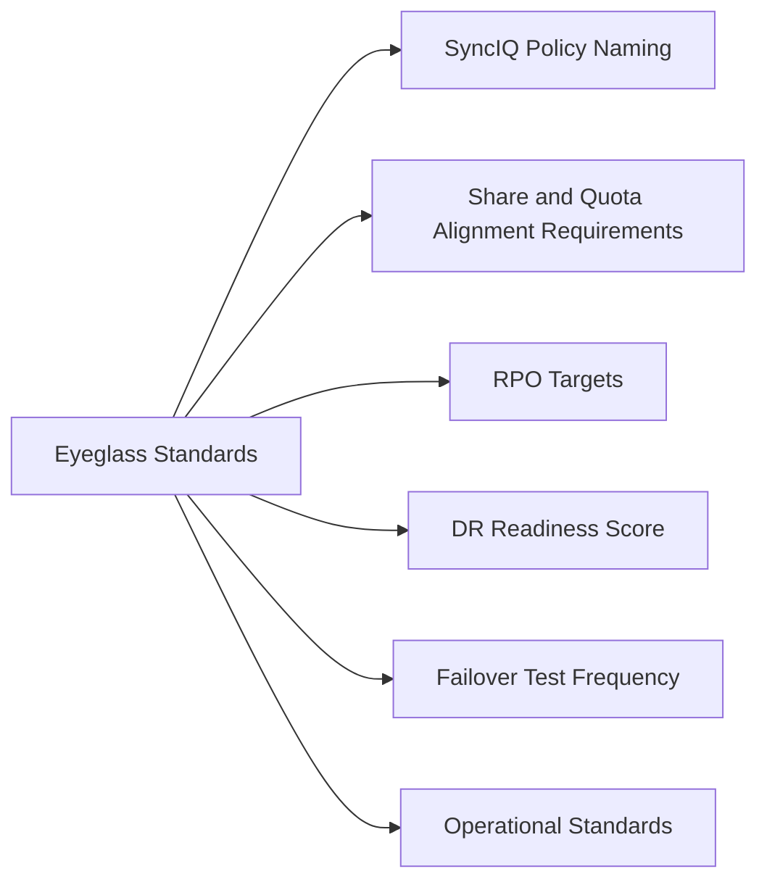

# Superna Eyeglass Standards



## SyncIQ Policy Naming

SyncIQ policy names must be consistent between primary and DR clusters and follow the format:

```
<source-cluster>-<target-cluster>-<zone-or-path>
```

Examples:
- `isilon-a-isilon-b-homedir` — home directory replication between Isilon A and B
- `pscale-dc1-pscale-dc2-finance` — finance data zone
- `pscale-dc1-pscale-dc2-archive` — archival data path

Eyeglass DR configuration groups mirror SyncIQ policy naming — consistent names simplify DR readiness audits.

## Share and Quota Alignment Requirements

Before declaring DR-ready, ALL of the following must be met:

| Check | Standard |
|---|---|
| SMB share mapping | Every primary share must have a corresponding DR share defined in Eyeglass |
| NFS export mapping | Every primary NFS export mapped for DR |
| Quota mapping | All quotas (user, group, directory) aligned between primary and DR cluster |
| ACL verification | Share ACLs reference AD groups (not local users) to survive failover |
| DNS zone delegation | Pre-configured and validated in DNS preview before any DR test |

Verify via Admin UI: DR → Readiness → expand each category for gap report.

## RPO Targets

Define RPO thresholds per SyncIQ policy in Eyeglass:

| Data Tier | SyncIQ Schedule | RPO Target | Eyeglass Alert Threshold |
|---|---|---|---|
| Tier 1 (critical file services) | Continuous | < 15 minutes | Alert at > 10 minutes lag |
| Tier 2 (departmental shares) | Every 4 hours | < 4 hours | Alert at > 3.5 hours lag |
| Tier 3 (archival) | Daily | < 24 hours | Alert at > 20 hours lag |

## DR Readiness Score

The Eyeglass DR Readiness Score must be 100% before any scheduled failover test or before declaring DR capability for the environment.

Score < 100% indicates one or more missing mappings or replication lag beyond threshold — investigate and resolve before proceeding with DR exercises.

## Failover Test Frequency

| Test Type | Minimum Frequency |
|---|---|
| DNS cutover test (non-disruptive) | Quarterly |
| Share/quota validation on DR cluster (read-only check) | Monthly |
| Full failover test (maintenance window, with data) | Annually |
| Failback validation | After each full failover test |

Document all failover test results in the change management system.

## Operational Standards

| Item | Standard |
|---|---|
| Eyeglass appliance backup | Daily configuration backup exported and stored off-appliance |
| Monitoring | Eyeglass SNMP traps integrated with Aria Operations or equivalent |
| Notifications | Email notifications active for DR team distribution list |
| Service account rotation | Eyeglass service account credentials rotated every 90 days (coordinate with CyberArk policy) |
| Post-change validation | Re-run Eyeglass readiness scan after any SyncIQ or PowerScale configuration change |
