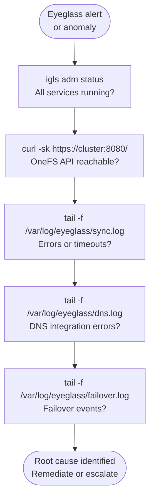

# Superna Eyeglass — Diagnostics

## Diagnostic Commands



```bash
# Check Eyeglass service status (from appliance console)
igls adm status

# View Eyeglass sync log
tail -f /var/log/superna/eyeglass/sync.log

# Verify OneFS API connectivity from Eyeglass
curl -sk -u admin https://<onefs-cluster>:8080/platform/1/cluster/identity
```

## Log Locations (on Eyeglass Appliance)

```bash
# SSH to Eyeglass appliance as admin user

# Main application logs
tail -f /var/log/eyeglass/eyeglass.log

# SyncIQ monitoring logs
tail -f /var/log/eyeglass/synciq_monitor.log

# DNS integration logs
tail -f /var/log/eyeglass/dns.log

# Failover event logs
tail -f /var/log/eyeglass/failover.log
```
