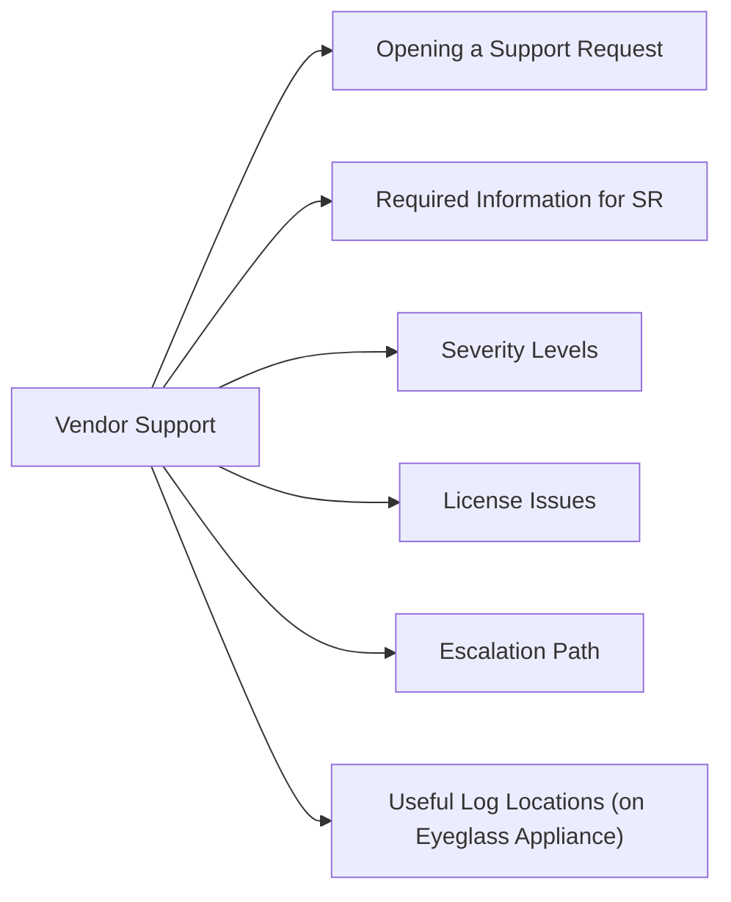

# Superna Eyeglass Vendor Support



## Opening a Support Request

Raise support cases at: [https://support.superna.net](https://support.superna.net)

**Before opening an SR**, collect a support bundle — this dramatically reduces time to resolution:

1. Log in to Eyeglass Admin UI
2. Navigate to: Admin → Support Bundle
3. Click "Download Support Bundle" — this captures logs, configuration, and system state in a single archive
4. Upload the bundle to the SR when creating it

## Required Information for SR

| Field | Detail |
|---|---|
| Eyeglass version | Admin UI → About → version string |
| OneFS version | Both primary and DR clusters |
| SyncIQ policy count | DR → Replication Policies → total count |
| Error description | Exact error text from UI or logs |
| Timestamps | When the issue first occurred (with timezone) |
| DR readiness score | Current score and what changed |
| Recent changes | Any OneFS upgrades, Eyeglass upgrades, or network changes prior to issue |

## Severity Levels

| Severity | Criteria | Response SLA |
|---|---|---|
| S1 (Critical) | Production failover blocked; DR completely inoperative | 1–2 hours |
| S2 (High) | DR readiness score degraded; failover at risk | Same business day |
| S3 (Medium) | Non-critical feature broken; workaround available | 2 business days |
| S4 (Low) | Cosmetic issue, documentation, enhancement request | Best effort |

## License Issues

Licensing issues (appliance reporting "Unlicensed") are handled via the Superna licensing portal:

1. Go to [https://licensing.superna.net](https://licensing.superna.net)
2. Locate license by serial number
3. Confirm that the license UUID matches the UUID shown in Admin UI → License
4. If UUID mismatch (after OVA redeployment), request license re-issue via the portal

Do not open a general support SR for licensing — use the licensing portal directly.

## Escalation Path

1. Initial SR — assigned to Tier 1 support
2. If no resolution within SLA: comment in SR "Request escalation to Tier 2"
3. For critical issues, call Superna's emergency support line (listed on the support portal)
4. For account-level escalation: contact Superna account manager

## Useful Log Locations (on Eyeglass Appliance)

```bash
# SSH to Eyeglass appliance as admin user
# Main application logs
tail -f /var/log/eyeglass/eyeglass.log

# SyncIQ monitoring logs
tail -f /var/log/eyeglass/synciq_monitor.log

# DNS integration logs
tail -f /var/log/eyeglass/dns.log

# Failover event logs
tail -f /var/log/eyeglass/failover.log
```
